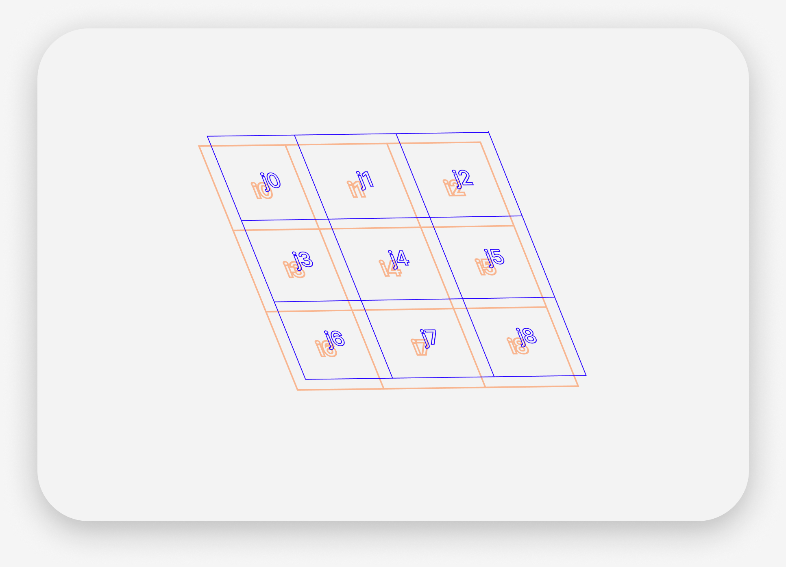

# 🟡 Tic Tac Toe

#### 🫐 Course developed by Kylie Ying.

[min: 35:55 | 12 Beginner Python Projects - Coding Course](https://youtu.be/8ext9G7xspg?si=U_U7YuBMpWRwDksc&t=2155)


<br>
<br>

## I will be creating a simple setup for a game involving players.

  🔶 Imagine we’re talking about a game like **Tic-Tac-Toe** where players can be either people or computer characters.

```bash
   X | O | 3
  ---|---|---
   4 | X | 6
  ---|---|---
   7 | 8 | O

```
<br>
<br>

<br>

<br>

## 🟣 QUESTION: create a diagram to visualize the O and X on the game


#### ✅ CHATGPT:

- -  **a diagram** is a great idea. Here’s a simple textual representation of the game board where you can see how **Xs** and **Os** are placed:


<br>

### 🟦 To visualize the game of Tic-Tac-Toe with Xs and Os,


#### 🔶 Example 1: Initial Board


```bash
   1 | 2 | 3
  ---|---|---
   4 | 5 | 6
  ---|---|---
   7 | 8 | 9

```

<br>

- -   **1-9** are placeholders for where you can put **Xs and Os**.

- - You can **update the board** as **players** make their **moves**.

<br>


#### 🔶 Example 2: X and O Placed

```bash
   X | O | 3
  ---|---|---
   4 | X | 6
  ---|---|---
   7 | 8 | O

```

### How to Read the Board

https://www.vedantu.com/maths/rows-in-maths


**Rows:** The board is divided into three rows.

**Columns:** Each row has three columns.

**Cells:** The intersections of rows and columns are where you place Xs or Os


<br>
<br>

<br>
<br>

# 🟡 Let's Start

<br>
<br>


<br>

## 🟦 Within the `player.py`


- Start by importing the below


```python
import math
import random
```

<br>
<br>

## 🟦 Creating a `Player`:

<br>

- -  Create a **class:** `class Player:`


 - - #### Think of this as a blueprint for a player in the game.

 - - Each player has a special mark, like **X or O**.


<br>
<br>

```python
class Player:
    def __init__()
```

<br>
<br>

## 🟦 initialize it: `def __init__()`


- -  `__init__(self, letter)`: This is like setting up the player with their mark when they start the game.

- **For example**, if you choose X, then the player will be X.


<br>

- - ### `self.letter = letter`: (letter is X or O)

```bash
   X | O | 3
  ---|---|---
   4 | X | 6
  ---|---|---
   7 | 8 | O

```

<br>


- - ### 🟤 get_move(self, game)


- - `get_move(self, game)`: This is like a placeholder for where the **player will decide what move to make in the game**.

- -  Right **now**, it's **empty**, so the player doesn’t actually make a move yet.

<br>
<br>

```python
class Player:
    def __init__(self, letter):
        # letter is X or O
        self.letter = letter

    def get_move(self, game):
        pass


```


<br>
<br>

# 🟡 Child Classes and super()

- **When** you **create** a **child class**, you **often want** to **use the setup from the parent class**. This is where `super()` **comes in**.

<br>

### 🔶 What `super().`__init__(letter)` Does

- - **super():** This function is used to call methods from the parent class (Player in this case).


- - **super().__init__(letter)**: This calls the __init__ method of the Player class, passing the letter parameter to it.


<br>
<br>
<br>


### 🟠 `class RandomComputerPlayer` & `HumanPlayer`

#### When you use `super().__init__(letter)`, you are saying, “I want to use the setup that the Player class provides to initialize this new player, including setting up their mark (X or O).”


- It ensures that the **child classes** `(RandomComputerPlayer and HumanPlayer)` properly inherit and set up the letter attribute from the Player class.


<br>

```python
# child class
class RandomComputerPlayer(Player):
    def __init__(self, letter):
        super().__init__(letter)

    def get_move(self, game):
        pass


# ✋ Same here
#
class HumanPlayer(Player):
    def __init__(self, letter):
        super().__init__(letter)


    def get_move(self, game):
        pass
```


<br>

- - `class RandomComputerPlayer`: This is a special type of player who is a computer that makes random moves.


- - `super().__init__(letter)`: This line is like saying, “Hey, use the setup from the Player blueprint because I am still a player.”


- - `get_move(self, game)`: This is also a placeholder for where the computer would decide on a random move. For now, it’s empty.


<br>
<br>

## 🟤 Summary


**Parent Class (Player):** Defines the basic setup, including the letter attribute.

**Child Classes (RandomComputerPlayer and HumanPlayer):** Use super() to inherit and utilize the setup from the Player class.


`super().__init__(letter):` Ensures that the child classes correctly set up the letter attribute by calling the parent class’s __init__ method.

<br>
<br>
<br>

## 🟡 Create the `game.py`

```python
class TicTacToe:
    def __init__(self):
        self.board = [' ' for _ in range(9)]

        self.current_winner = None # Keep track of winner
```

<br>
<br>

### 🟧 `self.board = [' ' for _ in range(9)]`

<br>


- - 🔸 This line of code: `self.board = [' ' for _ in range(9)]` ,  **initializes** the <u>self.board</u>


- - 🔸 `for _ in range(9)`: This **iterates 9** times, and for each iteration, it adds a space to the list.


- - 🔸 Result: The list self.board will be `[' ', ' ', ' ', ' ', ' ', ' ', ' ', ' ', ' ']`. This represents an empty Tic-Tac-Toe board with 9 positions, all initially empty.


<br>

- - ###  🔸 Think of it as a 3x3 grid but stored in a single line.


<br>
<br>

## 🟧  `self.current_winner = None`

<br>

**self.current_winner:** This keeps track of who is winning the game.

**None:** This means we don’t know yet if anyone has won because the game hasn’t been played.

<br>
<br>

---

<br>
<br>

## 🌴 Create a another function, call it:  `print_board`

- pass the param from the parent function: **self**

```python
def print_board(self):
    #This part creates a list of rows from the board. Let’s break this down:
    #- - self.board: This is the list with all the spaces on the board.
    for row in [self.board[i*3:(i+1)*3] for i in range(3)]:
```

<br>
<br>

## 🟩  Let’s break this down:


### 🟠 `for row in [self.board[i*3:(i+1)*3] for i in range(3)]`:

<br>

- 🌈 **Imagine** we have a tic-tac-toe board represented as a list with 9 positions, like this:

```python
self.board = [0, 1, 2, 3, 4, 5, 6, 7, 8]

```

#### This list represents the tic-tac-toe board like this:

```bash
   0 | 1 | 2
  ---|---|---
   3 | 4 | 5
  ---|---|---
   6 | 7 | 8

```


<br>
<br>

### `for row in`:

- - `for` row `in` ...: This part **tells** the **computer** to **go through each** <u>row</u>  **one by one**.

- - ##### It’s like saying, “For each row in the list we’re making, do something with it.”


<br>
<br>


### `[self.board[i*3:(i+1)*3] for i in range(3)]`:

- - This part creates a list of rows from the **board.**

- - **self.board:** This **is** the **list** with **all** the **spaces** on the **board**.


<br>
<br>

## 🟨 What Does `i*3:(i+1)*3` Do?

<br>

🟦 `i*3`: This tells us where to **start** in the list for each row.

🟦 `(i+1)*3`: This tells us where to **stop** in the list for each row.


<br>

#### Understanding i*3

- In this Tic-Tac-Toe game, the list of numbers is divided into three rows.

<br>
<br>

 

<br>

### 🌈 short explanation:

### Imagine you’re at a funfair with a carousel that has 3 sections. Each section has different animals to ride on. You get to choose one animal from each section as the carousel spins.

- 🎠 Carousel Machine = Loop: Just like the carousel machine spins through different animal seats, the loop goes through different rows.

- 🎠 Each Turn = Each Iteration: Each turn of the carousel machine moves you to a new set of animal seats, just like each iteration of the loop moves to the next row. 🎠


<br>

- The for row in [...] loop iterates over:


```bash
   0 | 1 | 2
  ---|---|---
   3 | 4 | 5
  ---|---|---
   6 | 7 | 8

```

## or

[ 🐴 | 🦄 | 🐪 ]

[ 🦓 | 🦒 | 🦁 ]

[ 🐯 | 🐵 | 🦔 ]

#### Each section represents a different part of the carousel 🎠 . Think of these sections like the rows in our Tic-Tac-Toe game

- - Imagine you’re at a **funfair** 🎪 with a carousel 🎠 that has 3 sections.

- - Each section has different animals to ride on. You get to choose one animal 🦓 from each section as the carousel spins .

<br>


<br>

### 🍭 When i is 0:

- -  `i*3` is `0*3`, which equals `0`.

- - This means **we start at position `0`** in the **list**.

<br>

### 🎠 How it works, imagine a iteration, like a carousel SPIN, each turn is similar to a loop iteration

<br>


#### First Round (First Turn):

```bash
Round 1:
[ 🐴 | 🦄 | 🐪 ]


# - You start at the first section.
# - Pick an animal from this section.
# - Example: You choose the 🐴 from the first section.
```
#### Second Round (Second Turn):

```bash
Round 2:
[ 🦓 | 🦒 | 🦁 ]
# - Carousel turns to the second section.
# - Pick an animal from this new section.
# - Example: You choose the 🦓 from the second section.
```
#### Third Round (Third Turn):

```bash
Round 3:
[ 🐯 | 🐵 | 🦔 ]

# - Carousel turns to the third section.
# - Pick an animal from this last section.
# - Example: You choose the 🐯 from the third section.
```

<br>
<br>

```python
Tic-Tac-Toe Grid:

🍭
1. **First Iteration (i = 0)**
   - Start at index: 0
   - End at index: 3
   - Extract: [0, 1, 2]

   [0 | 1 | 2]  <- First Row (0 to 2)

🍰
2. **Second Iteration (i = 1)**
   - Start at index: 3
   - End at index: 6
   - Extract: [3, 4, 5]

   [3 | 4 | 5]  <- Second Row (3 to 5)

🍓
3. **Third Iteration (i = 2)**
   - Start at index: 6
   - End at index: 9
   - Extract: [6, 7, 8]

   [6 | 7 | 8]  <- Third Row (6 to 8)

```
<br>

#### and opla.. jump to the next row


<br>

### Visual Explanation

- The **for** row **in** [...] loop iterates over:


```bash
| 0 | 1 | 2 |  <- First Row (0 to 2)
| 3 | 4 | 5 |  <- Second Row (3 to 5)
| 6 | 7 | 8 |  <- Third Row (6 to 8)
```


<br>

## `for row in [self.board[i*3:(i+1)*3] for i in range(3)]:`


## 🟠 What i+1 Does 🟡

`i+1` helps us figure out the end position of the slice.


```bash
i represents the current row index.

i + 1 gives you the next row’s index, which helps determine the end of the current row.
```
<br>

#### 🟣 in other words: `i + 1` gives you the next row’s index, which helps determine the end of the current row.

```bash
For i = 0: (0+1)*3 = 3 which gives us the end index 3.
For i = 1: (1+1)*3 = 6 which gives us the end index 6.
For i = 2: (2+1)*3 = 9 which gives us the end index 9.
```


### 🟣 In other words: when the first round (or spin) of the carousel ends, it slices at position 3, which marks the end of the first row and the beginning of the second row.

```python
# (i+1) or (0+1)
For i = 0: (0+1)*3 = 3 which gives us the end index 3.
```
<br>

### As the carousel continues to spin, the visible rows are updated, but this movement is not shown in the slice. The slicing expression [self.board[i*3:(i+1)*3]] dynamically adjusts to extract each row based on the current iteration.

```python
For i = 1: (1+1)*3 = 6 which gives us the end index 6.
# AND so on
```
<br>
<br>

### Expanding to a Grid with 4 Values Per Row


- - If you change the slicing formula to `[self.board[i*4:(i+1)*4]]`, this will create a grid where each row contains 4 values:

```bash
| 🐴 | 🦄 | 🐪 | 🦓 |  <- First Row (positions 0 to 3)
| 🦒 | 🦁 | 🐯 | 🐵 |  <- Second Row (positions 4 to 7)
| 🦔 | 🦋 | 🦜 | 🦨 |  <- Third Row (positions 8 to 11)
```


<br>
<br>
<br>
<br>

## 🟡 Connection and Purpose

<br>

- - **Initialization**

`self.board = [' ' for _ in range(9)]`:

>This creates the board with 9 empty spaces, setting up the initial state of the Tic-Tac-Toe game.

<br>

- -  **Row Extraction**

`for row in [self.board[i*3:(i+1)*3] for i in range(3)]:`

>This takes the linear list self.board and splits it into 3 rows, each containing 3 elements. It makes it easier to print the board in a 3x3 grid format.

<br>

### 🟫 Consider the board after some moves might look like this:

```python
self.board = ['X', 'O', 'X', ' ', 'X', 'O', ' ', ' ', 'O']

```


### The list comprehension inside print_board:

```python
[self.board[i*3:(i+1)*3] for i in range(3)]
```

<br>

#### Another example

```python
i=0: self.board[0:3] gives ['X', ' ', 'O'] (Row 0).
i=1: self.board[3:6] gives [' ', 'X', ' '] (Row 1).
i=2: self.board[6:9] gives ['O', ' ', 'X'] (Row 2).
```


<br>


<br>
<br>

## 🟡 Add the bars to the table


<br>

- -  `' | '.join(row)` joins the elements of the row with `' | '` as the separator, so each row’s elements are separated by vertical bars.

<br>

- - `'| ' + ... + ' |'` wraps the formatted row with | on both ends.

<br>

> #### This format makes it easy to *visually* inspect the current state of the Tic-Tac-Toe board, with each cell separated by vertical bars and each row clearly delineated.


```python
print('| ' +  ' | '.join(row) +  ' |')
```
#### output

```bash
| X | O | X |
|   | X | O |
|   |   | O |
```

<br>


```python
class TicTacToe:
    def __init__(self):

        self.board = [' ' for _ in range(9)]
        self.current_winner = None

    def print_board(self):

         for row in [self.board[i*3:(i+1)*3] for i in range(3)]:
             #
             #  | '.join(row) joins the elements of the row with ' | ' as the separator, so each row’s elements are separated by vertical bars.
             print('| ' +  ' | '.join(row) +  ' |')
```

<br>
<br>
<br>
<br>

## 🟡 `@staticmethod`

### 🫐 What is `@staticmethod`?

<br>

####  A staticmethod in Python is a 🔸  *method decorator*.


🍊 It is **used** to **define a method** in a **class** that **does not require access** to the **instance** (`self`) or the class (`cls`) to which it belongs (*check the examples in the link below*).

####  🧶 [READ MORE: z_decorators](../../../z_decorators.md)


<br>
<br>

## 🟦 Creating the Double Grid

### 🍊 This line Below creates a grid with numbered positions (0 to 8) for players to choose where to place their X or O.


#### `number_board = [[str(i) for i in range(j*3, (j+1)*3)] for j in range(3)]`


**Players Choose a Position by Number:** For example, if a player wants to place their `X` in the middle of the board, they would choose position 4.

<br>

#### Before move

```bash
number_board = [
    ['0', '1', '2'],  # Row j = 0
    ['3', '4', '5'],  # Row j = 1
    ['6', '7', '8']   # Row j = 2
]

```

- - This number_board is used to show the positions on the Tic-Tac-Toe board to help players select where  they want to place their X or O.

#### After player places X in position 4:


```bash
| 0 | 1 | 2 |
| 3 | X | 5 |
| 6 | 7 | 8 |

```
<br>

## 🚀 Recapitulative

- so to be clear: the 9 boxes are **indexes**

- Each of the **9 cells** is indexed from `0 to 8`.

- These indices represent the positions in  the board.

- - #### 👾 so when user adds `X` to index `4` (dot orange), its seeing as J4 in i4, just like in chess board visual (not the logic)

```python
| 0 |  1 | 2 |  <- First Row (0 to 2)
| 3 |🔸4 | 5 |  <- Second Row (3 to 5)
| 6 |  7 | 8 |  <- Third Row (6 to 8)
```

- - **Index 4:** In the 1D list, it is the fifth position, corresponding to the center of the grid.

- - **Grid View:** You would see it as J4 in the i4 position, indicating where the move was made.

<br>

## 🟫 Like here

[](https://threejs-journey.com/lessons/9)


<br>
<br>

## 🌈 Breaking It Down

`for j in range(3)` :  This part is a **loop** that **runs 3 times**.

- - **Each time**, `j` takes on a value of 0, 1, and 2, one at a time.

- - #### Think of `j` as the row number in the grid.

<br>


### 🟠 Inner List Comprehension `[[str(i) for i in range(j*3, (j+1)*3)] for j in range(3)]`:


<br>

>- - **For each** value of `j`, 🤺 this part creates a list of numbers.

>- - **It starts** at `j*3` and **goes up to** `(j+1)*3`, but doesn’t include `j+1)*3`.


<br>
<br>

### 🟡 The logic used in the previous for loop in the `print_board()` function is similar, but now it’s applied to track and display the player's moves instead of just printing the board layout.🤺

- Based on the previous `For` LOOP:  `j + 1` gives you the next row’s index (where the orange🔸 dot is, means that the index of the second row is the 3, 3 is the current index, and it marks the end of the ), which helps determine the end of the current row.

```bash
| 0 | 1 | 2 |  <- First Row (0 to 2)
|3🔸| 4 | 5 |  <- Second Row (3 to 5)
|6🔸 | 7 | 8 |  <- Third Row (6 to 8)
```

```python
For i = 0: (0+1)*3 = 3 which gives us the end index 3.
For i = 1: (1+1)*3 = 6 which gives us the end index 6.
For i = 2: (2+1)*3 = 9 which gives us the end index 9.
```


<br>
<br>

### Before continuing with the `available moves`, this is what i have until now:

<br>

```python
class TicTacToe:
    def __init__(self):

        self.board = [' ' for _ in range(9)] #
        self.current_winner = None #

    def print_board(self):

         for row in [self.board[i*3:(i+1)*3] for i in range(3)]:
             print('| ' +  ' | '.join(row) +  ' |')

    @staticmethod
    def print_board_nums():
        number_board = [[str(i) for i in range(j*3, (j+1)*3)] for j in range(3)]

        for row in number_board:
            print('| ' + '| '.join(row) + ' |')

```

<br>

<br>

<br>
<br>

## 🟧 `Available Moves`

### This function helps us find out which boxes are still free to make a move in the game.


```python
def available_moves(self):
```


<br>
<br>

### 🟦 After you've played with some of the boxes, this function will check which ones are left for you to use.


```python

    def available_moves(self):

        moves = []

        for (i, spot) in enumerate(self.board):

            if spot == ' ':
                moves.append(i)

        return

```


<br>
<br>


### 1. 🔶 Creating a List for Moves:

Here, you **create an empty**  <u>list</u> **called moves**.

```python
moves = []
```

- - This list will store the positions on the board where a move can be made.

<br>


#### 2. 🔶 Looping Through the Board:

### ENUMERATE()

```python
 for (i, spot) in enumerate(self.board):
```

-  `enumerate()`: will help you to loop through items that dont have an assigned id, like "id": 0, "id": 1, its for values such as [ apple, fruits, etc,]

<br>


#### 3. 🔶 Checking if the Spot is Empty

```python
if spot == ' ':
```

<br>
<br>

#### 4. 🔶 Adding Empty Spots to the List:

```python
 moves.append(i)
```

- - **If** the **spot is empty**, this line adds the position i to the moves list. This way, you keep track of where players can make a move.

<br>
<br>

#### 5. 🔶 return the func

```python
return
```

- -  Finally, the function returns the moves list, which now contains all the positions on the board where a player can put their mark.

<br>
<br>


```python

    def available_moves(self):

        moves = []

        for (i, spot) in enumerate(self.board):

            if spot == ' ':
                moves.append(i)

        return

```


### 🟧 Example

Let’s say your board looks like this:

```python
X | * | O
---------
* | X | *
---------
🔸| * | O

```

<br>

### 👾 Explanation with enumerate

<br>

- - **Index 0:** The spot is **X** (not empty).

- - So, index 0 is not added to the moves list.


<br>

**Index 1:** The spot is * (empty). So, index 1 is added to the moves list.

**Index 2:** The spot is O (not empty). So, index 2 is not added to the moves list.

**Index 3:** The spot is * (empty). So, index 3 is added to the moves list.

**Index 4:** The spot is X (not empty). So, index 4 is not added to the moves list.

**Index 5:** The spot is * (empty). So, index 5 is added to the moves list.

**Index 6:** The spot is * (empty). So, index 6 is added to the moves list.

**Index 7:** The spot is * (empty). So, index 7 is added to the moves list.

**Index 8:** The spot is O (not empty). So, index 8 is not added to the moves list.

<br>

### 🟧 Result

<br>

The `available_moves` function will `return [1, 3, 5, 6, 7]`, indicating the positions on the board where a player can make a move.


<br>
<br>

## 🟡 A cleaner way of doing this:

```python
# ---- OPtion A
def available_moves(self):
        moves = []
        for (i, spot) in enumerate(self.board):
            if spot == ' ':
                moves.append(i)
        return

# ---- OPtion B
# cleaner
#
return [i for i, spot in enumerate(self.board) if spot == ' ']

```

<br>

## 🟡`return [i for i, spot in enumerate(self.board) if spot == ' ']`


- - #### 🍊 This line finds all the empty spaces on the board where a player can put their mark. It looks at each spot on the board and checks if it's empty. If it is, it remembers the position so the player knows where they can move.


<br>

## 🫐 `i for i`

🔴 "It's **like** saying, 'I want to create a new list 👭 by copying certain spots from the original list (the first i list).

- - I will look at each spot in the original list, check if it is empty (what I mean by spot in this game), and if it is, I’ll add that spot to the new list (the second i list).'"

```python
#
i for i,
```

<br>

#### The code without the above line

```python
class TicTacToe:
    def __init__(self):
        # This line of code: self.board = [' ' for _ in range(9)] ,  initializes the self.board
        # for _ in range(9) : This iterates 9 times, and for each iteration, it adds a space to the list.
        # Result: The list self.board will be [' ', ' ', ' ', ' ', ' ', ' ', ' ', ' ', ' ']. This represents an empty Tic-Tac-Toe board with 9 positions, all initially empty.
        #
        self.board = [' ' for _ in range(9)] # This creates a list (like a row of boxes) with 9 empty spaces. Each space will be where we put X or O. Think of it as a 3x3 grid but stored in a single line.

        self.current_winner = None # Keep track of winner

    def print_board(self):
    #     #This part creates a list of rows from the board:
    #     #- - self.board: This is the list with all the spaces on the board.
         for row in [self.board[i*3:(i+1)*3] for i in range(3)]:
             #
             #  | '.join(row) joins the elements of the row with ' | ' as the separator, so each row’s elements are separated by vertical bars.
             print('| ' +  ' | '.join(row) +  ' |')

    @staticmethod
    def print_board_nums():
        number_board = [[str(i) for i in range(j*3, (j+1)*3)] for j in range(3)]

        for row in number_board:
            print('| ' + '| '.join(row) + ' |')
        #  | '.join(row) joins the elements of the row with ' | ' as the separator, so each row’s elements are separated by vertical bars.


#The available_moves function is designed to find out which spaces on the tic-tac-toe board are empty and can be used for a move.
    def available_moves(self):
        # - 1 Creating a List for Moves:
        moves = []
        # Here, you create an empty list called moves. This list will store the positions on the board where a move can be made.


        # - 2 Looping Through the Board:
        # enumerate(): will help you to loop through items that dont have an assigned id, like "id": 0, "id": 1, its for values such as [ apple, fruits, etc,]
        for (i, spot) in enumerate(self.board):


            # - 3 Checking if the Spot is Empty
            if spot == ' ':


                # - 4 Adding Empty Spots to the List:
                # If the spot is empty, this line adds the position i to the moves list. This way, you keep track of where players can make a move.
                moves.append(i)

        return
    #5 Finally, the function returns the moves list, which now contains all the positions on the board where a player can put their mark.
```

<br>
<br>

---

<br>
<br>


## 🟦 Back to the `Player.py` 🍍


 ### 🟠 Modify this function

```python
  # ---- before ----
  def get_move(self, game):
        pass # hold pn for now

  # ---- after ----

  def get_move(self, game):
        pass # hold pn for now
```

<br>
<br>

## 🍍 Computer Move

### 🟧 Computer Player that picks its move randomly.

```python
    def get_move(self, game):
        # Getting a Move: Chooses a random empty position from
        # the board for the computer’s move.
         #
        #picks a random position from that list of available moves.
        square = random.choice(game.available_moves())
        return square
        # The method returns this random position (square), which tells the game
        # where the computer player wants to place its mark.


```


<br>
<br>


## 🍍 Human Move

### 🟧  The Human Player

- -  the Human Player, it’s a bit like the game is saying, “I’m not letting you move until you pick a spot that’s actually free!”


```python

#🤚 HUMAN move
class HumanPlayer(Player):
    def __init__(self, letter):
        super().__init__(letter)

    #Human Player is asked to choose a spot to put their mark, and the game will keep
    def get_move(self, game):

       valid_square = False
       #Start with No Move: It starts with valid_square = False which means it hasn’t found a good move yet.


       val = None
       #val = None, just means there’s no move chosen yet.

       while not valid_square:

           #Ask for Input: The game will ask the player to type in their move. For example,
           # it might ask, "Where do you want to place your mark? (Pick a number from 0 to 9)."
           square = input(self.letter + '\'s turn. Input move (0-9):')
```


<br>
<br>

## 🔴 `Try & exception`

### In the try block...

- - the **function converts the user input** to an **integer** and **checks if** this **integer** is a **valid move** by ensuring it's in the list of available moves.

<br>

- - **If the integer** is **not** in the **list** or the conversion fails, it raises a **ValueError**, which prompts the except block to ask the user to enter a valid move. If the input is valid, it sets valid_square to True and completes the input process.

<br>

```python
    try:
            val = int(square)
            if val not in game.available_moves():
                    raise ValueError
            valid_square = True


    except ValueError:
                print(' Invalid square. Try again')

return val
```


<br>
<br>

### 🎠 🌈  Imagine you’re playing Tic-Tac-Toe and you pick a spot.

>The game then **checks if it’s a good choice**—like **making sure** you **picked a valid box**.

> - - **If your pick is wrong**, the game tells you to try again, like a friend helping you get the right answer.

> - - When you finally choose a good spot, the game lets you place your mark and everyone’s happy!

<br>


```python
 try:

               # This line tries to turn the player's input (which is a string, like "5") into a number (an integer). For example, if the player typed "5", this line changes it into the number 5
               val = int(square)


               # Here, the game checks if the number the player chose (like 5) is one of the valid empty spots where the player can place their mark. The list game.available_moves() contains all the numbers for empty spots.
               if val not in game.available_moves():

                   # If the number the player chose is not a valid empty spot, this line makes a special kind of error called ValueError. This tells the game that something went wrong and it needs to handle it.
                   raise ValueError

            # If everything is okay (the input was a number and it’s a valid empty spot), this line says that the player's move is valid. This stops the game from asking for another move.
               valid_square = True

           # if something went wrong. If there was an error (like the input wasn’t a number or wasn’t a valid spot), the game will launch the exception
           except ValueError:
               # the exception will CATCH it and launch an error procedure 'ValueError', then will print the messa below
               print(' Invalid square. Try again')
               # if there was an error, this line tells the player that their move is not allowed and asks them to try again.


          # Once a valid move is found, this line returns (gives back) the number of the chosen spot. This number will be used to put the player’s mark on the grid.
           return val
```

<br>
<br>

### 🟤 Putting It All Together

#### Here’s a simple story to tie it all together:

Imagine you’re playing Tic-Tac-Toe and you need to pick a spot to place your mark.

- -  You tell the game your choice (like saying "5").

- - The game then tries to make sure "5" is a valid spot.

- - **It checks if "5"** is actually a number and if it’s a spot where you can put your mark.

<br>

- - **If "5"** 👍 is a valid spot, the game says, "Great! That’s a valid move!"

- - **If "5" isn’t** 👎 valid (maybe it’s already taken or isn’t a number), the game says, "Oops! That’s not a valid spot. Try again!"

<br>

- - Finally, when you make a **valid choice**, the **game uses** that **number to put your mark on the grid.**

#### 🌈 So, this part of the code makes sure that you’re making a good move and helps you correct it if you’re not.

<br>

```python
import math
import random


class Player:
    def __init__(self, letter):
        # letter is X or O
        self.letter = letter

    def get_move(self, game):
        pass


# inherited class
#🤚 COMPUTER move
class RandomComputerPlayer(Player):

    def __init__(self, letter):
        super().__init__(letter)

    def get_move(self, game):
        # ✋ This 'square' here below will be used serveral times within the game.py
        square = random.choice(game.available_moves())
        return square


#🤚 HUMAN move
class HumanPlayer(Player):
    def __init__(self, letter):
        super().__init__(letter)

    #Human Player is asked to choose a spot to put their mark, and the game will keep
    def get_move(self, game):

       valid_square = False
       val = None

       while not valid_square:

           square = input(self.letter + '\'s turn. Input move (0-9):')

           try:

               val = int(square)
               if val not in game.available_moves():
                   raise ValueError

               valid_square = True

           except ValueError:
                print(' Invalid square. Try again')

       return val


```

<br>
<br>
<br>
<br>

## 🟦 Back to the `game.py` 🍍

<br>

### 🟠 The `play` function is designed to manage and run our game

```python
    def available_moves(self):
        return [i for i, spot in enumerate(self.board) if spot == ' ']

def play(game, x_player, o_player, print_game=[True]):
    if print_game:
        game.print_board_nums()

    letter = 'X'
```

<br>
<br>


## 🍨 Explanation:

#### `def play(game, x_player, o_player, print_game=[True])`:

- - This defines the `play` function which takes  **four** **param**eters:

<br>

- - **game:** An instance of the Tic-Tac-Toe game.

- - **x_player:** The player (or computer) who will make moves for **'X'**.

- - **o_player:** The player (or computer) who will make moves for **'O'**.

- - **print_game:** An optional boolean parameter (defaulting to True) that controls whether the game board should be printed.

<br>


`if print_game`: This checks if the **print_game** flag is set to **True**.

- -  If it is, the game board is printed using game.

<br>

`print_board_nums()`.

- - This helps visualize the board's current state.

<br>

**`letter = 'X'`**

- - This **initializes the variable** `letter with 'X'`, **indicating** that **'X'** will start the game.

- It’s used to keep track of which player's turn it is.


<br>
<br>

### 🟦 The 👾 WHILE 👾  loop keeps running `while` there are still empty squares on the game board. This ensures that the game continues until there are no more moves left to be made.

- `empty_squares()` , dont exist yet

- for now I will use the **pass**, as there is another function that I will need to create

- - > PASS: This is a placeholder 'while' waiting to implement other parts of the game logic, such as handling player moves or checking for game end conditions.

```python
     letter = 'X'

    while game.empty_squares():
        pass # wait  until we finish other stuff
```


<br>
<br>

## 🟦 After the `WHILE` loop continue with the below functions

- create them just before the `play(game...)` function that contains the `letter X`

<br>
<br>
<br>

## 🟦 `empty_squares` function

```python
 def empty_squares(self):
```
🟠 The `empty_squares` function **checks if** there **are any empty spaces** on the **board**, **returning `True`** `if` **at least one space is empty** and `False` **otherwise**.


<br>

```python
 def empty_squares(self):
        return ' ' in self.board
```

<br>

- - In the `play` **function**, `empty_squares` **function is used** in a **while loop to continue the game as long as** there are **empty squares**, providing a way to keep the game active until the board is full.

<br>


<br>
<br>


## 🟦 `num_empty_squares` function


 **The num_empty_squares** function counts the total number of empty spaces remaining on the board.

- - >Example: If the board is ['X', ' ', 'O'], this function will return True because there’s an empty spot.

<br>

```python
 def empty_squares(self):
       return ' ' in self.board
```
<br>

🟠  **Purpose:** This function counts how many empty spaces are left on the board.

- - **How It Works:** It counts all the empty squares on the board where you can still place a mark.

- - **What It Returns:** It tells you the number of empty spaces remaining.


<br>
<br>


##  🟧 How It Fits in the `play()` Function:

<br>

- - **Checking for Empty Spaces:** In the play function, game.empty_squares() is used in the while loop. This tells the game to keep running as long as there are empty spaces on the board.

- - **Counting Empty Spaces:** You can use game.num_empty_squares() to find out exactly how many empty spots are left, which might be useful for deciding the next move or for game strategy.

<br>

```python
 # .. more code

    def empty_squares(self):
        # Check if there is at least one empty space on the board
        return ' ' in self.board  # Returns True if there's at least one empty space, False otherwise

    def num_empty_squares(self):
        # Count how many empty spaces are left on the board
        return self.board.count(' ')  # Returns the number of empty spaces

# ✋
def play(game, x_player, o_player, print_game=[True]):
    letter = 'X'  # 'X' starts the game
    while game.empty_squares():  # Keep playing as long as there are empty squares
        pass  # Placeholder for game logic
```

<br>

> 🌈 So, the **`empty_squares`** function helps to check if the game can continue, and **`num_empty_squares`** helps count how many spots are left. These functions are important for keeping track of the game state during play.

<br>
<br>
<br>

## 🟠 Summary

 **`available_moves`** **finds all** the **empty spots** on the board **where a move can be made**.

- - >Example: If the board is ['X', ' ', 'O'] ( 👀 focus on the middle ' '), the function will return [1] because position 1 is empty.

<br>

```python
# FINDS all the spots
    def available_moves(self):
        return [i for i, spot in enumerate(self.board) if spot == ' ']
# CHECK if there are empty spots LEFT
    def empty_squares(self):
        return ' ' in self.board
# COUNTS how many empty spots are available
    def num_empty_squares(self):
        return self.board.count(' ')


# ✋
def play(game, x_player, o_player, print_game=[True]):
    if print_game:
        game.print_board_nums()

    letter = 'X'

    while game.empty_squares():
        pass
```

<br>


- - **`empty_squares`** **checks if** there are any empty spots left on the board.

- - **`num_empty_squares`** **counts how many empty** spots are available.

<br>


🍦In the  **PLAY function**, `empty_squares` is used to keep the game running while there are empty spots, and available_moves helps to identify valid positions for making moves.

<br>
<br>
<br>


## 🟠 back to the `Play()` function


- replace the **pass** for the below and add the condition.

#### 🔶 Purpose of the CONDITION:

- - **Determine which player’s move to get based on whose turn it is**.


- - It **assigns** the **move to the square** <u>variable</u>  by calling the appropriate player’s method `(o_player. get_move` or `x_player.get_move)` depending on whether it’s **'O'** s turn or **'X'** s turn. This ensures that the correct player's move is processed.

<br>

### 👾 `square`

```python
    while game.empty_squares():
        #pass # wait  until we finish other stuff ( the functions: empty_squares, num_empty_squares)

        if letter == '0':
            # 🔴 `square` variable here **below** is related to the square used in `player.py`
            square = o_player.get_move(game)
        else:
            square = x_player.get_move(game)

```

<br>

- 🔴 **REMEMBER**: In `player.py`, **square** is a variable within the **get_move** method of the `RandomComputerPlayer()` class. It **represents** a **random**ly **chosen move** from the available moves on the game board.


```python
#player.py
class RandomComputerPlayer(Player):
    def __init__(self, letter):
        super().__init__(letter)

    def get_move(self, game):
        square = random.choice(game.available_moves())
        return square
```

### 🟫 Role in game.py:

- - - **In `game.py`**, **square is an argument passed to the** `make_move` **method**.

- - - This **var**iable **indicates** the **index on the board where** a **move is to be made**.


- - - The make_move method uses this square index to place a letter (either 'X' or 'O') in the specified position on the board and then checks if the move results in a win.

### Summary

- - The **square** in `player.py` is determined by the player's move logic (e.g., random choice).

- - This **square** is then used in game.py to update the board and process the move.

Essentially, `player.py` **generates the move** (square), and game.py applies it to the game board.

<br>
<br>
<br>


## 🟦 `make_move` function


```python
def make_move(self, square, letter):
    # If the move is valid (the square is empty), place the letter there
    if self.board[square] == ' ':
        self.board[square] = letter
        return True
    return False

```

#### `if self.board[square] == ' '`:

**Purpose:** Checks if the square is empty before making the move.

**Comparison (==):** This compares the current state of self.board[square] to ' '.

- - >If the spot is empty, it proceeds to make the move.

#### `self.board[square] = letter`

**Purpose:** Assigns the letter (either 'X' or 'O') to the specified square on the board.

<br>

##  Summary

#### 🟠 `play()` Function:

- - **Determines** which player's turn it is and gets the move from the respective player.

- - **Uses `make_move` to place** the **mark** on the board if the move is valid.

- - **Alternates turns between players** and optionally prints the board.


#### 🟠 `make_move()` Function:

- - **Checks if a spot** on the **board** is **empty** and, if so, places the player's mark there.

- - **Returns True if** the **move** is **valid** and **False if** it is **not**

<br>
<br>
<br>

### 🟦 Back to the `Play()` function

- After creating the **make_move()** ,  continue the condition

```python
        if letter == '0':
            square = o_player.get_move(game) # Get move from 'O' player
        else:
            square = x_player.get_move(game) # Get move from 'X' player

        # ✋ --- after creating the make_move function
        #  FUNCTION to make the MOVE
        if game.make_move(square, letter):
```

<br>

### 🟠 `if game.make_move(square, letter):`

  **Purpose:**

- - This line calls the **make_move function** to **attempt placing** the **current player's** mark **(letter)** on the **board** at the position square.

<br>

 **How It Works:**


```python

        if game.make_move(square, letter):
        # ----
        # If make_move returns True
        # (indicating the move was successfully made),
        # the subsequent code inside the if block executes.
            if print_game:
                print(letter + f' makes a move to a square {square}')
                game.print_board()
                print("")


```
<br>

🔶 <u>If</u> `make_move` <u>returns</u> **True** (indicating the move was successfully made), **the subsequent code inside** the `if` **block executes**.

🔶 **If** the **move** was **not successful** (returns **False**), this **block is skipped**.

<br>

## 🟠 Switching Players:

**Purpose:** This line switches the turn to the other player.
How It Works:

```python
            letter = '0' if letter == 'X' else 'X' #switches player
```


`'O' if letter == 'X' else 'X'`

- - **is a shorthand way to toggle between** `'X'` and `'O'`.

<br>

- - `If` the **current letter is** `'X'`, **it changes it to** `'O'`;

- - `if` it’s `'O'`, **it changes it to** `'X'`.

>This ensures that after each move, the next player’s turn is correctly set.

<br>

```python
        # FUNCTION to make the MOVE
        if game.make_move(square, letter):
            if print_game:
                print(letter + f' makes a move to a square {square}')
                game.print_board()
                print("")


            ✋
            letter = '0' if letter == 'X' else 'X'
```

<br>
<br>


### 🟠 Check if this move wins the game

- Back to the `make_move()`

- with the following 2 lines, the `make_move` function **now provides additional info**rmation **by checking if a move res**ults **in a win**.

- - - This **allows** the **game to** potentially **end if a player wins**, which can be detected and handled after the move is made.

<br>

```python
    def make_move(self, square, letter):

        if self.board[square] == ' ':
            self.board[square] = letter
            # ✋ Check if this move wins the game
            if self.winner(square, letter):
                self.current_winner = letter
            return True
        return False

```


#### 🟠 `if self.winner(square, letter)`:

**Purpose:**

-  - This line **checks if the move** made **at square** with **letter** results in **a win** for the current player.

**How It Works:**

- - `self.winner(square, letter)` is a method that **determines if placing the letter at the square has** <u>created a winning condition on the board</u>  (like three in a row).

<br>

#### 🟠 `self.current_winner = letter`

**Purpose:** This line sets self.current_winner to the current player's letter if the move results in a win.

**How It Works:** `self.current_winner` **keeps track** of **which player won the game**.

- - - **letter is assigned to** `self.current_winner` **to record the winner**.

<br>
<br>

### 🔴 Remember

> the line **`if self.winner(square, letter)`**: **is** closely **related to** the `self.current_winner` **attr**ibute **defined in** the `__init__` method of the TicTacToe class.

```python
class TicTacToe:
    def __init__(self):
        self.board = [' ' for _ in range(9)] # This
        # ✋ current_winner
        self.current_winner = None # Keep track of winner
```

<br>
<br>

<!-- ## After the WHILE loop is over we will print the following:

```python
            letter = '0' if letter == 'X' else 'X' #switches player
        # ✋
        if print_game:
            print('It\'s a tie!')
``` -->

<br>

## 🟠 `winner()` Function


The winner function determines if the current move has resulted in a win by checking the row and column where the move was made.

#### This is used to check if a player has won the game after making a move.

<br>

**Purpose:**

- - Defines the winner method that takes in the position of the move (`square`) and the player's mark (`letter`).

```python
  def winner(self, square, letter):
```


<br>

 **Relation to play:**

- - This **function** is **called in the** `make_move` method to determine if the move resulted in a win, exactly this part of the **make_move:**

```python
# def make_move(self, square, letter):
#     if self.board[square] == ' ':
#         self.board[square] = letter
if self.winner(square, letter):

```


<br>

### 🟠 Checking the Row

**Purpose:** Calculates the row index and extracts the row from the board.


```python
        # row_ind
        row_index = square // 3
        row = self.board[row_index*3 : (row_index + 1) * 3]
```
<br>

- - 🍰 `row_index = square // 3`: **Divides** the square index **by 3** to **find which row the move is in**.

- -  🔪 `row = self.board[row_index*3: (row_index + 1) * 3]`: **Slices** the board list to get the row where the move was made.

<br>
<br>

#### 🟤 Relation to `play()`: This helps determine if the move has resulted in a winning row.

```python
if all([spot == letter for spot in row]):
    return True
```
**Purpose:**

- - **Checks if all spots** in the **row are occupied** by the **current player's** mark (`letter`).

<br>

#### `all([spot == letter for spot in row])`:

- - **Creates a list** of **Boolean values** <u>checking</u>  **if each spot in the row equals letter**.

-  - `all()` returns True if all values are True.

<br>

**If the row check returns `True`**, it means the player has won by completing a row.

- - The `make_move` function will set the current_winner based on this result.

```python
if all([spot == letter for spot in row]):
    return True
```

<br>
<br>

### 🟠 Checking the Column

```python
# check column
col_index = square % 3
column = [self.board[col_index+i*3] for i in range(3)]
```
<br>

**Purpose:** Calculates the column index and extracts the column from the board.

`col_index = square % 3`: Uses the remainder to find the column index where the move was made.

`column = [self.board[col_index+i*3] for i in range(3)]`: Creates a list of values from the board for the column.

<br>

#### 🟤 Relation to `play()`: This helps determine if the move has resulted in a winning column.

```python
if all([spot == letter for spot in column]):
    return True

```

**Purpose:**

- - **Checks if all spots** in the **column** are occupied by the current player's mark (`letter`).

`all([spot == letter for spot in column])`:

 - - Creates a list of **Boolean** values **checking** if **each spot in the column equals letter**.

##### `all()` returns True if all values are True.

#### 🟤 Relation to `play()`: If the column check returns True, it means the player has won by completing a column.

The `make_move` **function** will set the `current_winner` based on this result.

<br>

###  Summary


```python
    def winner(self, square, letter):


        row_index = square // 3
        row = self.board[row_index*3 : (row_index + 1) * 3]

        if all([spot == letter for spot in row]):
            return True

        # check column
        col_index = square % 3
        column = [self.board[col_index+i*3] for i in range(3)]

        if all([spot == letter for spot in column]):
            return True
```


`winner` **Function:** Checks if a move results in a win by examining the row and column where the move was made.

**Relation to play:** The winner function is called in `make_move` **to verify** if the **current move** has won the game.

**If** `winner` returns True, `make_move` **updates** **current_winner**, which influences game flow and ending conditions in the play function.


<br>
<br>

<br>
<br>

## 🟢 Checking Diagonals:

### In the code below, we will check if a player has won by filling one of the ✋ <u>diagonal lines</u>  with their mark:


```python

        if square % 2 == 0:
            diagonal1 = [self.board[i] for i in [0, 4, 8]]

            if all([spot == letter for spot in diagonal1]):
                return True

            diagonal2 = [self.board[i] for i in [2, 4, 6]]

            if all([spot == letter for spot in diagonal2]):
                return True

        return False
```


<br>

#### 🔸 Here below the user added the marks and created a diagonal line (green)

- 🟢 Won!!

<br>

```python
  🟢 |   | 🔵
 ---|---|---
    | 🟢 |
 ---|---|---
  🔵 |   | 🟢

```


<br>


<br>


## 🟧 Explanation:

### 🟦 When to Check Diagonals:

`if square % 2 == 0`: means we only check for diagonal wins if the move was made in one of these spots: **0, 2, 4, 6, or 8.** These are the spots where a diagonal can start or end.

```python

   X |   | O
  ---|---|---
     | X |
  ---|---|---
   O |   | X

```

- 🔴 When you say an index like 2 is part of a diagonal, it means that if a move is made at index 2, it could potentially be part of the anti-diagonal.

<br>

<br>

## 🌈 Diagonal Patterns:

### Main Diagonal & Anti-Diagonal:

<br>


🌈**Main Diagonal:** Moves are at indices `0, 4, and 8`.

```python
#When you say an index like 2 is part of a diagonal, it means that if a move is made at index 2, it could potentially be part of the anti-diagonal.
 if square % 2 == 0:
            diagonal1 = [self.board[i] for i in [0, 4, 8]] #left to right diagonal
            #  This line checks if positions 0, 4, and 8 form a diagonal from the top-left to the bottom-right.


            if all([spot == letter for spot in diagonal1]):
                return True
```

```bash
  🔸0| 1 | 2
  ---|---|---
   3 |🔸4| 5
  ---|---|---
   6 | 7 |🔸8

```

<br>
<br>

🌈 **Anti-Diagonal:** Moves are at indices 2, 4, and 6.

```python
 diagonal2 = [self.board[i] for i in [2, 4, 6]]
 # This line checks if positions 2, 4, and 6 form a diagonal from the top-right to the bottom-left.
 # right to left diagonal
            if all([spot == letter for spot in diagonal2]):
                return True
```

```bash
   0 | 1 |🔸2
  ---|---|---
   3 |🔸4| 5
  ---|---|---
  🔸6| 7 | 8

```
<br>

### 🟫 Why Start with 2?

- -  The **anti**-diagonal **starts at** index **2 and goes** through index **4 to 6**.

- -  - The move at **index 2** is significant because it's part of the **anti-diagonal**.

<br>

### 🟫 The Role of Index 4:

- - **Index 4** is **crucial** because it’s the center of the board and part of both diagonals.


#### `2, 4, 6`

```bash
   0 | 1 |🔸2
  ---|---|---
   3 |🔸4| 5
  ---|---|---
  🔸6| 7 | 8

```

#### or `0, 4, 8`

```bash
  🔸0| 1 | 2
  ---|---|---
   3 |🔸4| 5
  ---|---|---
   6 | 7 |🔸8

```

<br>
<br>
<br>

### 🟧 If all three spots in this line are filled with the same player's mark, then that player won on this diagonal.


```python
# DIAGONAL1
   if all([spot == letter for spot in diagonal1]):
                return True


# DIAGONAL2
   if all([spot == letter for spot in diagonal2]):
                return True
```

<br>
<br>


```python
      # CHECK DIAGONALS

        # but only if the square is an even number (0, 2, 4, 6, 8)
        # these are the only moves possible to win a diagonal
        if square % 2 == 0:

            # This checks the line going from the top-left to the bottom-right of the board.
            diagonal1 = [self.board[i] for i in [0, 4, 8]] #left to right diagonal

            # If all three spots in this line are filled with the same player's mark, then that player won on this diagonal.
            if all([spot == letter for spot in diagonal1]):
                return True

            #  This checks the line going from the top-right to the bottom-left of the board.
            diagonal2 = [self.board[i] for i in [2, 4, 6]] # right to left diagonal


            #If all three spots in this line are filled with the same player's mark, then that player won on this diagonal.
            if all([spot == letter for spot in diagonal2]):
                return True

        # if all these fail
        # If neither diagonal is completely filled with the same mark, the function
        return False
```


<br>
<br>
<br>


## 🌈 Creating Players:

- Import the Player to start testing the game

```python
from player import HumanPlayer, RandomComputerPlayer
```

<br>
<br>

## 👬 Players

### 🟦 Create two players:

🟡 `x_player` is an instance of **HumanPlayer** with the mark `'X'`. This means the human will play as 'X'.
