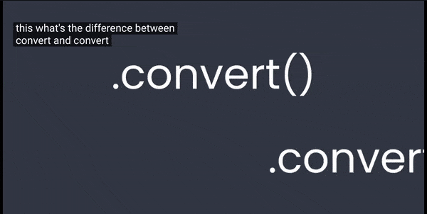

## 🟡 `convert()` &   `convert_alpha()`

<br>

###   🫐 When Importing an Image, you want to `convert` it to a format that PYgame can work more easily

<br>

- -  if the image has **no transparent** pixels: `.convert()`

- -  if the image **has transparent** pixels: `.convert_alpha()` , this will make your game run much faster.


<br>

### 🧶 Optimizing Image Import for Pygame


#### 🟠 When importing images into Pygame, converting them to a suitable format can significantly enhance performance. Here's how to handle different types of images:

<br>

##  `convert()`

🔸 **For images without transparency:**

- -  Use the `.convert()` **method**.

- - - This will optimize the image's color format for faster rendering, as it ✋ simplifies the image data without the need for transparency support.

<br>

### For example:

a simple `background image` or a `sprite` **with a solid color background.**

-  Use the `.convert()` method to optimize these images. This converts the image to a format that Pygame can quickly render because it doesn’t need to manage transparency.

```python
background = pygame.image.load('background.png').convert()
```
 <br>
 <br>

 - check the video by 🌟  [**Code with Russ**](https://youtu.be/z_tLkRMw-2Y?si=saYnzZFNh6kgGWdZ)


 [](https://youtu.be/z_tLkRMw-2Y?si=saYnzZFNh6kgGWdZ)


<br>
<br>


## `convert_alpha()`

🔸 **For images with transparency:**

- -  Use the `.convert_alpha()` **method**.

- - - This method **preserves the transparency info**rmation and **converts** the **image** into a **format** that **maintains** the `alpha channel`, ✋ **ensuring both quality and performance**.


<br>


### For example,


- `a character` **sprite** with a `transparent background` **or a UI icon** with **see-through areas**.

- - **Use** the `.convert_alpha()` **method for these images**.

- - - This method preserves the transparency of the image, ensuring that the alpha channel (which controls transparency) is maintained for accurate rendering.

