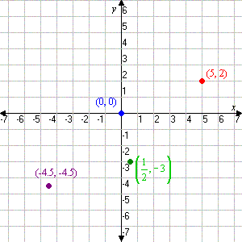
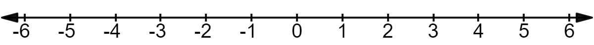
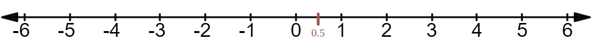
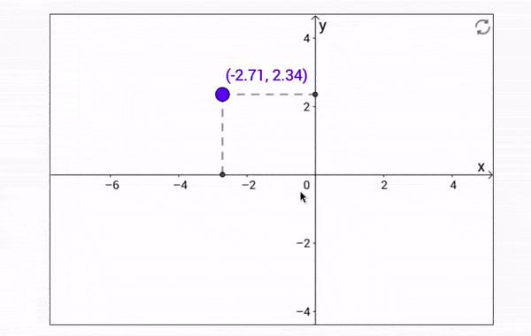

# 🟡 Cartesian coordinate system

#### In geometry, a Cartesian coordinate system in a plane is a coordinate system that specifies each point uniquely by a pair of real numbers called coordinates

 

- - Which are the **signed distances** to the **point from two fixed perpendicular oriented lines**, called coordinate lines, coordinate axes or just axes (plural of axis) of the system.

> #### The *point* where they *meet* is called the origin and has (0, 0) as coordinates.

  

 

 

 

## 🟧 Negative & Positive

- **Negative** nums on the **left** (infinite) & **Positive** nums on the **right** (infinite)

 

 

 

 

 

## 🟠  (integers)

- **Don't forget** that you can have **(numbers) between** the **integers**.

>you don't see it in the cartesian img below(but **i retouched it and added** the **0.5** just to give an example)

 

 

- check this: [style your cartesian](https://www.oliverboorman.biz/projects/tools/cartesian_grid.php)

