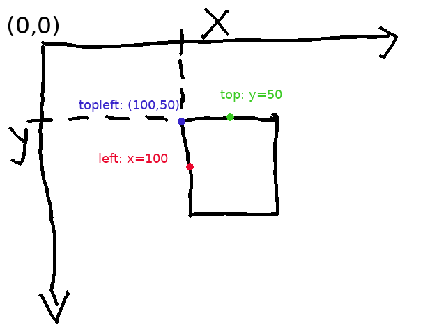

## 🟠 Rects & Frects


<br>

### Sources:

https://www.pygame.org/docs/ref/surface.html

https://www.pygame.org/docs/ref/rect.html


<br>
<br>


## 🟦 In this section:

### What is the Difference between Rects & Frects

-  In Pygame, `Rect and frect (or FRect)` are **both used to represent rectangular areas**, but **they differ** mainly in the type of **precision** they **use for their coordinates and dimensions**:


<br>

## 🟠  Differences

<br>

🔴 **Precision:** `Rect uses integer` values(20), while `FRect uses floating-point` values(20.5).

<br>


**Use Case:** Use `Rect` for most general purposes where integer precision is adequate, and `FRect` when you need finer control over positioning and dimensions that require floating-point precision.


#### It is ideal for pixel-perfect positioning and size definitions.

### `frect`

In Pygame, the frect type is part of the `pygame.freetype` module and is used in scenarios where you are working with text rendering and need sub-pixel accuracy. **For typical rectangle operations in Pygame, the Rect class is commonly used**.


**Example:**


```python
# ✋ rect
import pygame
rect = pygame.Rect(10, 20, 30, 40)

#
# ✋ FRECT (great precision: 30.5)
import pygame.freetype
frect = pygame.freetype.FRect(10.5, 20.5, 30.5, 40.5)
```

<br>

> - - 🔴
it doesn't make sense to keep Rect with integers, it will be deprecated once FRect is released in 2.1.4. [Frect OR RECT](https://github.com/pygame/pygame/issues/3643)


<br>
<br>
<br>

### 🟣 QUESTION: Is `Frect` standard or commonly used in `Pygame` or related libraries?

<br>

#### ✅ chatgpt:

In Pygame, `Frect` (or frect) is **less commonly used compared** to `Rect`, **and it is not a standard** part **of** the core **Pygame library**.

> - - - ##### As of my last update, Pygame itself does not include an FRect class by default.

<br>

> #### However, the concept of floating-point rectangles is supported through certain extensions or external libraries, or you might use custom implementations. For example:

<br>

### 🟧 Pygame and Floating-Point Rectangles:

<br>

- - 🔴 The standard **Pygame** library **does not include a built-in** `Frect` **class** <u>for floating-point rectangles</u> .

<br>

- - If you need floating-point precision for rectangles, you might have to use or create **custom classes or rely on external libraries.
Third-Party Libraries:**

<br>

- - - Some third-party libraries or extensions might provide an FRect class or similar functionality.

<br>

### `pygame.freetype`

-  One such library is `pygame.freetype` **for text rendering**, which **uses floating-point precision** for certain **operations**, but it does not provide a general FRect class.

<br>
<br>
<br>

## 🟠 Rects

https://www.pygame.org/docs/ref/rect.html

<br>

#### In Pygame, a Rect is like a `nice 🧸 box` that helps us keep track of rectangular areas.

- - ✋ You can make a Rect by choosing where the box starts (its left side and top) and how big it is (its width and height).

<br>

> - -  #### 🔴 Placing surfaces is kind of messy

-  - -  Since we always place the top-left , it requires math to place it in a precise spot


<br>
<br>

### 🟠  Things You Can Do with `Rects`:

<br>
<br>

🟤 **Position Surfaces Precisely:** Use Rects to place images or shapes exactly where you want them on the screen.

- **WIDTH & HEIGHT:** Create a rectangle that is 20 pixels wide and 30 pixels tall

- **POSITION on the screen:** and place it at the position (100, 50) on the screen

<br>

```python

myRect = pygame.Rect(100, 50, 20, 30)

```
<br>

[](https://sigon.gitlab.io/post/2018-10-10-pygame-rect/)

> Source [Pygame Rect Object, a basic guide](https://sigon.gitlab.io/post/2018-10-10-pygame-rect/)

<br>
<br>

🟤 **Detect Collisions:** Check if two objects are touching or overlapping, which is useful for games and interactive applications.

<br>

 - - #### `.colliderect()` method:

- - is a useful function in Pygame for detecting collisions between rectangular areas. It's part of the pygame.Rect class, which is used to handle rectangular regions for positioning and collision detection.

<br>

```python
    # Check if the character is inside the play area
    if not play_area.colliderect(character):
        # Print message if the character is outside the play area
        print("The character is outside the play area!: 🟨")

        # Move the character back inside
        if character.left < play_area.left:
            character.left = play_area.left
```
<br>

 - **Purpose:** The `.colliderect()` method checks if two pygame.Rect objects overlap or intersect with each other.

