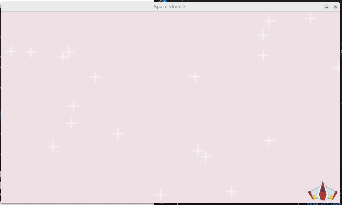
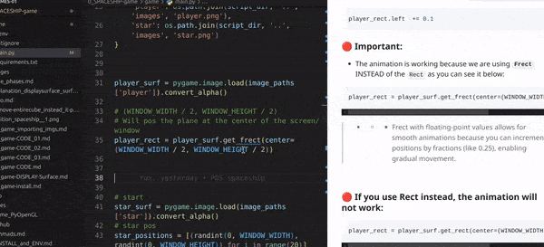

#  🟡 `Frect` Position


<br>


### 🟦 Rectangle: use `Frect`

#### To position it in specific places we will use the `frect` instead of rect (you will see later on why).


> - - #### 🟠 REMEMBER the Differences between rect & frect:

>**Rect** `uses integer` values(**20**), <u>while</u> **FRect**  uses` floating-point` values(**20.5**).

<br>


<br>
<br>


## 🟡 Create a square/rect to use for this example:

- To understand this section, I will start with a basic cube, later on i will continue with the plane


<br>

**1.** **create** a **new variable**, call it:

`kop`

>Assign it the:`pygame.Surface` to the variable

**2.**  **kop** is a small cube/square 🟧

`kop = pygame.Surface((50, 50))`

**3.** **Add** some color to **kop**

`kop.fill("orange")`

<br>

**4.** Before positioning where the square will be, this is what we have:

```python
kop = pygame.Surface((50, 50))
kop.fill("orange")
```


### a) 🟤 Positioning:

**5.** we will position it at the **center point** of the **CUBE**  (which give us the center of the cube, not the window).

>its a position **within**

```python
# ✋ the kop_rect variable, is taking the info of the cube(measurements & and color, to then create something new)
kop_rect = kop.get_frect(center=())
```

<br>

[](  )
<br>

> - - #### Look at 🔴 the center  <u>blue dot</u>, this is the `center =` i am talking about.
> - - - this center can be changed to topleft, bottomright etc ... (check the options below)


<br>
<br>

### If you imagine a rectangle on the "screen" (the cube is inside the screen window):

 - - you can move a `central` **point** to different positions around it, but once you move it, it no longer be the `center =` but whatever you chose in the cube, like `topleft =` or `midleft =` etc.

 - - - For example, if you move the center dot of the rectangle to the "topleft" position, it will be placed at the top-left corner of the rectangle.

#### 🟤 The image below shows all the available position options for the rectangle:

- Here you can see the all the options

[](https://youtu.be/8OMghdHP-zs?si=wGX83WQl1sMWU8ra&t=2674/)

<br>
<br>

### a) 🟤 Positioning:

**6.** Now lets add the position in the coordinate, we need 2 arguments here **x and y:** like so `(0, 30))`, 0 means that we will pos the cube at 0 position on the window, as you can see, the cube is showing only the half of its surface, and its because we specified the **center**

```python
kop_rect = kop.get_frect(center=(0, 30))
```

- The value 30 represents the y-coordinate, which means the center of the rectangle is positioned 30 pixels down from the top of the screen.

### 🟤 which give us the below


[]( )

<br>

 ```python
kop = pygame.Surface((50, 50))
kop.fill("orange")
kop_rect = kop.get_frect(center=(0, 30))
 ```

 <br>

### 🔴 Not Moving the Entire Cube:

- - This does not mean that the entire object (or cube) is being moved to (0,0).

> - - - #### 🌈 Instead, it means that the position of the rectangle's center is set to (0,0).

 - - #### The overall object’s position is still relative to where it was before; only its internal alignment within the parent or coordinate system is adjusted so that its center is at the specified point.

<br>
<br>

## 🟡 Other Options

```python
# Create a rectangle with different positioning options
center_rect = player_surf.get_rect(center=(100, 100))
topleft_rect = player_surf.get_rect(topleft=(50, 50))
topright_rect = player_surf.get_rect(topright=(200, 50))
bottomleft_rect = player_surf.get_rect(bottomleft=(50, 200))
bottomright_rect = player_surf.get_rect(bottomright=(200, 200))
midtop_rect = player_surf.get_rect(midtop=(100, 30))
midbottom_rect = player_surf.get_rect(midbottom=(100, 200))
midleft_rect = player_surf.get_rect(midleft=(30, 100))
midright_rect = player_surf.get_rect(midright=(200, 100))
```


<br>
<br>


## 🟦 Play with the above table

## 🟤 `topleft & topright`

- notice the behavior of the cube using the same positioning but using a different property (example: topleft)

```python
kop_rect = kop.get_frect(topleft=(0, 120))
# or
kop_rect = kop.get_frect(topright=(0, 120))
```

https://github.com/user-attachments/assets/1e85ca4d-91b9-4814-89c5-a8eed17cae3f


<br>
<br>

## 🟤 `midbottom & midtop`

- change the values accordingly

```python
# change the values accordingly
kop_rect = kop.get_frect(midbottom=(40, 30))
kop_rect = kop.get_frect(midtop=(40, 30))
```


https://github.com/user-attachments/assets/a3150afc-dfb7-4074-85ca-e63fc8838d3d


<br>
<br>

### 🌈 the code

```python


import pygame
import os
from random import randint


pygame.init()
script_dir = os.path.dirname(__file__)


WINDOW_WIDTH, WINDOW_HEIGHT = 1280, 720
display_surface = pygame.display.set_mode((WINDOW_WIDTH, WINDOW_HEIGHT))
pygame.display.set_caption("Space shooter")


#while loop related
running = True
surf = pygame.Surface((100,200))
# animation related
x = 100

# img's path
image_paths = {
    'player': os.path.join(script_dir, '..', 'images', 'player.png'),
    'star': os.path.join(script_dir, '..', 'images', 'star.png')
}

# ----- 🌈 the cube example ------
kop = pygame.Surface((50, 50))
kop.fill("orange")
# 🟠 Observe the behavior of the topleft and topright with the same value, 0 for the X axis, 120 Y axis , check the videos

kop_rect = kop.get_frect(center=(0, 30))
# -------------------

player_surf = pygame.image.load(image_paths['player']).convert_alpha()

# (WINDOW_WIDTH / 2, WINDOW_HEIGHT / 2)
# Will pos the plane at the center of the screen/window
player_rect = player_surf.get_frect(center=(WINDOW_WIDTH / 2, WINDOW_HEIGHT / 2))


# start
star_surf = pygame.image.load(image_paths['star']).convert_alpha()
# star pos
star_positions = [(randint(0, WINDOW_WIDTH), randint(0, WINDOW_HEIGHT)) for i in range(20)]


while running:
    for event in pygame.event.get():
       if event.type == pygame.QUIT:
            running = False


 # FILL the window with a red color
 # player = pygame.Rect((300, 250, 50, 50))
 # https://pyga.me/docs/ref/pygame.html

 # 7 --- DRAW the game ----
 # list of colors: https://pyga.me/docs/ref/color_list.html
    display_surface.fill("lavenderblush2")


    # ----- 🌈 the cube example ------
    # has nothing to do with the project
    display_surface.blit(kop, kop_rect )
    #------------------

    for pos in star_positions:
        display_surface.blit(star_surf, pos)

    # x += 0.1

    display_surface.blit(player_surf, player_rect)
    pygame.display.update()


pygame.quit()
```
<br>
<br>


## 🟦 Position the plane in the middle

- You can manually calculate the center of the window by dividing the width and height by 2:


```python
WINDOW_WIDTH, WINDOW_HEIGHT = 1280, 720
# Center X-coordinate: 1280 / 2 = 640
# Center Y-coordinate: 720 / 2 = 360
```

### And then implementing it here:

```python
# before
player_rect = player_surf.get_frect(center=(0,0))

# after
player_rect = player_surf.get_frect(center=(1280 / 2, 640 / 2))
```
<br>


https://github.com/user-attachments/assets/62429f35-074b-457a-b238-e2a2656d422f

<br>

## 🟠 A Better Approach


 **Instead of hardcoding** the **center coor**dinates, **use the window dimensions** directly.

 > - -  #### 🟤 This ensures that if you resize the window, the position of your plane will remain centered without additional adjustments.


```python
# (WINDOW_WIDTH / 2, WINDOW_HEIGHT / 2)
# Will pos the plane at the center of the screen/window
player_rect = player_surf.get_frect(center=(WINDOW_WIDTH / 2, WINDOW_HEIGHT / 2))
```

https://github.com/user-attachments/assets/62429f35-074b-457a-b238-e2a2656d422f


<br>
<br>

### 🟣 QUESTION: so the `center =` or `topleft` etc... is similar to the `camera.lookAt(new THREE.Vector3(0, 0, 0));` in threejs

#### ✅ chatgpt:

 **Yes, in a way**, setting the center in Pygame is conceptually **similar to** using **`camera.lookAt(new THREE.Vector3(0, 0, 0));`** **in Three.js**.

 <br>

- - 🌈 **Both determine how an object is positioned or oriented relative to the scene**.

<br>

[min: 2:14 | ThreeJS - camera.lookAt VS OrbitControls](https://youtu.be/PcHW02QA5d4?si=TlCN5I8430t9jHjj)

https://github.com/user-attachments/assets/328f60ea-967d-42c5-bc0e-2cfbeddcdd63


<br>

## 🟤 Here’s a comparison to clarify:

<br>

### 🟦  Pygame's center Argument


- - **Example:**

- -  `kop.get_frect(center=(0, 30))`

- - #### Purpose:

- -  This sets the center of the rectangle to the coordinates `(0, 30)`.

- - It **defines where the center** of the **rectangle** should be positioned on the screen.


<br>


### 🟧 Three.js's `camera.lookAt()`

- - **Example:**

 `camera.lookAt(new THREE.Vector3(0, 0, 0));`

- - #### Purpose:

- - This method orients the camera to **look at** the `point (0, 0, 0)` in the 3D space.

-  - It determines which part of the scene is visible through the camera.

<br>
<br>

## 🟢 Similarities

**Positioning:** Both involve specifying a position or point of interest. In Pygame, it’s where a 2D object (like a rectangle) is centered. In Three.js, it’s where the camera is directed.


**Coordinate System:** Both use coordinate systems to define positions.

- Pygame uses 2D coordinates (x, y), while Three.js uses 3D coordinates (x, y, z).

<br>

## 🟢 Differences

**Context:** In Pygame, setting the center affects the position of 2D shapes on the screen.

- - In Three.js, lookAt affects the camera’s view direction in a 3D environment.


**Impact:** Changing the center moves the object relative to the screen or window.

- - Changing the `lookAt` alters the camera's viewpoint, which affects the perspective and composition of the 3D scene.

> #### 📌 So, while they are used in different contexts and for different purposes, both concepts are about positioning or orienting elements relative to some reference point


<br>
<br>
<br>

---

<br>


## 🟡 PADDING:

### What if I want the plane to be positioned at the bottom right of the screen instead of the center?


**Padding:**

- -  **Add** space between the plane and the edges of the screen to prevent it from being too close to the screen limits.

<br>
<br>

### 🟤 Replace this:

- Because i no longer want it to be positioned at the **center center** of the **screen/window**  **`/ 2`**


```python
player_rect = player_surf.get_frect(center=(WINDOW_WIDTH / 2, WINDOW_HEIGHT / 2))
```
<br>

### 🟤 Add the padding

- 10px from the

```python
player_rect = player_surf.get_frect(bottomright=(WINDOW_WIDTH -10, WINDOW_HEIGHT -10))
```
<br>


[](  )

<br>

### 🟤 Another Example:

```python
player_rect = player_surf.get_frect(bottomright=(WINDOW_WIDTH -10, WINDOW_HEIGHT -320))
```

[](  )

<br>
<br>

<br>

### Lets bring it back to the center

```python
player_rect = player_surf.get_frect(center=(WINDOW_WIDTH / 2, WINDOW_HEIGHT / 2))
```

<br>
<br>

## 🟠 Updating individual points of the rectangle


#### 🔴 Remember: Inside of the rectangle, we have Tuples and integers

[](https://youtu.be/8OMghdHP-zs?si=9bnV1doH88xy5ZMK&t=3007)

<br>
<br>

## Positioning the rect to the left

- 🔴 Knowing that our plane rect is positioned already at the center center **(x,y)** of the **screen/window**, we can position it again based on this  ` / 2` positioning

<br>

 #### 🟢 1. center center of the screen

```python
player_rect = player_surf.get_frect(center=(WINDOW_WIDTH / 2, WINDOW_HEIGHT / 2))
 ```

<br>

 #### 🟢 2. add a value more to the step 1. from above

 - Grab the `player_rect` variable containing the **center center** positioning `(center=(WINDOW_WIDTH / 2, WINDOW_HEIGHT / 2))`

 <br>

 - Use it it within the WHILE  loop, and add it a value, once you add a value you know that its going to be on the **X axis**

```python
player_rect.left = 100
```

<br>
<br>
<br>

# 🟡 Animation

### To make the plane  <u>go from one side the other</u>

<br>

- within the while loop, replace this: `player_rect.left = 100` with the below:

```python
player_rect.left  += 0.1
```

<br>

### 🟤 Notice how the `plane ✈️`  starts from the <u>center center</u>  of the screen

[]( )


<br>
<br>
<br>

# 🔴 Important:

- The animation is working because we are using **`Frect`** INSTEAD of the `Rect`

## `frect`

```python
player_rect = player_surf.get_frect(center=(WINDOW_WIDTH / 2, WINDOW_HEIGHT / 2))
```

> - - -  **Frect** with floating-point values allows for smooth animations because you can increment positions by fractions (like 0.25), enabling gradual movement.

<br>


[]( )


<br>

### 🔴 If you use `Rect` instead, the animation will not work:

## `rect`

```python
player_rect = player_surf.get_rect(center=(WINDOW_WIDTH / 2, WINDOW_HEIGHT / 2))
```

> - - -  **Rect** **does not support** such fine-grained control, making animations less smooth when only whole numbers are used.

<br>

[]( )

<br>

### 🟠 But What happens if you remove the `0` from the `0.01` of this line: `player_rect.left  += 0.1`

[]( )

<br>
<br>

## 🌈 Why This Happens:


- `Frect` allows for floating-point values (like `0.25`), which lets you animate the rectangle smoothly.

> - - ####  `Rect` only works with whole numbers and does not support smooth animations.

### 🟦 Threejs Similarities:

```javascript
object.position.x += 0.1; // Smooth movement
```
<br>

#### 🟧 Both systems (PYGAME &Threjs) rely on floating-point precision to enable smooth animations and precise transformations, albeit in different contexts and implementations.
