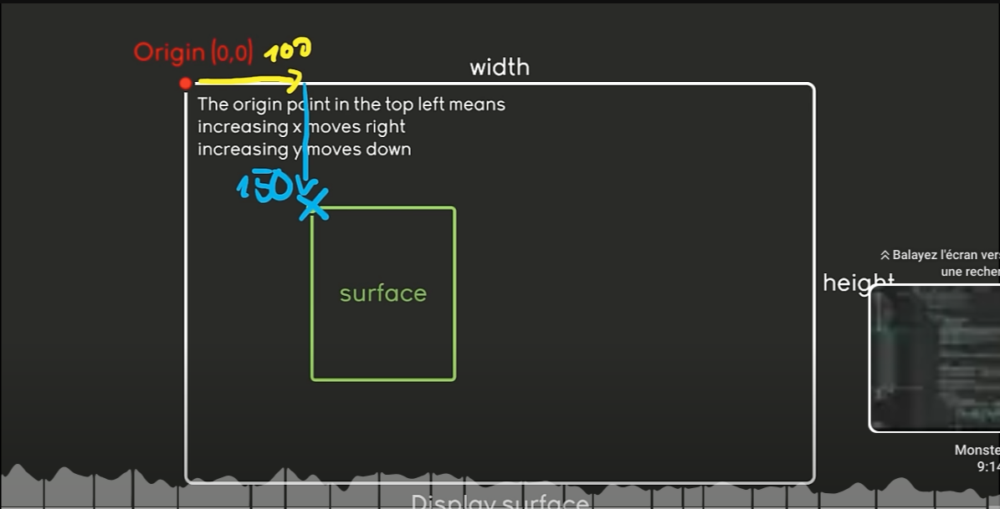

## 🧶 Sections

<br>
<br>

### 🟡 Scene

- `update()` : [Go to section](#update_)

-  `flip()`: [Go to section](#update_)


-  `surface()`: [Go to section](#surface_)

- -  `surface.fill(())`

-   `display()`: [Go to section](#display_)

<br>

### 🟡 Blit | Animation | load img's

<br>

- Animation:  [Go to section](#anim1_)

- Create a Surface shape: [Go to section](#anotherSurface_)


- - `Blit()`: [Go to section](#blit_)

> - - - Blit() is a fancy way of saying <u>You want to put ONE surface on ANOTHER surface</u>


- Load Image: [Go to section](#load_img_)


<br>

---


<br>
<br>


## 🟦 Phase 1


## 🟠 Import and Init

```python

import pygame  # Import the Pygame library, which provides functionalities for game development and multimedia applications.

# ---- general setup ----

# Initialize Pygame modules and settings
pygame.init()  # Initialize all imported Pygame modules. This must be called before using other Pygame functions.
```
<br>
<br>

### 🟦 The following should be added at the top and bottom of the file

```python
# init/start
pygame.init()

# end
pygame.quit()
# the pygame,quit() should always be placed after the loop
```

<br>
<br>
<br>

## 🟠 Create the window

- Its a bit similar to threejs [3d-waving-flag-threejs](https://github.com/nadiamariduena/3d-waving-flag-threejs)


```python
# Define the dimensions for the window
WINDOW_WIDTH, WINDOW_HEIGHT = 1280, 720  # Set the width and height of the window. These values define the resolution of the display surface.

# Create a display surface with the specified dimensions
display_surface = pygame.display.set_mode((WINDOW_WIDTH, WINDOW_HEIGHT))  # Create a window or screen for display with the specified width and height. This surface is where you'll draw your game graphics and handle user interactions.
```

<br>
<br>

## 🟠 Implement the Loop

- -  Compare the below codes (both):

- - - The code below is from a previous project

[https://github.com/nadiamariduena/python-intro-2024-privat/blob/master/LESSON_5_loops/loop_rain/intro_pygame.py](https://github.com/nadiamariduena/python-intro-2024-privat/blob/master/LESSON_5_loops/loop_rain/intro_pygame.py)


```python
import pygame

pygame.init()

# Define the dimensions for the window
WINDOW_WIDTH, WINDOW_HEIGHT = 1280, 720

display_surface = pygame.display.set_mode((WINDOW_WIDTH, WINDOW_HEIGHT))

# ✋
running = True

# ✋
while running:
#------------- GAME LOOP
# 6 WHILE 'run' is TRUE ':' execute all the code below
   for event in pygame.event.get():
       if event.type == pygame.QUIT:
           running = False

```

<br>
<br>


 <a name="update_"></a>


## 🟠 UPDATE <u>the scene/ game</u>

#### `pygame.display.update()` and `pygame.display.flip()

<br>

 The teacher on the tutorial says that **they are the same**, `but` **they are not**. [read more: update_and_flip_diff](../update_and_flip_diff_.md)

<br>

- - In Pygame, both `pygame.display.update()` and `pygame.display.flip()` are **used** to **update** the contents of the display, **but** they have **different use cases and behaviors**.

<br>

```python
# ✋
pygame.display.update()
# ✋
pygame.quit()
```

<br>
<br>


 <a name="surface_"></a>

## 🟦 Draw: `Display`, `Surface`, `Fill`

<br>

### Read the documentation

<br>

 https://pyga.me/docs/ref/surface.html#pygame.Surface.fill

 https://pyga.me/docs/ref/draw.html


<br>

🔶 I will be using the **display** & the `surface`

- - https://pyga.me/docs/ref/display.html

- - https://pyga.me/docs/ref/surface.html


<br>

### 🟣 QUESTION:  to draw something using pygame, do you need first the `display` and then the `surface`, why?

<br>

#### ✅ chatgpt:

-  When using Pygame to draw graphics, the process involves working with both the display and surfaces.

<br>

### 🟡 Display surface vs surface

 - The **display surface** is the main surface that we draw **on**, and there can only be one and its always visible.

 - A regular **surface** is an image of some kind, **you can have any number** but they are 🔴 **only visible when attached to the `display surface`**.

 #### 🍦 Other than that, they share some attributes and methods.


<br><br>

  <a name="display_"></a>

<br>


### 🟠 1. Display

https://pyga.me/docs/ref/display.html

The **display** <u>in Pygame</u>  **is** the **main window or screen** <u>where</u>  **your game** or graphical application **will be shown**.


**Creation:** You create the display using `pygame.display.set_mode()`.


```python
import pygame

pygame.init()
screen = pygame.display.set_mode((800, 600))  # Create a display surface with size 800x600
```

<br>
<br>


 <a name="surface_"></a>

## 🟠 2. <u>Surface</u>  / new shape

https://pyga.me/docs/ref/surface.html


<br>

**A surface in Pygame** is a **2D array of pixels** that **represents** an **image** or a **portion** of the **screen.**


```python
# SIZE of the shape
my_surface = pygame.Surface((100, 100))  # Create an off-screen surface of size 100x100
```
- - ###  Adding color to the new shape:

#### Examples:

- 🟤 Fill a surface with a color:

```python
surface.fill((255, 0, 0))  # Fills the surface with red
```

<br>
<br>

```python
import pygame


pygame.init()


WINDOW_WIDTH, WINDOW_HEIGHT = 1280, 720

display_surface = pygame.display.set_mode((WINDOW_WIDTH, WINDOW_HEIGHT))

running = True

while running:

    for event in pygame.event.get():
        if event.type == pygame.QUIT:
            running = False


    pygame.display.update()


pygame.quit()
```

- 🟤 Run the code: it should be black

<br>
<br>

## 🟠 `surface.fill`

### Change the BG

Colors in Pygame are typically managed using **RGB** values, where each color is represented by a combination of **Red, Green, and Blue** components. Here’s a detailed overview:

#### READ MORE [color_fill](../color_fill_.md)


### 🌈 All colors

https://pyga.me/docs/ref/color_list.html

<br>

```python
import pygame


pygame.init()


WINDOW_WIDTH, WINDOW_HEIGHT = 1280, 720


# ✋
display_surface = pygame.display.set_mode((WINDOW_WIDTH, WINDOW_HEIGHT))

running = True

while running:

    for event in pygame.event.get():
        if event.type == pygame.QUIT:
            running = False

    # ✋
    display_surface.fill("lavenderblush2")


    pygame.display.update()


pygame.quit()
```


<br>


<br>
<br>

# 🟦 Phase 2

## 🟠 Displaying Graphics

<br>

### 🟤 CREATE another `SURFACE` 🕺

 - this surface will be like the 🔫 **shooter**(can be anything you want)

 - - Create the `surf` variable, add some a width and height

 - - Add some color with `Fill`

 ```python
#10 create a surface
# w:100 px & h: 200px
surf = pygame.Surface((100,200))
# surf for surface
# COLOR of the shape
surf.fill('orange')
```

### 🟤 Use it within the WHILE loop

```python
    display_surface.blit(surf, (100,150))
```
<br>
<br>


 <a name="blit_"></a>

## 🟦 `Blit()` (Block Image Transfer)

- The `Blit()` is a fancy way of saying **You want to put ONE surface on ANOTHER surface**

####  1. This method *Blit*, will have `2` arguments, first one is *surface* i just create `surf` from here below

```python
#10 create a surface
# w:100 px & h: 200px
surf = pygame.Surface((100,200))
# surf for surface
```

2. The second argument can be a tuple with the `(x, y)` **position**, it can also be a rectangle, but we will check this later on

<br>

#### like so

```python
# args = arguments
#  display_surface.blit(1args, (2args))
 display_surface.blit(surf, (x,y))
```


<br>

```python
import pygame


pygame.init()


WINDOW_WIDTH, WINDOW_HEIGHT = 1280, 720

display_surface = pygame.display.set_mode((WINDOW_WIDTH, WINDOW_HEIGHT))

running = True

# ✋ shape size
# w, h
surf = pygame.Surface((100,200))
# ✋ shape color
surf.fill('orange')

while running:

    for event in pygame.event.get():
        if event.type == pygame.QUIT:
            running = False

    display_surface.fill("lavenderblush2")
    # ✋ position of the shape on the window/scene
    display_surface.blit(surf, (100,150))


    pygame.display.update()


pygame.quit()
```

https://github.com/user-attachments/assets/fc8424c8-5034-4c99-9d66-b031ad5c6178


<br>

### REMEMBER: 🔴 one set of numeric values defines the <u>size of the surface</u>  and the <u>other set defines its position on the canvas</u>   where it will be drawn?


<br>

<br>

-  As you can see it on the image, **100** from the **X axis** and **150** from the **Y axis**

[](https://youtu.be/8OMghdHP-zs?si=grSlvwZx4hcMnnxq&t=1451)


<br>


<br>
<br>
<br>

<a name="anim1_"></a>

## 🧶 Animate

<br>
<br>

## 🟠 New variable

**Define a Variable for Position:**

- - Start by **creating** a **variable** to **hold the position** of the **shape** on the `x-axis`.

#### For instance:

```python
x = 100
#This variable x represents the horizontal position of your shape.
```


<br>
<br>

### Why `x` ?

To animate a shape or surface in a graphical program, you need to `update` its **position over time**.

- - This involves **adjusting a numeric value in a variable**, which **controls where** the **shape is drawn** on **the screen**.

```python
# before
(surf, (100,150))

# after
x = 100
# x, y axis
display_surface.blit(surf, (x, 150))
```
<br>
<br>


## 🟠 Update Position for Animation:

- - In your animation loop, you need to continuously change the value of `x` to move the shape. The line: `x += 0.1`

<br>

>means **you are increasing** the **value of x by 0.1 each time the loop runs.**

- - This creates a smooth movement as the shape gradually moves to the right.

<br>


```python
# ✋
x = 100

while running:

    for event in pygame.event.get():
        if event.type == pygame.QUIT:
            running = False

    display_surface.fill("lavenderblush2")
    # ✋ anim
    x += 0.1
    display_surface.blit(surf, (x,150))

    pygame.display.update()
pygame.quit()
```

### Output


https://github.com/user-attachments/assets/e5a1fcd9-5d8d-469c-9cd9-2eb91cc17b97

<br>
<br>

### 🟦 Once you have the animation, if you hide this line below, you will have another effect

```python
 # 7 --- DRAW the game ----
 # list of colors: https://pyga.me/docs/ref/color_list.html

display_surface.fill("lavenderblush2")
```


https://github.com/user-attachments/assets/d44a274c-2a16-48ef-91b5-51cfbabba6ed


<br>
<br>
<br>

<a name="load_img_"></a>


## 🟡 Load an image

```python
#13 IMporting img
player_surf = pygame.image.load('../images/player.png')
```

<br>

> We have successfully `Blited` the **surf** for the **player_surf**

https://github.com/user-attachments/assets/c3db1e6e-3cd4-41c6-9105-34964df50eab

<br>
<br>
<br>


## 🟠 To consider

### 🟤 File PATH


- - The **file path** can become a problem depending on the code editor
**VS code** starts a relative path from the main directory

> - -  🌈 DEPENDING ont the operating system you might need a different slash in the **file path** , example:

`images/player.png` or `../images/player.png`


<br>

### 🟤 To see the image

- replace

```python
# this
# surf is the squared/cuboid shape
display_surface.blit(surf, (x,150))

# for this
display_surface.blit(player_surf, (x,150))
```

<br>

> We have successfully `Blited` the **surf** for the **player_surf**

https://github.com/user-attachments/assets/c3db1e6e-3cd4-41c6-9105-34964df50eab


<br>
<br>

```python

import pygame

pygame.init()

WINDOW_WIDTH, WINDOW_HEIGHT = 1280, 720

display_surface = pygame.display.set_mode((WINDOW_WIDTH, WINDOW_HEIGHT))

pygame.display.set_caption("Space shooter")

running = True

surf = pygame.Surface((100,200))

surf.fill('orange')

x = 100

# ✋
player_surf = pygame.image.load('../images/player.png')


while running:
    for event in pygame.event.get():
       if event.type == pygame.QUIT:
            running = False


    display_surface.fill("lavenderblush2")
    x += 0.1
    # ✋
    display_surface.blit(player_surf, (x,150))

    pygame.display.update()


pygame.quit()
```


<br>
<br>
<br>

## 🟡 `Join()` / path

<br>

- `os.path.join()` **method** is used to **concatenate** directory and file names into a single path.
