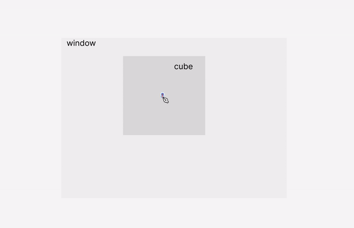
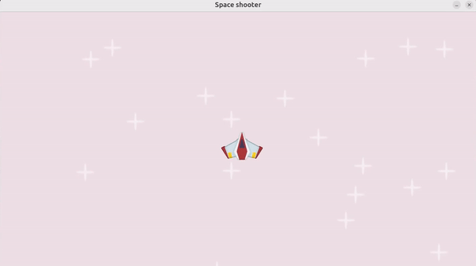

# 🟡 Phase 3

## 🟠 Rects & Frects


- -  Read More [a__about_rects](../a__about_rects.md)

- - - Read More [rect Position & animation](../a__about_rects_1_POS.md)

<br>

### What is the Difference between Rects & Frects

-  In Pygame, `Rect and frect (or FRect)` are **both used to represent rectangular areas**, but **they differ** mainly in the type of **precision** they **use for their coordinates and dimensions:**

<br>

## `rect` & `frect`

### ⚫  Differences

🔴 **Precision:** `Rect uses integer` values(20), while `FRect uses floating-point` values(20.5).


```python
# ✋ rect
import pygame
rect = pygame.Rect(10, 20, 30, 40)

#
# ✋ FRECT (great precision: 30.5)
import pygame.freetype
frect = pygame.freetype.FRect(10.5, 20.5, 30.5, 40.5)
```

<br>

> - - 🔴
it doesn't make sense to keep Rect with integers, it will be deprecated once FRect is released in 2.1.4. [Frect OR RECT](https://github.com/pygame/pygame/issues/3643)


<br>
<br>


## 🟠 About  Rect's

In Pygame, Rect objects represent rectangles with defined size and position.

- - They include a variety of **points** ⚫, such as **tuples with X and Y coordinates**.

- - - Additionally, Rect objects have properties for width, height, and overall size.

<br>

**Read More:** exercises and ways you can use the rect (collision example) [a__about_rects](../a__about_rects.md) , check the exercise below also there:

https://github.com/user-attachments/assets/3397c1ba-e011-49a0-a8c9-f9f915067076

<br>
<br>
<br>

### 🟤 In Pygame, Rect objects include several <u>key ⚫ points</u>  that help define their position and dimensions:


[](https://www.youtube.com/watch?v=8OMghdHP-zs&t=821s)


<br>

**Top-left corner:** The `(x, y)` position of the rectangle's top-left corner.

```python
rect = pygame.Rect(30, 40, 100, 80)

# This creates a rectangle with:
# ✋
# Top-left corner at (30, 40)
# Width of 100 pixels
# Height of 80 pixels
```

<br>

**Top-right corner:** The `(x + width, y)` position of the rectangle's top-right corner.

<br>

**Bottom-left corner:** The `(x, y + height)` position of the rectangle's bottom-left corner.

**Bottom-right corner:** The `(x + width, y + height)` position of the rectangle's bottom-right corner.

<br>
<br>


<br>
<br>
<br>
<br>

## 🟠 POS & Dimensions:

<br>


- **WIDTH & HEIGHT:** Create a rectangle that is 20 pixels wide and 30 pixels tall

- **POSITION on the screen:** and place it at the position (100, 50) on the screen

```python
myRect = pygame.Rect(100, 50, 20, 30)
```

[](https://sigon.gitlab.io/post/2018-10-10-pygame-rect/)

<br>
<br>
<br>

## 🟠 `surface.get_rect()` / `pygame.Rect`

<br>

### 🟪 QUESTION: Which of the following options is more commonly used in Pygame development?


<br>

#### ✅ chatgpt:

- -  `pygame.Rect` is the most widely used and  [canonical](https://canonical.com/) way to handle rectangles in Pygame.

- - `surface.get_rect()` is a standard and commonly used method in Pygame to **obtain the bounding rectangle of a surface**.

<br>

```python
# OPT 1
pygame.Rect(pos, size)
pygame.Frect(pos, size)


# OPT 2
surface.get_rect(point = pos)
surface.get_frect(point = pos)
```

**Therefore**, `Option 1` is the **more standard and widely used approach in Pygame.**

- - If you are working with traditional Pygame development and need rectangles, you’ll typically use pygame.Rect and surface.get_rect().


<br>
<br>

<br>
<br>

## 🟦 Back to the Tutorial


- Before continuing, this is what i have until now, in the next step i will remove the animation, and i will replace a couple of things, so to use the `get_frect()`


```python
#0
import pygame
#14
# from os.path import join
import os

# after you add the images within the loop, import the star and randomize it
from random import randint


# 1
pygame.init()


# 15 Get the directory of the current script
script_dir = os.path.dirname(__file__)


#2 --- window
WINDOW_WIDTH, WINDOW_HEIGHT = 1280, 720
#3
display_surface = pygame.display.set_mode((WINDOW_WIDTH, WINDOW_HEIGHT))
#------
# 9 change the window caption:
pygame.display.set_caption("Space shooter")
# change icon
# add an img to the project folder and insert it below
# pygame.display.set_icon('')


# 4 LOOP var
running = True


#10 create a surface
# w:100 px & h: 200px
# size of the shape
surf = pygame.Surface((100,200))
# # Add color to the shape/Surface
# surf.fill('orange')
# 11 anima
x = 100


#13 IMporting img
# player_surf = pygame.image.load(join('../images', 'player.png'))
# 16
# Build the path to the image file
# image_path = os.path.join(script_dir, '..', 'images', 'player.png')
# -----
# 19 import several images, so to not repeat the above line
# Dictionary of image paths
image_paths = {
    'player': os.path.join(script_dir, '..', 'images', 'player.png'),
    'star': os.path.join(script_dir, '..', 'images', 'star.png')
}

# 17 Load the image
# player_surf = pygame.image.load(image_path)
# 18 - convert
# player_surf = pygame.image.load(image_path).convert_alpha()
# 21
player_surf = pygame.image.load(image_paths['player']).convert_alpha()
star_surf = pygame.image.load(image_paths['star']).convert_alpha()

# 22
star_positions = [(randint(0, WINDOW_WIDTH), randint(0, WINDOW_HEIGHT)) for i in range(20)]


# 5 the Loop
while running:
    for event in pygame.event.get():
       if event.type == pygame.QUIT:
            running = False


 # FILL the window with a red color
 # player = pygame.Rect((300, 250, 50, 50))
 # https://pyga.me/docs/ref/pygame.html

 # 7 --- DRAW the game ----
 # list of colors: https://pyga.me/docs/ref/color_list.html
    display_surface.fill("lavenderblush2")

    for pos in star_positions:
        display_surface.blit(star_surf, pos)

    # 12 anima
    # CAREFUL with the identation, otherwise it wont work
    # means **you are increasing** the **value of x by 0.1 each time the loop runs.**
    x += 0.1
    # pos of the shape
    #  Position: Top-left corner at (100, 150) on the display surface
    # 20 Anim images ---
    display_surface.blit(player_surf, (x,150))

    # Anim images ---
    #`Blit()` is a fancy way of saying **You want to put ONE surface on ANOTHER surface**
    pygame.display.update()


# 6 EXIT
# - if you dont add the below, its not going to cause a problem but it will behave
pygame.quit()
```

<br>
<br>

### You have  a couple of options here, like for example:

```python
#1
player_rect = player_surf.get_frect(topleft = (0, 0))
#2
player_rect = player_surf.get_frect(center = (0, 0))
```

<br>

### 🟠 this position: `(0, 0)`,  would be the position on the display surface from here:


```python
display_surface = pygame.display.set_mode((WINDOW_WIDTH, WINDOW_HEIGHT))
```

<br>
<br>
<br>
<br>
<br>
<br>


### 🟦 But what if i wanted to position it at `top-left` or `middle` or `bottom-right` of the screen with also some padding in each side, like in the img below?

<br>

[](https://youtu.be/8OMghdHP-zs?si=04YfiUzL7Gt5JOsv&t=2845)


<br>
<br>

## 👾 Before start

- remove the animation: `x += 0.1`

<br>
<br>

## 🟦 Rectangle:  use `Frect`

### To position it in specific places we will use the `frect`

#### ⚫ [a__about_rects_1_POSITIONING](../a__about_rects_1_POS.md)

<br>


### 🟠 STEPS:

- Create a **new variable**, call it: **player_rect**

- We will place the **center point** of the `rectangle` at position `0,0` (which give us the top left of the window). Don't confuse this **center** with the position of the entire cube, its a position **within** on the cube

```python

player_rect = player_surf.get_frect(center = (0,0))

```

[](  )

> - - #### Look at: 🔴 the center blue dot, that is the center i am talking about, this center can be changed to topleft, bottomright etc (check the opstions below)

<br>
<br>

## 🟠 While LOOP:

- Within the `While loop` and then the `for loop` **remove** the hardcoded position

```python
# before
    display_surface.blit(player_surf, (x,150))

# after
    display_surface.blit(player_surf, player_rect)
```


## Test it

#### 🔴 err

- if you get this:

```python
pygame 2.6.0 (SDL 2.28.4, Python 3.7.14)
Hello from the pygame community. https://www.pygame.org/contribute.html
Traceback (most recent call last):
  File "main.py", line 28, in <module>
    player_rect = player_surf.get_frect(center = (0,0))
AttributeError:
'pygame.surface.Surface'
object has no attribute 'get_frect' 🔴
```

<br>

### 🌈 Check if your environment is activated

- `source .venv/bin/activate`

- once activated, run the `python main.py`


<br>

#### Output


https://github.com/user-attachments/assets/4b9ca2e0-7f5c-44bb-bf26-39299b9f186a

<br>

- 🌈 As you can notice, we can only see **half of the plane**, and that is because we specified it to be, at the **center point** `(center =` of the **rectangle**.

```python
player_rect = player_surf.get_frect(center = (0,0))
```

<br>
<br>


### 🟡 Options

```python
# Create a rectangle with different positioning options
center_rect = player_surf.get_rect(center=(100, 100))
topleft_rect = player_surf.get_rect(topleft=(50, 50))
topright_rect = player_surf.get_rect(topright=(200, 50))
bottomleft_rect = player_surf.get_rect(bottomleft=(50, 200))
bottomright_rect = player_surf.get_rect(bottomright=(200, 200))
midtop_rect = player_surf.get_rect(midtop=(100, 30))
midbottom_rect = player_surf.get_rect(midbottom=(100, 200))
midleft_rect = player_surf.get_rect(midleft=(30, 100))
midright_rect = player_surf.get_rect(midright=(200, 100))
```

<br>
<br>

```python

import pygame
import os
from random import randint


pygame.init()
script_dir = os.path.dirname(__file__)
WINDOW_WIDTH, WINDOW_HEIGHT = 1280, 720
display_surface = pygame.display.set_mode((WINDOW_WIDTH, WINDOW_HEIGHT))
pygame.display.set_caption("Space shooter")


#while loop related
running = True
surf = pygame.Surface((100,200))
# animation related
x = 100

# img's path
image_paths = {
    'player': os.path.join(script_dir, '..', 'images', 'player.png'),
    'star': os.path.join(script_dir, '..', 'images', 'star.png')
}


player_surf = pygame.image.load(image_paths['player']).convert_alpha()


# --------- just example ---------
# has nothing to do with the project
kop = pygame.Surface((50, 50))
kop.fill("orange")
# 🟠 Observe the behavior of the topleft and topright with the same value, 0 for the X axis, 120 Y axis , check the videos

kop_rect = kop.get_frect(topleft=(0, 30))
# --------------


player_rect = player_surf.get_frect(center=(0,0))


# start
star_surf = pygame.image.load(image_paths['star']).convert_alpha()
# star pos
star_positions = [(randint(0, WINDOW_WIDTH), randint(0, WINDOW_HEIGHT)) for i in range(20)]


while running:
    for event in pygame.event.get():
       if event.type == pygame.QUIT:
            running = False


 # FILL the window with a red color
 # player = pygame.Rect((300, 250, 50, 50))
 # https://pyga.me/docs/ref/pygame.html

 # 7 --- DRAW the game ----
 # list of colors: https://pyga.me/docs/ref/color_list.html
    display_surface.fill("lavenderblush2")


# --------- just example ---------
# has nothing to do with the project
    display_surface.blit(kop, kop_rect )
    #------------------

    for pos in star_positions:
        display_surface.blit(star_surf, pos)

    # x += 0.1

    display_surface.blit(player_surf, player_rect)
    pygame.display.update()


pygame.quit()
```

<br>
<br>
<br>

## 🟡 Position the plane `🛩️` in the middle of the screen/window

<br>

#### 🟫 option 1.

- 🟤 You can manually calculate the center of the window by dividing the width and height by 2:


```python
WINDOW_WIDTH, WINDOW_HEIGHT = 1280, 720
# Center X-coordinate: 1280 / 2 = 640
# Center Y-coordinate: 720 / 2 = 360
```

### And then implementing it here:

```python
# before
player_rect = player_surf.get_frect(center=(0,0))

# after
player_rect = player_surf.get_frect(center=(1280 / 2, 640 / 2))
```
<br>


https://github.com/user-attachments/assets/62429f35-074b-457a-b238-e2a2656d422f

<br>

#### 🟫 option 2.

## 🟠 A Better Approach


- **Instead of hardcoding** the **center coor**dinates, **use the window dimensions** directly.

 > - -  #### 🟤 This ensures that if you resize the window, the position of your plane will remain centered without additional adjustments.


```python
# (WINDOW_WIDTH / 2, WINDOW_HEIGHT / 2)
# Will pos the plane at the center of the screen/window
player_rect = player_surf.get_frect(center=(WINDOW_WIDTH / 2, WINDOW_HEIGHT / 2))
```

https://github.com/user-attachments/assets/62429f35-074b-457a-b238-e2a2656d422f

<br>
<br>
<br>

---

<br>


## 🟡 PADDING:

### What if I want the plane to be positioned at the bottom right of the screen instead of the center?


**Padding:**

- -  **Add** space between the plane and the edges of the screen to prevent it from being too close to the screen limits.

<br>
<br>

### 🟤 Replace this:

- Because i no longer want it to be positioned at the center center of the screen `/ 2`


```python
player_rect = player_surf.get_frect(center=(WINDOW_WIDTH / 2, WINDOW_HEIGHT / 2))
```
<br>

### 🟤 Add the padding

- 10px from the

```python
player_rect = player_surf.get_frect(bottomright=(WINDOW_WIDTH -10, WINDOW_HEIGHT -10))
```
<br>


[](  )

<br>

### 🟤 Another Example:

```python
player_rect = player_surf.get_frect(bottomright=(WINDOW_WIDTH -10, WINDOW_HEIGHT -320))
```

[](  )

<br>
<br>

<br>

### Lets bring it back to the center

```python
player_rect = player_surf.get_frect(center=(WINDOW_WIDTH / 2, WINDOW_HEIGHT / 2))
```

<br>
<br>

## 🟠 Updating individual points of the rectangle

[50:07](https://youtu.be/8OMghdHP-zs?si=9bnV1doH88xy5ZMK&t=3007)

#### 🔴 Remember: Inside of the rectangle, we have Tuples and integers

[](https://youtu.be/8OMghdHP-zs?si=9bnV1doH88xy5ZMK&t=3007)

<br>
<br>

## Positioning the rect to the left

- 🔴 Knowing that our plane rect is positioned already at the center center (x,y) of the screen/window, we can position it again based on this  ` / 2` positioning

<br>

 #### 🟢 1. center center of the screen

```python
player_rect = player_surf.get_frect(center=(WINDOW_WIDTH / 2, WINDOW_HEIGHT / 2))
 ```

<br>

 #### 🟢 2. add a value more to the step 1. from above

 - Grab the `player_rect` variable containing the **center center** positioning `(center=(WINDOW_WIDTH / 2, WINDOW_HEIGHT / 2))`

 <br>

 - Use it it within the WHILE  loop, and add it a value, once you add a value you know that its going to be on the **X axis**

```python
player_rect.left = 100
```

<br>
<br>
<br>

# 🟡 Animation

### To make the plane  <u>go from one side the other</u>

- within the while loop, replace this: `player_rect.left = 100`

```python
player_rect.left  += 0.1
```
#### 🟤 Notice how the `plane ✈️`  starts from the <u>center center</u>  of the screen

[]( )


<br>
<br>
<br>

# 🔴 Important:

- The animation is working because we are using **`Frect`** INSTEAD of the `Rect`

## `frect`

```python
player_rect = player_surf.get_frect(center=(WINDOW_WIDTH / 2, WINDOW_HEIGHT / 2))
```

> - - -  **Frect** with floating-point values allows for smooth animations because you can increment positions by fractions (like 0.25), enabling gradual movement.

<br>


[]( )


<br>

### 🔴 If you use Rect instead, the animation will not work:

## `rect`

```python
player_rect = player_surf.get_rect(center=(WINDOW_WIDTH / 2, WINDOW_HEIGHT / 2))
```

> - - -  **Rect** does not support such fine-grained control, making animations less smooth when only whole numbers are used.

<br>

[]( )

<br>
<br>

## 🟠 Faster/slower

###  But What happens if you remove the `0` from the `0.01` of this line: `player_rect.left  += 0.1` and add only `1`, like so: `player_rect.left  += 1` , or if you add `0.06` , just play with the values


```python
   if player_rect.right < WINDOW_WIDTH:
        # player_rect.left  += 1
        player_rect.left  += 0.1
        # player_rect.left  += 0.06

```

[]( )


<br>
<br>

## 🌈 Why This Happens:


- `Frect` allows for floating-point values (like `0.25`), which lets you animate the rectangle smoothly.

> - - ####  `Rect` only works with whole numbers and does not support smooth animations.

### 🟦 Threejs Similarities:

```javascript
object.position.x += 0.1; // Smooth movement
```


#### Both systems (PYGAME &Threjs) rely on floating-point precision to enable smooth animations and precise transformations, albeit in different contexts and implementations.

<br>
<br>


### 🟦Condition to stop the plane within the limits of the window

- **As long** as the **right edge** of the rectangle is **within** the **window's width** (  it hasn't reached or exceeded the window’s edge) `if player_rect.right < WINDOW_WIDTH` , the rectangle **will continue to move to the right**.

<br>

```python
    if player_rect.right < WINDOW_WIDTH:
        player_rect.left  += 0.1

```


 []( )

 - - ####  🌈 the code ensures that the rectangle moves to the right by small increments (`0.1 units`) as long as its right edge is within the window's width. Once it reaches or exceeds the window's width, the rectangle stops moving.


 <br>
 <br>

 ---

 <br>


 ## 🟠 Exercise


 - Import a meteor and place it in the center of the screen

 - Import a laser and place it in the bottom left with 20 pixels padding to the left and bottom

 - Make the player bounce from left to right


<br>
<br>

### 🟤 Import a meteor and place it at the center of the screen

```python
meteor_surf = pygame.image.load(image_paths['meteor']).convert_alpha()

# ---
laser_surf = pygame.image.load(image_paths['laser']).convert_alpha()

```

#### 🟫 Position the METEOR

- I will position the laser after this

```python
meteor_rect = meteor_surf.get_frect(center=(WINDOW_WIDTH / 2, WINDOW_HEIGHT / 2))
```


#### 🟫 Within the WHile loop

```python
    # player
    display_surface.blit(player_surf, player_rect)
    # meteor
    display_surface.blit(meteor_surf, meteor_rect)
    # laser
    display_surface.blit(laser_surf, laser_rect)

    pygame.display.update()

pygame.quit()
```


## 💥 Laser position

### 🟤 Import a laser and place it at the bottom left with 20 pixels padding to the left and bottom

```python
laser_rect = laser_surf.get_frect(bottomleft=(20, WINDOW_HEIGHT - 10))
```

- **bottomleft** of the screen, 20px padding, i see it more like 20px away from the 0 origin of the left (20px away from the left edge of the screen.), and -10 away from the bottom


<br>

[]( )

<br>


```python

import pygame
import os
from random import randint


pygame.init()
script_dir = os.path.dirname(__file__)


WINDOW_WIDTH, WINDOW_HEIGHT = 1280, 720
display_surface = pygame.display.set_mode((WINDOW_WIDTH, WINDOW_HEIGHT))
pygame.display.set_caption("Space shooter")


#while loop related
running = True
surf = pygame.Surface((100,200))
# animation related


# img's path
image_paths = {
    'player': os.path.join(script_dir, '..', 'images', 'player.png'),
    'star': os.path.join(script_dir, '..', 'images', 'star.png'),
    'meteor': os.path.join(script_dir, '..', 'images', 'meteor.png'),
    'laser': os.path.join(script_dir, '..', 'images', 'laser.png')

}


player_surf = pygame.image.load(image_paths['player']).convert_alpha()

# --------- new
meteor_surf = pygame.image.load(image_paths['meteor']).convert_alpha()
laser_surf = pygame.image.load(image_paths['laser']).convert_alpha()
# --------- new


# (WINDOW_WIDTH / 2, WINDOW_HEIGHT / 2)
# Will pos the plane at the center of the screen/window
player_rect = player_surf.get_frect(center=(WINDOW_WIDTH / 2, WINDOW_HEIGHT / 2))


# --------- new
meteor_rect = meteor_surf.get_frect(center=(WINDOW_WIDTH / 2, WINDOW_HEIGHT / 2))
laser_rect = laser_surf.get_frect(bottomleft=(20, WINDOW_HEIGHT - 10))
# --------- new


# start
star_surf = pygame.image.load(image_paths['star']).convert_alpha()
# star pos
star_positions = [(randint(0, WINDOW_WIDTH), randint(0, WINDOW_HEIGHT)) for i in range(20)]


while running:
    for event in pygame.event.get():
       if event.type == pygame.QUIT:
            running = False


 # FILL thplayer_rect = player_surf.get_frect(center=(WINDOW_WIDTH / 2, WINDOW_HEIGHT / 2))e window with a red color
 # player = pygame.Rect((300, 250, 50, 50))
 # https://pyga.me/docs/ref/pygame.html

 # 7 --- DRAW the game ----
 # list of colors: https://pyga.me/docs/ref/color_list.html
    display_surface.fill("lavenderblush2")


    for pos in star_positions:
        display_surface.blit(star_surf, pos)

    # x += 0.1
    if player_rect.right < WINDOW_WIDTH:
        player_rect.left  += 2


    # player
    display_surface.blit(player_surf, player_rect)


    # --------- new
    # meteor
    display_surface.blit(meteor_surf, meteor_rect)
    # laser
    display_surface.blit(laser_surf, laser_rect)

    pygame.display.update()


pygame.quit()
```

<br>
<br>

## 🟡   Make the player bounce  [from left to right: go to page ➡️](https://github.com/nadiamariduena/python-intro-2024-privat/blob/master/z_PYgame/spaceship_game/RE_game-CODE_03.md)