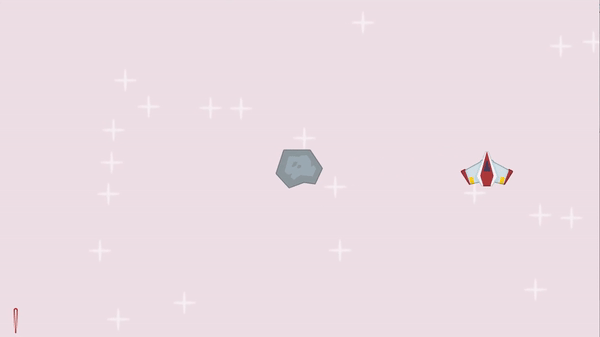
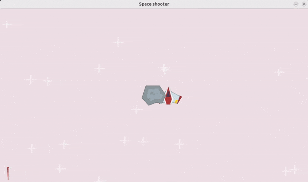

## 🟡 ANIMATION


- move the plane from right to left &  vice versa

- clock

 - - FPS (frames per second)


<br>
<br>

### 💥 Make the player bounce from left to right

- at the moment we have the player moving to the right until it reaches the end of the screen on the right side

```python
 if player_rect.right < WINDOW_WIDTH:
        player_rect.left  += 2
```

<br>

### 🟦 1. Moving it LEFT & RIGHT

  Create a new variable and assign the value of 1:

- - `player_direction = 1`

- - Use the player direction within the loop, hide the old animation

```python
    # player movement💥
    player_rect.x += player_direction * 0.4

    # old anim
    # if player_rect.right < WINDOW_WIDTH:
    #     player_rect.left  += 2
```
<br>

### 🌈 Focus on the X axis

[]( )


## 🟠 Explanation

<br>

### `player_rect.x += player_direction * 0.4`

`player_rect.x +=`

-  - **updates** the **x-coordinate** of the `player_rect` **by adding this calculated amount**.

> #### This effectively moves the player rectangle horizontally on the screen based on the direction and speed of movement.


 <br>
<br>

 🟤 **If** `player_direction` is **positive +=**,

 - - `player_rect.x` **will be increased**

 > - - - (moving the player right).

 <br>

 🟤 **If** `player_direction` is **negative -=**,

 - - `player_rect.x` **will be decreased**

 > - - - (moving the player left).

<br>

####   🟤 `player_direction * 0.4`

- - calculates the amount to move the player horizontally.


<br>
<br>
<br>

## 2. 🌈🦄 Now I want to check if the player is OUTSIDE of the window

<br>

- Means that the player reaches the right edge and is now out of the window

```python
if player_rect.right > WINDOW_WIDTH or player_rect.left < 0:

        player_direction *= -1
```
<br>


[]( )

## 🟠 Explanation

<br>

## 🫐 `if player_rect.right > WINDOW_WIDTH or player_rect.left < 0:`
<br>

### 🟤  `player_rect.right > WINDOW_WIDTH:`

- -  **This** condition **checks** `if` **the right edge** of the `player_rect` **has moved beyond the  `right` ➡️ edge** of the **screen.**

> - - - #### 🍨 If it has, the plane has reached the right boundary.

<br>

### 🟤  `player_rect.left < 0:`

 - - **This** condition **checks** `if` **the left edge** of the `player_rect` **has moved beyond the ⬅️`left` edge** of the window.

 > - - - #### 🍨 If it has, the plane has reached the left boundary.

### 🟤 `or`:

- - This `logical operator` **ensures** that **if either** boundary **condition** is `true`

 > - - - ####  (i.e., the plane is **either** at the **right** edge **or left edge** of the window),

- - **the action inside** the `if` **block will be executed**.

<br>

```python
if player_rect.right > WINDOW_WIDTH or player_rect.left < 0:

        player_direction *= -1
```

### 🍊 `player_direction *= -1:`

- -  This line reverses the direction of movement.

<br>

- - **If** `player_direction` **was `1`** (moving right),

- - - **it becomes `-1`** (moving left).

<br>

- - **If** `player_direction` **was `-1`**,

- - - **it becomes** `1`.

> #### This effectively ✋ <u>*changes*  the plane's movement direction when it hits either boundary</u>.


<br>
<br>

### 🟢 In other words

- The player_direction starts at 1 , moves the player to the right, and once it hits the edge, it changes to -1 to move the player to the left.


```python
#  PLAYER DIRECTION
# The player_direction starts at 1 ...
player_direction = 1
 # ✋


# WHILE loop ---


    # if player x direction positive +=, then it will be increased +, hence will move to the right.
    player_rect.x += player_direction * 0.4
    # if player x direction negative -=, then it will be decreased -, hence will move to the left
    #  -----  move right to left loop  ---


    # Continuously check if the player's rectangle has moved past the window's boundaries.
    if player_rect.right > WINDOW_WIDTH or player_rect.left < 0:
    # If the rectangle's right edge exceeds the window width or its left edge is less than 0,
    # it means the player has reached one of the screen edges.
    # Reverse the movement direction by multiplying `player_direction` by -1 to make the plane move in the opposite direction.
     player_direction *= -1

```
<br>

[]( )


<br>

```python

import pygame
import os
from random import randint


pygame.init()
script_dir = os.path.dirname(__file__)


WINDOW_WIDTH, WINDOW_HEIGHT = 1280, 720
display_surface = pygame.display.set_mode((WINDOW_WIDTH, WINDOW_HEIGHT))
pygame.display.set_caption("Space shooter")


#while loop related
running = True
surf = pygame.Surface((100,200))
# animation related


# img's path
image_paths = {
    'player': os.path.join(script_dir, '..', 'images', 'player.png'),
    'star': os.path.join(script_dir, '..', 'images', 'star.png'),
    'meteor': os.path.join(script_dir, '..', 'images', 'meteor.png'),
    'laser': os.path.join(script_dir, '..', 'images', 'laser.png')

}


player_surf = pygame.image.load(image_paths['player']).convert_alpha()

# 1. -----  move right to left loop  ---
player_direction = 1
# -----  move right to left loop  ---


meteor_surf = pygame.image.load(image_paths['meteor']).convert_alpha()
laser_surf = pygame.image.load(image_paths['laser']).convert_alpha()

# (WINDOW_WIDTH / 2, WINDOW_HEIGHT / 2)
# Will pos the plane at the center of the screen/window
player_rect = player_surf.get_frect(center=(WINDOW_WIDTH / 2, WINDOW_HEIGHT / 2))

meteor_rect = meteor_surf.get_frect(center=(WINDOW_WIDTH / 2, WINDOW_HEIGHT / 2))

laser_rect = laser_surf.get_frect(bottomleft=(20, WINDOW_HEIGHT - 10))

# start
star_surf = pygame.image.load(image_paths['star']).convert_alpha()
# star pos
star_positions = [(randint(0, WINDOW_WIDTH), randint(0, WINDOW_HEIGHT)) for i in range(20)]


while running:
    for event in pygame.event.get():
       if event.type == pygame.QUIT:
            running = False


 # FILL thplayer_rect = player_surf.get_frect(center=(WINDOW_WIDTH / 2, WINDOW_HEIGHT / 2))e window with a red color
 # player = pygame.Rect((300, 250, 50, 50))
 # https://pyga.me/docs/ref/pygame.html

 # 7 --- DRAW the game ----
 # list of colors: https://pyga.me/docs/ref/color_list.html
    display_surface.fill("lavenderblush2")


    for pos in star_positions:
        display_surface.blit(star_surf, pos)


    # player
    display_surface.blit(player_surf, player_rect)
    # meteor
    display_surface.blit(meteor_surf, meteor_rect)
    # laser
    display_surface.blit(laser_surf, laser_rect)


    # 2. -----  move right to left loop  ---
    # The player_direction starts at 1 (look at line 37), moves the player to the right, and once it hits the edge, it changes to -1 to move the player to the left.

    # if player x direction positive +=, then it will be increased +, hence will move to the right.
    player_rect.x += player_direction * 0.4
    # if player x direction negative -=, then it will be decreased -, hence will move to the left
    #  -----  move right to left loop  ---


    # Continuously check if the player's rectangle has moved past the window's boundaries.
    if player_rect.right > WINDOW_WIDTH or player_rect.left < 0:
    # If the rectangle's right edge exceeds the window width or its left edge is less than 0,
    # it means the player has reached one of the screen edges.
    # Reverse the movement direction by multiplying `player_direction` by -1 to make the plane move in the opposite direction.
     player_direction *= -1

    # -------------
    pygame.display.update()


pygame.quit()
```

<br>
<br>
<br>

---

<br>

## 🟡 Clock()

<br>

```python

import pygame
import os
from random import randint


pygame.init()
script_dir = os.path.dirname(__file__)


WINDOW_WIDTH, WINDOW_HEIGHT = 1280, 720
display_surface = pygame.display.set_mode((WINDOW_WIDTH, WINDOW_HEIGHT))
pygame.display.set_caption("Space shooter")


#while loop related
running = True
surf = pygame.Surface((100,200))
# animation related


# img's path
image_paths = {
    'player': os.path.join(script_dir, '..', 'images', 'player.png'),
    'star': os.path.join(script_dir, '..', 'images', 'star.png'),
    'meteor': os.path.join(script_dir, '..', 'images', 'meteor.png'),
    'laser': os.path.join(script_dir, '..', 'images', 'laser.png')

}


player_surf = pygame.image.load(image_paths['player']).convert_alpha()

# 1. -----  move right to left loop  ---
player_direction = 1
# -----  move right to left loop  ---


meteor_surf = pygame.image.load(image_paths['meteor']).convert_alpha()
laser_surf = pygame.image.load(image_paths['laser']).convert_alpha()

# (WINDOW_WIDTH / 2, WINDOW_HEIGHT / 2)
# Will pos the plane at the center of the screen/window
player_rect = player_surf.get_frect(center=(WINDOW_WIDTH / 2, WINDOW_HEIGHT / 2))

meteor_rect = meteor_surf.get_frect(center=(WINDOW_WIDTH / 2, WINDOW_HEIGHT / 2))

laser_rect = laser_surf.get_frect(bottomleft=(20, WINDOW_HEIGHT - 10))

# start
star_surf = pygame.image.load(image_paths['star']).convert_alpha()
# star pos
star_positions = [(randint(0, WINDOW_WIDTH), randint(0, WINDOW_HEIGHT)) for i in range(20)]


while running:
    for event in pygame.event.get():
       if event.type == pygame.QUIT:
            running = False


 # FILL thplayer_rect = player_surf.get_frect(center=(WINDOW_WIDTH / 2, WINDOW_HEIGHT / 2))e window with a red color
 # player = pygame.Rect((300, 250, 50, 50))
 # https://pyga.me/docs/ref/pygame.html

 # 7 --- DRAW the game ----
 # list of colors: https://pyga.me/docs/ref/color_list.html
    display_surface.fill("lavenderblush2")


    for pos in star_positions:
        display_surface.blit(star_surf, pos)


    # player
    display_surface.blit(player_surf, player_rect)
    # meteor
    display_surface.blit(meteor_surf, meteor_rect)
    # laser
    display_surface.blit(laser_surf, laser_rect)


    # 2. -----  move right to left loop  ---
    # The player_direction starts at 1 (look at line 37), moves the player to the right, and once it hits the edge, it changes to -1 to move the player to the left.

    # if player x direction positive +=, then it will be increased +, hence will move to the right.
    player_rect.x += player_direction * 0.4
    # if player x direction negative -=, then it will be decreased -, hence will move to the left
    #  -----  move right to left loop  ---


    # Continuously check if the player's rectangle has moved past the window's boundaries.
    if player_rect.right > WINDOW_WIDTH or player_rect.left < 0:
    # If the rectangle's right edge exceeds the window width or its left edge is less than 0,
    # it means the player has reached one of the screen edges.
    # Reverse the movement direction by multiplying `player_direction` by -1 to make the plane move in the opposite direction.
     player_direction *= -1

    # -------------
    pygame.display.update()


pygame.quit()
```

<br>
<br>
<br>

---

<br>

## 🟡 Clock()

### In Pygame, the `clock()` is used to manage the frame rate of your game, ensuring smooth and consistent updates by controlling the timing of each frame.

<br>


<br>

### `clock()`

- - 🟠 It helps regulate how often the game loop runs, which is crucial for synchronizing game actions and animations.


<br>

- - 🟤 By setting a specific frame rate, the clock prevents the game from running too fast or too slow.


<br>

### Three.js

> #### Similarly, in Three.js, a clock can be used to manage time-based animations and updates, providing consistent timing for rendering and interactions.

<br>


#### Check the video: [GTA 5 FPS COMPARISON 1 FPS VS 10 FPS VS 30 FPS VS 60 FPS VS 100 FPS](https://youtu.be/ESLdzYs8Bj4?si=i0TkZpuE1tY0U4tw)


<br>
<br>


### 🟦 Understanding FPS (frames per second) helps you gauge how smoothly your game or application is running.


## 🟠 FPS Interpretation:

 Here's how to interpret FPS values:


<br>

**High FPS (e.g., 60 FPS or more) ✅ :**

 - -  This indicates smooth performance.

 <br>

 - - - The game or application is updating quickly, and you should experience fluid motion and responsiveness.

 > - - #### This is typically considered ideal for most interactive applications.

**Low FPS (e.g., 30 FPS or less):**

- -  This suggests slower performance. The game or application is updating less frequently, which may result in choppy or stuttery visuals and reduced responsiveness. Lower FPS can affect the user experience negatively.

<br>
<br>

### 🟦 What is "Okay" FPS?

<br>

🌈**60 FPS:** Often considered the target for smooth gameplay or applications, providing a very fluid experience.

🟤**30 FPS:** Generally acceptable for many games and applications, though it may feel less smooth compared to 60 FPS.

🔴 **Below 30 FPS:** Can be problematic and might indicate performance issues. It could lead to noticeable lag and poor user experience.

<br>

### Understanding FPS Limitations:

Monitor Capabilities: The refresh rate of your monitor can limit your FPS. For example, a 60Hz monitor can display up to 60 FPS.

- - 🔴 Hardware Constraints: 🔴 The performance of your CPU, GPU, and other components can affect your achievable FPS.


<br>
<br>


## 🟡 Exercise: FPS (frames per second)

 FPS tracking and display the FPS on the screen.


### 🟤 Move the cube with the below keys:

- 🟠 a,d,w,s

```python
 # Move the player based on key presses
    if key[pygame.K_a]:
        player.move_ip(-1, 0)
    elif key[pygame.K_d]:
        player.move_ip(1, 0)
    elif key[pygame.K_w]:
        player.move_ip(0, -1)
    elif key[pygame.K_s]:
        player.move_ip(0, 1)
```
<br>
