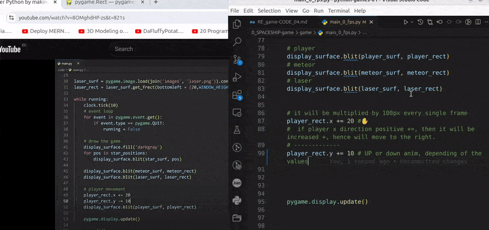
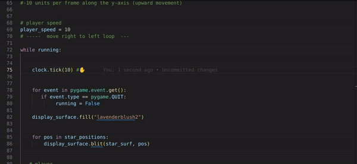
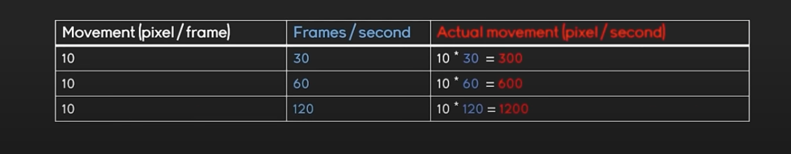
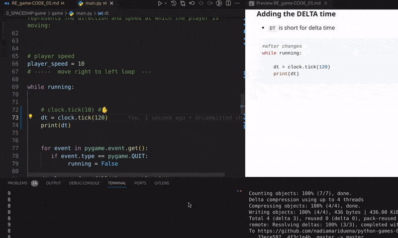
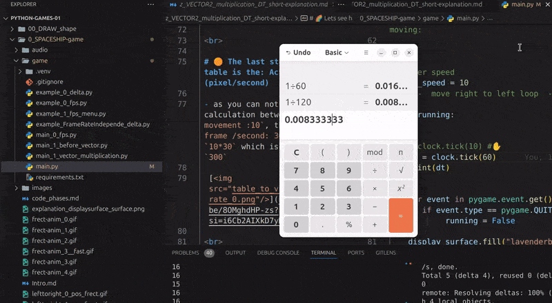
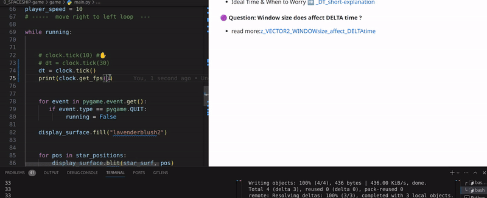
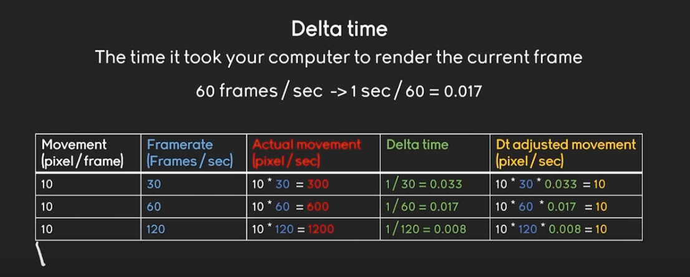

## 🟡 ANIMATION 2.


- Up & down animation


<br>


###  🟡 Vectors


- - - **Vectors** [Go to section](#Vectors_about)


- - - **Why vectors if we have lists?:** First Understand this error: [Go to section](#why_vectors_if_we_have_lists)


<br>

- - -  **Why use a Vector**  [Go to section](#why_use_a_vector_)

- - - **Vector Multiplication:** Multiplying a Vector by a Number [Go to section](#multiplying_a_vector_)

<br>


- - 🟠 **Vector Init** [Go to section](#Init_of_Vector2)


<br>

 <br>


### 🟡 Delta time

- - -  **Delta time:** [Go to section](#delta_time_)

- - -   **Independent of the Frame rate:**  [Go to section](#independent_frame_rate_)

- - - **Window size does affect DELTA time?:** [Go to section](#windowSize_affect_delta_)


<!-- <a name="delta_time_"></a> -->

<br>
<br>

<br>


<br>

## 🟠 Moving the Player


### 🟤  Currently, the code below handles the player's left and right movement, but we’re going to change this.

- - For now, let's remove this section,**as we’ll revisit it later when we cover `delta` time**:

<br>

```python
    # Continuously check if the player's rectangle has moved past the window's boundaries.
    if player_rect.right > WINDOW_WIDTH or player_rect.left < 0:
    # If the rectangle's right edge exceeds the window width or its left edge is less than 0,
    # it means the player has reached one of the screen edges.

     player_direction *= -1
    # Reverse the movement direction by multiplying `player_direction` by -1 to make the plane move in the opposite direction.
```


### 🟠 Update This Line

- - Change the following line to achieve the new movement behavior:

```python
    player_rect.x += player_direction * 100
```

### 🟠  Replace It With This Code

- - Use this updated line to move the player in one direction:

```python
    # it will be multiplied by 100px every single frame
    player_rect.x += 100
    #  if player x direction positive +=, then it will be increased +, hence will move to the right.
    # -------------
```

<br>
<br>

### 🌈 Before animating the player this is what i have

- i changed the fps again and the animation

```python

import pygame
import os
from random import randint


pygame.init()
script_dir = os.path.dirname(__file__)


WINDOW_WIDTH, WINDOW_HEIGHT = 1280, 720
display_surface = pygame.display.set_mode((WINDOW_WIDTH, WINDOW_HEIGHT))
pygame.display.set_caption("Space shooter")


#while loop related
running = True
#✋ CLOCK:  FPS (frame per second)
clock = pygame.time.Clock()


# img's path
image_paths = {
    'player': os.path.join(script_dir, '..', 'images', 'player.png'),
    'star': os.path.join(script_dir, '..', 'images', 'star.png'),
    'meteor': os.path.join(script_dir, '..', 'images', 'meteor.png'),
    'laser': os.path.join(script_dir, '..', 'images', 'laser.png')

}


player_surf = pygame.image.load(image_paths['player']).convert_alpha()

# 1. -----  move right to left loop  ---
player_direction = 1
# -----  move right to left loop  ---


meteor_surf = pygame.image.load(image_paths['meteor']).convert_alpha()
laser_surf = pygame.image.load(image_paths['laser']).convert_alpha()

# (WINDOW_WIDTH / 2, WINDOW_HEIGHT / 2)
# Will pos the plane at the center of the screen/window
player_rect = player_surf.get_frect(center=(WINDOW_WIDTH / 2, WINDOW_HEIGHT / 2))

meteor_rect = meteor_surf.get_frect(center=(WINDOW_WIDTH / 2, WINDOW_HEIGHT / 2))

laser_rect = laser_surf.get_frect(bottomleft=(20, WINDOW_HEIGHT - 10))

# start
star_surf = pygame.image.load(image_paths['star']).convert_alpha()
# star pos
star_positions = [(randint(0, WINDOW_WIDTH), randint(0, WINDOW_HEIGHT)) for i in range(20)]


while running:


    clock.tick(10) #✋


    for event in pygame.event.get():
       if event.type == pygame.QUIT:
            running = False

    display_surface.fill("lavenderblush2")


    for pos in star_positions:
        display_surface.blit(star_surf, pos)


    # player
    display_surface.blit(player_surf, player_rect)
    # meteor
    display_surface.blit(meteor_surf, meteor_rect)
    # laser
    display_surface.blit(laser_surf, laser_rect)


    # it will be multiplied by 100px every single frame
    player_rect.x += 20 #✋
    #  if player x direction positive +=, then it will be increased +, hence will move to the right.
    # -------------

    pygame.display.update()


pygame.quit()
```

<br>
<br>


<br>

## 🧶 🟡 Basic Animation: Updating Coordinates Along X and Y Axes


In the steps Below, we’re learning how to move a rectangle in two directions: right and down.

- - **First**, we update the x and y coordinates separately to move the rectangle.

- - **Then**, we use a single line to update both coordinates at once.

> ####  This approach makes the movement smoother and more efficient, allowing for simultaneous adjustments.

<br>

## 🟤 Steps

<br>

### 1. Update Both x and y Coordinates

- To move the rectangle both right and down, use:

```python
player_rect.x += 20
player_rect.y += 10

```

### 2. Update Coordinates Simultaneously

- For a single operation that updates both x and y:

```python
player_rect.center += (20, -10)

```

<br>

## In Detail

#### 🔶 `X`: Moves the rectangle to the right by `20 pixels`

- - Increases the x-coordinate, moving the rectangle to the right.

```python
 player_rect.x += 20
```

#### 🔶 `Y`: Moves the rectangle down by 10 pixels

- - Increases the y-coordinate, moving the rectangle down.

```python
player_rect.y += 10
```
<br>

> #### 🟠 In this part of the game development, we are dealing with updating the position of our player’s rectangle.

<br>

[]( )


<br>
<br>


### 🟧 1. We want to update, both the `x` and `y` coordinates:


```python
player_rect.x += 20
player_rect.y += 10

```

### 🟠 2. Now We want to update both the x and y coordinates simultaneously using a single operation:


- Here below we are grabbing one of the tuple() points inside of the rectangle

```python
player_rect.center += (20, -10)
```


<br>

## 🧶 Explanation:

<br>

#### `player_rect.center`:

-  - Represents the center point of the rectangle.


#### `(20, -10)`:

-  - Moves the rectangle’s center by 20 pixels to the right and 10 pixels up.

<br>
<br>

### 🟦 If we tried to execute this, it will raise an error:

```python
player_rect.center += (20, -10)
```

## 🔴  error:

- We have an invalid **rect** assignment 🤔

>An its because we cannot add a tuple() or a list[] to a tuple position inside of the rectangle

```python
 File "main_0_fps.py", line 92, in <module>
    player_rect.center += (20, -10)
TypeError: invalid rect assignment 🔴
```

<br>

## 🧶 Why Does player_rect.center += (20, -10) Result in an Error?

#### Immutable Assignment:

- - In `Pygame`, the center attribute of a Rect object is a property that represents the center point of the rectangle.

<br>

- - This property is not directly mutable via operations like addition or subtraction with a tuple.

> - - #### ✋ It’s a special attribute that `Pygame` manages internally, and you can’t use operators like `+=` to modify it directly.

<br>
<br>
<br>


<br>
<br>

### 🔴 Why This Error Occurs


#### 🟫 Tuple Operations Not Allowed:

`player_rect.center`

- -  **returns a tuple** representing the `center position (x, y)` **of the rectangle**

<br>

- - 🔴 **In Python, tuples are immutable**, meaning their values cannot be changed once they are created.

<br>

- - 🔴  The operation `player_rect.center += (20, -10)` **attempts to modify** this **tuple directly**, which is **not allowed because tuples do not support** in-place modification.


<br>

### Direct Assignment Issue:

**Pygame's Rect** `object` **does not allow direct assignment** or modification of its attributes through mathematical operations on their values.

#### 🔴 You need to use explicit assignments to update the position.


<br>
<br>

## 🌈 Solutions

### 1. ✅ chatgpt approach:

- -  Instead of trying to add to `player_rect.center` directly, `you should calculate the new center position` and `then assign it back to the center` attribute.

  Here’s how you can do it:

```python
# Moves the rectangle to the right by 20 pixels
# Increases the x-coordinate, moving the rectangle to the right.

# Calculate the new center position
new_center_x = player_rect.centerx + 20

new_center_y = player_rect.centery - 10
# Moves the rectangle down by 10 pixels
# Increases the y-coordinate, moving the rectangle down.

# Update the center attribute with the new position
player_rect.center = (new_center_x, new_center_y)

```

<br>
<br>
<br>

<a name="Vectors_about"></a>

<br>

## 🟡 VECTORS

### 2.  Tutorial approach: VECTORS

 ✋ Using a vector can be a good solution to handle position updates more flexibly and avoid the issues you encountered with directly modifying **the** `center` attribute of a `Rect` **object**.

<br>

> - - -  🔴 Do not confuse the terms "vector norm" (length of vector), "normal vector" (perpendicular vector) and "normalized vector" (unit-length vector). [**READ MORE:** Normal Vector](https://mathworld.wolfram.com/NormalVector.html#:~:text=The%20unit%20vector%20obtained%20by,(perpendicular%20vector)%20and%20%22normalized)


<br>
<br>

## 🟠 About: VECTORS

#### Read More here: [z_VECTOR2_in_pygame](../z_VECTOR2_in_pygame.md)

<br>

  🟤 Vectors are mathematical objects used to represent quantities with both magnitude and direction.

<br>


### 🟤 In `2D` space, a vector has two components: `x (horizontal) and y (vertical)`.

> -   #### 🟢 Operations like addition, subtraction, and scaling (multiplying by a scalar) are performed element-wise("element-wise" means that each component of the vector is operated on individually.).

<br>

-  Vectors simplify calculations and transformations in graphics and physics by managing direction and distance efficiently.

<br>

### `Vectors` can be thought of as `lists` with `two` values: `x and y`, `representing coordinates in a 2D` space.


<br>
<br>

---


 <a name="why_use_a_vector_"></a>

## 🟢 Why Use a Vector?


#### 🔴 Mutable and Flexible:


**Tuples vs. Vectors:** While tuples are immutable (meaning `you can't change their values once they’re created`), vectors (like pygame.math.Vector2 in Pygame) are mutable.

**Mutability Advantage:** This `mutability allows` you to easily perform arithmetic operations such as addition or subtraction directly on vectors.

- - This flexibility simplifies tasks like updating positions or directions in your animation.


<br>
<br>

---

##   🌈 Vectors & Delta Time

### 🍨 Why Vectors Instead of Rects?

#### Delta Time:

To ensure that movement remains smooth and consistent across different frame rates, we use delta time—the amount of time that has passed since the last frame.

- - Delta time helps make the player’s movement frame rate-independent, meaning the speed of movement won’t vary with changes in the frame rate.

<br>

## Vectors for Delta Time:

#### Flexibility in Movement:

**Vectors** (such as `pygame.math.Vector2`) are designed to handle both direction and magnitude in a single, easy-to-manage object.

- -  This makes it simple to update the player's position by performing vector arithmetic (e.g., adding a direction vector to the current position).
Smooth Animation:

> #### When using vectors, `you can easily scale movement based on delta time`.

- - - For example, if you want the player to move 100 pixels per second, you can multiply the movement vector by delta time to achieve consistent speed regardless of the frame rate.

<br>

⚠️**For instance**, `if` **delta time is** `0.016` seconds (for a 60 FPS frame rate), moving the player involves adding direction * speed * dt to the player’s position vector.

<br>
<br>

### 🟠 Using a Vector for Position Updates


#### 🔴 Advantages Over Rects:

<br>

**Rects or FRects** in Pygame are primarily used for defining and managing rectangular areas or  💥 **[hit boxes](https://youtu.be/4BURZ5WTIKg?feature=shared)** , such as for collision detection and layout purposes.

-  They are great for handling the boundaries of objects but are not as effective for managing smooth, frame rate-independent movement.

> - - -  While they can store position data, they are not as well-suited for handling movement and direction calculations, especially when incorporating delta time.

<br>

**Updating position with Rect** `involves manually adjusting the x and y coordinates` and handling movement calculations separately.

- - This can become cumbersome when trying to maintain smooth, frame rate-independent movement.


**Vectors simplify this process** by allowing you to update both x and y coordinates simultaneously with a single operation. This makes it easier to implement consistent movement and direction changes.


<br>
<br>


### 🟤 Math Operations

> - - 🟠 Simplified Math Operations:

> - -  With vectors, **<u>you can perform vector arithmetic directly</u>** , which is more intuitive and flexible **compared to handling separate `x` and `y`** values.

> - - ##### Read More here: [z_VECTOR2_in_pygame](../z_VECTOR2_in_pygame.md)


<br>
<br>


<br>

<a name="multiplying_a_vector_"></a>

## 🟡 Multiplying a Vector by a Number:

- -  When you multiply a vector by a ✋ `scalar` **(a single number)**, each component of the vector is multiplied by that number.

```python
vector = Vector2(4, 2)  # A vector with x = 4 and y = 2
scaled_vector = vector * 2  # Multiply both x and y by 2
# 4 x 2 = 8
# 2 x 2 = 4

# 👍 output of the multiplication
# This results in a new vector: Vector2(8, 4)
```

<a name="duplicated_values"></a>

### 🟤 Difference from Lists

**In Lists:**

#### 🔴 Multiplying a list by a number duplicates the entire list, but does not operate on its individual elements.

```python
lst = [4, 2]
scaled_lst = lst * 2  # Duplicates the list
# 🔴 Result: [4, 2, 4, 2]

```
<br>


### 🟠  Key Difference


**Vector Operation:** Affects each component of the vector individually, scaling them according to the scalar value.

<br>

**List Operation:** Repeats the entire list without altering individual elements.

<br>

### 🍯 Summary:

**Vectors:** When multiplied by a scalar, each component of the vector is scaled, resulting in `Vector2(8, 4)` from Vector2(4, 2) when scaled by 2.

<br>

**Lists:** Multiplying a list by a number duplicates the entire list, resulting in `[4, 2, 4, 2]`  **from** `[4, 2]`.

<br>
<br>
<br>
<br>


# 🟦 🌻 Tutorial explanation

<br>

- 🟤 If you multiply a **vector** by a number

- 🟤 And then you multiply BOTH numbers inside of that VECTOR

<br>


<a name="why_vectors_if_we_have_lists"></a>


### ⚫ 🔴 If you were to do all of the above into a LIST, you would simply DUPLICATE all of the values Solution [Go to duplicated values](#duplicated_values)

<br>

- 🟢 So the difference here is noticeable

```python
vector(4,2) *2 = vector(8,4)
```

- You can also add 2 vectors together, and then get the sum of the individual number

<br>

- #### 🟤 Finally, what is important to us, is that you can add a vector to the Tuple position of a rectangle

- - That way we change BOTH: `x` and `y` at the same time


<br>

## 🟡 Lets modify the code

- 🟤 **inside** of the `player_direction` we have a value of **`-1`**

- 🟤 **Replace** the **`1`** value for the **`math.vector2`**

<br>


```python
# before
player_direction = 1

# ✋ after
player_direction = pygame.math.Vector2( )
```

<br>
<br>

<a name="Init_of_Vector2"></a>

<br>

## 🟠 Initialization of Vector2:

####  `pygame.math.Vector2()`

- - 🔴  When you create a new Vector2 object **without any parameters**, like here: `Vector2()`

<br>

- -  <u>it defaults to `[0, 0]`</u>, , **which represents the origin in a 2D coor**dinate system.

<br>


```python
#   -----  move right to left loop
#🤚 VECTOR
player_direction = pygame.math.Vector2( )
#20 X, - 10Y axis
```

<br>


<br>
<br>

## 🟢 Test it

- 🟤 Before testing it, check that you are inside the environment, then activate it (otherwise you will get an error)

- 🟤 hide `player_rect.center += (20, -10) # hide this`

<br>

```python
    #🤚
    # 🔴 player_rect.center += (20, -10) # hide this
    # -----------
    pygame.display.update()

pygame.quit()
```

<br>

- 🟤 When you will run the code, you will see the animation but in your terminal your will have this:

```python
pygame-ce 2.3.2
(SDL 2.26.5, Python 3.7.14)

# ✋ the below is what i care
[0, 0]

```
<br>

###  🟧 But what does the [0,0] stands for ?

> ### The output [0, 0] you’re seeing in the console is related to the `pygame.math.Vector2` object you’ve initialized.


 - - <u>**it defaults to** `[0, 0]`</u>, , **which represents the origin in a 2D coor**dinate system.

<br>
<br>

## 🟡 Add some value to the Vector2()

#### 🟤 1. add this `20, -10`

```python
#   -----  move right to left loop
#🤚 VECTOR
player_direction = pygame.math.Vector2(20, -10 )
#20 X, - 10Y axis
```

<br>

#### 🟤  2. Now go to the loop to `UPDATE`.

- Replace this 2 lines:

```python
    # it will be multiplied by 100px every single frame
    player_rect.x += 20 #✋
    #  if player x direction positive +=, then it will be increased +, hence will move to the right.
    # -------------
    player_rect.y -= 10 # UP or down anim, depending of the values

```

<br>

### 🟤  For this

<br>

The  `player_rect.center += player_direction` is **crucial** in updating the position of the **player's sprite**  in your space shooter game.


```python
player_rect.center += player_direction
```

<br>

### 🟤 Let's break down its role and purpose within the context of the code:


This **`player_rect.center += player_direction`** updates the position of the player's sprite by adding the `player_direction` **vector** to the current center position of **`player_rect`**.

 <br>

The `+=` **operator** 🟠

- - - Modifies `player_rect.center` **in-place, so the player's position changes according to `player_direction`**.

<br>

### 🟠 Purpose

**Movement:**

- -  The primary purpose of this line is **to move** the **player's** sprite.

<br>

- - - Each frame, the player's position is updated by adding the `player_direction` **vector** to its current position. This results in the player moving in the direction specified by player_direction.


<br>

**Animation:**

- -  This **`player_rect.center += player_direction`** continuously updates the player's position as long as the game is running, which is essential for creating smooth movement and animation in the game.

```python
    # vector
    # ✋
    player_rect.center += player_direction


    pygame.display.update()

pygame.quit()
```

## 🟤 Summary


- - The `player_rect.center += player_direction` **ensures** that the **player's sprite moves consistently across the screen based** <u>on the direction and speed specified by player_direction.</u>


```python
# -----  move right to left loop  ---
# VECTOR
# 🟡
player_direction = pygame.math.Vector2(20, -10)
# -----  move right to left loop  ---

while running:


    clock.tick(60) #✋


    for event in pygame.event.get():
       if event.type == pygame.QUIT:
            running = False

    display_surface.fill("lavenderblush2")


    for pos in star_positions:
        display_surface.blit(star_surf, pos)


   # player
    display_surface.blit(player_surf, player_rect)

    # meteor
    display_surface.blit(meteor_surf, meteor_rect)
    # laser
    display_surface.blit(laser_surf, laser_rect)

    # 🟡 vector
    player_rect.center += player_direction

    pygame.display.update()


pygame.quit()
```

<br>
<br>

## To Debug

- Add this line `print(player_direction * 2)` to below code

```python

#🤚 VECTOR
player_direction = pygame.math.Vector2(20, -10)

# 🟠
print(player_direction * 2)
# -----  move right to left loop  ---
```


## 🟤 Purpose

<br>

## Vector Multiplication:

> - - **`player_direction`** is a **pygame.math.Vector2 object initialized** with the values `(20, -10)`, which represents a direction and speed vector for your player.

> - - **Multiplying this vector by 2** (player_direction * 2) scales the vector by a factor of 2.

> - - - The result is a new vector (40, -20).

<br>


## 🟦 Printing the Vector:

#### 🟤 The print statement outputs the scaled vector `(40, -20)` to the <u>console</u> .


#### Purpose in the Context

- - The purpose of printing `player_direction * 2` is primarily for debugging or validation.

- - - 🍊 It helps you verify that your vector operations are working as expected and that the scaled vector has the correct values.

<br>
<br>

### 🟠 Before continuing

```python

import pygame
import os
from random import randint


pygame.init()
script_dir = os.path.dirname(__file__)


WINDOW_WIDTH, WINDOW_HEIGHT = 1280, 720
display_surface = pygame.display.set_mode((WINDOW_WIDTH, WINDOW_HEIGHT))
pygame.display.set_caption("Space shooter")


#while loop related
running = True
#✋ CLOCK:  FPS (frame per second)
clock = pygame.time.Clock()


# img's path
image_paths = {
    'player': os.path.join(script_dir, '..', 'images', 'player.png'),
    'star': os.path.join(script_dir, '..', 'images', 'star.png'),
    'meteor': os.path.join(script_dir, '..', 'images', 'meteor.png'),
    'laser': os.path.join(script_dir, '..', 'images', 'laser.png')

}


player_surf = pygame.image.load(image_paths['player']).convert_alpha()


meteor_surf = pygame.image.load(image_paths['meteor']).convert_alpha()
laser_surf = pygame.image.load(image_paths['laser']).convert_alpha()

# (WINDOW_WIDTH / 2, WINDOW_HEIGHT / 2)
# Will pos the plane at the center of the screen/window
player_rect = player_surf.get_frect(center=(WINDOW_WIDTH / 2, WINDOW_HEIGHT / 2))
meteor_rect = meteor_surf.get_frect(center=(WINDOW_WIDTH / 2, WINDOW_HEIGHT / 2))

laser_rect = laser_surf.get_frect(bottomleft=(20, WINDOW_HEIGHT - 10))

# start
star_surf = pygame.image.load(image_paths['star']).convert_alpha()
# star pos
star_positions = [(randint(0, WINDOW_WIDTH), randint(0, WINDOW_HEIGHT)) for i in range(20)]

# 1. -----  move right to left loop  ---
# player_direction = 1
# print(player_direction)
#
##20 X, - 10Y axis
#🤚 VECTOR
player_direction = pygame.math.Vector2(20, -10) # This vector represents the direction and speed at which the player is moving:

#20 units per frame along the x-axis (rightward movement)
#-10 units per frame along the y-axis (upward movement)
print(player_direction * 2)
# -----  move right to left loop  ---

while running:


    clock.tick(30) #✋


    for event in pygame.event.get():
       if event.type == pygame.QUIT:
            running = False

    display_surface.fill("lavenderblush2")


    for pos in star_positions:
        display_surface.blit(star_surf, pos)


   # player
    display_surface.blit(player_surf, player_rect)

    # meteor
    display_surface.blit(meteor_surf, meteor_rect)
    # laser
    display_surface.blit(laser_surf, laser_rect)


    # it will be multiplied by 100px every single frame
    # player_rect.x += 20
    #✋
    #  if player x direction positive +=, then it will be increased +, hence will move to the right.
    # -------------
    # player_rect.y -= 10
    # UP or down anim, depending of the values

    # player_rect.center += (20, -10) # this will give you an error

    # vector
    # The line below updates the position of the player's sprite by adding the player_direction vector to the current center position of player_rect
    player_rect.center += player_direction

    # The += operator modifies player_rect.center in-place, so the player's position changes according to player_direction

    pygame.display.update()


pygame.quit()
```

<br>
<br>
<br>


## 🟩 When you use `player_direction * 2`, you're essentially adding 🔴 very small increments.

For instance, rather than using larger values like `20 and -10`, you can **simplify** by using **smaller**, more manageable numbers:

```python
#🤚 VECTOR
player_direction = pygame.math.Vector2(2, -1)
```


<br>
<br>

## 🟤 Initialization: `(2, -1)`

<br>

**🟦 player_direction:**

 `pygame.math.Vector2` **object initialized to** `(2, -1)`.

 - -  **It represents** both the **direction and speed** of the **player's movement**.

 <br>


 ### 🌈 In vector terms , `(2, -1)`  means

  - #### the 🦄 player moves 2 units horizontally (to the right) and -1 unit vertically (upwards) per frame.


<br>
<br>

> #### 🟤 Remove the multiplication print `print(player_direction * 2)` and add the speed with value of 10, we will be using this variable within the LOOP


<br>
<br>

## 🌈  `player_speed`:

 ```python
# player speed
player_speed = 10
```


This **is a `scalar` value** `(10)` that **represents how fast the player moves.**


> - - 🫐 **It scales the** `player_direction` **vector**, effectively **determining how far** the `player` **moves** <u>in a single frame.</u>

 ```python
# player speed
player_speed = 10
```

<br>

## 🟧 Update

#### `player_direction * player_speed:` This operation scales the direction vector by the speed.


> - - #### 🔴 *For a direction* `vector (2, -1)` *and a speed of* `10`, *the result* of this *multiplication is* `(20, -10).`

<br>

- - 🔴 This means that in each frame, the player should move 20 units to the right and 10 units up.


```python
player_rect.center += player_direction * player_speed
```
<br>

🔴 By doing that, you can separate the player direction: `player_direction` and `player_speed` 🟡 By adding `player_direction * player_speed` **to** `player_rect.center`, **you’re** effectively **moving the player’s position** by `(20, -10)` **pixels each frame**.

[]()


#### Here's what happens:

- -  The player moves 2 units to the right and 1 unit up each frame, which can be described by the coordinates `(2, -1)`.


```python
#  VECTOR
player_direction = pygame.math.Vector2(2, -1)
```

<br>
<br>

<br>

---

<br>
<br>

<br>


# 🟦 FRAME Rate independence

- ### Frame rate independence is a concept in game development that ensures the game's behavior and movement remain consistent regardless of the frame rate.

<br>

- -   🟠  Essentially, it means that the speed and smoothness of animations and movements are <u>**not directly tied to how many frames per second (FPS) the game is running at**</u> 🔴 .

<br>
<br>

 ## 🫐 🔴 Why It Matters ?

 - Read More [DELTA| Why It Matters](../z_VECTOR2_multiplication_DELTA_.md)

 <br>
 <br>
 <br>

 ## 🟠 Movement Speed vs. Frame Rate: A Simple Breakdown


 #### The image shows how the speed of movement changes based on the frame rate in Pygame.


  [](https://youtu.be/8OMghdHP-zs?si=i6Cb2AIXkD7yMHnt&t=4565)

  - As mentioned earlier, this method isn’t ideal. Instead, we should use delta time to ensure smooth and consistent movement, regardless of frame rate changes.

  <br>


## 🌽 Explanation:

<br>

🟤 **Movement per Frame:**

- -  This tells us how many pixels the object moves each frame (which is 10 pixels in the example).

🟤 **Frames per Second:**

- -  This shows how many frames are displayed every second (30, 60, or 120 in the example).

🟤 **Actual Movement (Pixels per Second):**

- -  This calculates how far the object moves each second by multiplying the movement per frame by the number of frames per second.

<br>

### 🌞 🐝 So, if the object moves 10 pixels each frame:

<br>

> #### At 30 frames per second, it moves 10 * 30 = 300 pixels per second.


> #### At 60 frames per second, it moves 10 * 60 = 600 pixels per second.

> #### At 120 frames per second, it moves 10 * 120 = 1200 pixels per second.

#### This helps us understand how changing the frame rate affects the speed of the movement.


<br>
<br>

## 🍊 Let's try it on the code

- - I want the player to only move to the right only, and to the **Y** (up down) nothing

<br>


```python
# ✋ AFTER
player_direction = pygame.math.Vector2(1, 0)
#
#🤚 BEFORE
player_direction = pygame.math.Vector2(2, -1) # This vector represents the direction and speed at which the player is moving:
```
### Once you replace that, ADD `10` to the player speed

```python
# player speed
player_speed = 10
```

<br>

### 🔴 Try experimenting with different speeds and clock settings.

> - - I’ve tested how the player’s speed changes by adjusting the clock.tick(10) line to different numbers, like 5, 60, or 120. Play around with these settings and see how they impact the player’s movement!


```python

#🤚 VECTOR
player_direction = pygame.math.Vector2(1, 0) # I want the player to only move to the right only, and to the **Y** (up down) nothing


# player speed
player_speed = 10
# -----  move right to left loop  ---

while running:


    clock.tick(10) #✋ check the table


    for event in pygame.event.get():
       if event.type == pygame.QUIT:
            running = False

    display_surface.fill("lavenderblush2")


    for pos in star_positions:
        display_surface.blit(star_surf, pos)


   # player
    display_surface.blit(player_surf, player_rect)

    # meteor
    display_surface.blit(meteor_surf, meteor_rect)
    # laser
    display_surface.blit(laser_surf, laser_rect)


    # VECTOR multiplication
    player_rect.center += player_direction * player_speed


    pygame.display.update()


pygame.quit()
```
<br>

### 🔴 This approach is useful for testing and seeing different outcomes, but it’s not exactly what we need.

<br>
<br>
<br>

<a name="delta_time_"></a>


# 🟡 Delta Time (dt)

### 🟦 Adding the DELTA time to out code

>🟤 `DT` is short for delta time

- Here, dt is set to the time it took to render the last frame in milliseconds. (open the terminal and check the values you have there)

```python

while running:

    dt = clock.tick(120)
    print(dt)

#
#
# - 🔴 By printing dt, you can see how long each
# frame is taking, which should be close to 8 milliseconds
#  if you’re running at 120 FPS.
```
### 🟤 output

- check the console


 [](https://youtu.be/8OMghdHP-zs?si=gTv0eNs-iEZJf0tF)


<br>


### 🟢 As you can notice on the image, we are getting the delta time of `8` or `9`

🌈 🧸  **SHORT Output Explanation:** If you see values like 8 or 9, it means that each frame is taking about 8 or 9 milliseconds to render.

 [](https://youtu.be/8OMghdHP-zs?si=gTv0eNs-iEZJf0tF)

<br>


 ## 🟡 Is 8 or 9 Good for Rendering?

 - A number like 8 or 9 milliseconds can be good, but it depends on what you're aiming for!

 <br>

 ### 🚀 🌞 Best Rendering Scenario

 #### Ideal Time:

 The best time for rendering each frame is usually **under 16 milliseconds.**

 - - This is because `16` milliseconds means you’re hitting 60 frames per second (fps), which is smooth and looks great 💅.

 <br>

 ### 🌩️   When to Worry

 #### Too Slow:

 If it takes **longer than 16** milliseconds per frame, like **`30`** milliseconds or more, then your game or animation might start to look choppy or slow down.

 - - This is because it means you're getting fewer frames per second, which can make things less smooth.

<br>
<br>


## 🔴 Behavior Without a Frame Rate Limit: `clock.tick()`


<br>

  We will observe the behavior of these 2:

**1.** dt = clock.tick()

**2.** print(clock.get_fps())

<br>
<br>

## 🟤 1. `dt = clock.tick()`

####  If i let this: `dt = clock.tick(120)`  <u>empty</u> like so:

- `dt = clock.tick()`, the rate is going to be from `0 or 1`.

- - Indicates we are getting a frame rate from about a 1000 frames per second or even more

<br>

 ```python
while running:
    dt = clock.tick()
    print(dt)

```

- - 🔴 When you call clock.tick() without any arguments, it does not attempt to regulate the frame rate.

> - - #### Instead, it simply returns the time in milliseconds since the last call to clock.tick().


<br>
<br>

## 🟤 2.  `clock.get_fps()`


```python
while running:
    dt = clock.tick()
    print(clock.get_fps())
```

<br>

> #### 🔴 result of the clock.get_fps() and the print(dt)

<br>

 []( )

 <br>
 <br>


### 🟡 Output Explanation:

### 250k FPS:

- - Seeing FPS values in the range of 250k or higher indicates that your game is rendering frames extremely quickly, 🌈 likely as fast as the system's hardware allows.


- - - #### 🟤 Extremely high and indicates no frame rate limitation. / No Frame Rate Capping:

- **recap**

- - - Without a target frame rate, `clock.tick()` does not regulate the frame rate. This means your game can run as fast as possible, leading to extremely high FPS values. **This is not useful for practical game performance monitoring.**

<br>


### Practical FPS:

- - **Aim for FPS values** in the range of `30 to 120`, depending on your game’s requirements and target hardware.


### Regulated Frame Rate:

- - Use `clock.tick(target_fps)` to set and control the frame rate, ensuring that the FPS values are within a useful and manageable range for performance evaluation.


<br>
<br>

---

<br>


<br>

<br>
<br>

<a name="independent_frame_rate_"></a>


# 🟡 Independent of the Frame rate

<br>
<br>

### 🟠 🫐 `rect.center += direction * speed * dt`

- By incorporating this line of code, we ensure that movement calculations are consistent regardless of the frame rate.

<br>

 []( )

 <br>

 - back to the code


## 🟡 Adjust Movement with Delta Time


### 🟤 To calculate `dt`:


```python
dt = clock.tick() / 1000 # Converts milliseconds to seconds

```

<br>
<br>


### 🟠 Next

- - **Incorporate** `dt` into the calculation by multiplying it with the movement formula:

```python
# before changes
player_rect.center += player_direction * player_speed

# after changes
player_rect.center += player_direction * player_speed * dt
```

<br>

 ### 🌈 By multiplying `player_speed` by `dt`, you ensure that the movement is consistent, regardless of how fast the game is running.

 - - This way, the player moves at the same speed in real time, even if the frame rate changes.


<br>
<br>

## 🟦 🟠 Let's explore the differences

<br>

- recap

### 🟠 Original Code (Without Delta Time)

```python
player_rect.center += player_direction * player_speed
```

<br>

- - 🟫  In this version, the player moves a set distance every frame.

> - - #### If the frame rate changes, the movement can become uneven or jumpy.

#### 🔴 This means the player’s speed might not feel consistent.


<br>
<br>

### 🟠 Updated Code (With Delta Time)

```python
player_rect.center += player_direction * player_speed * dt
```

- - 🟫  To adjust for different frame rates and ensure consistent movement, multiply the speed by dt

<br>
<br>
<br>


### 🟣 QUESTION: Could we think of `dt` in our movement calculation like mangroves that balance the impact of tsunami waves?

- - Just as mangroves help absorb and smooth out the force of waves hitting the shore, does **`dt`** help make the player’s movement smooth and consistent, no matter how fast or slow the game is running?

###    ✅ chatgpt:

- - Absolutely!

<br>

### 🟦 Mangroves and Tsunami Waves:


- - Engineers use mangroves to absorb and slow down the impact of tsunami waves, reducing their destructive force when they reach the shore.

- -  This natural **barrier helps balance the energy of the waves, making their impact less severe**.


[](https://youtu.be/4HDQRduj5f8?si=PGg0a9RKeQYEGpHz)

<br>
<br>

## 🟦 Similarity

### 🟠 Movement Calculation and Delta Time (dt):

**Similarly**, the line of code `player_rect.center += player_direction * player_speed * dt` **acts like the mangroves.**


 🌈 It balances the movement speed of the player relative to the time that has passed between frames.

<br>
<br>


### 🌞 `player_direction * player_speed`

- - **Represents the intended movement speed**, analogous to the energy of the tsunami waves.

 <br>


### 🌞 🏰 `dt` is like the mangroves:

  it **adjusts or scales** the movement based on how much time has passed since the last frame, just as mangroves reduce the impact of the waves.

<br>
<br>

## Summary

###  🔴Just as mangroves balance and mitigate the impact of tsunami waves...

- - #### the `delta` time `(dt)` in your code balances the movement speed.

- - #### 👾👾 It adjusts the movement proportionally to the elapsed time, ensuring consistent gameplay regardless of frame rate fluctuations.

<br>
<br>
<br>


### 🌈 Before continuing, this is the code before the changes

<br>


 ```python

import pygame
import os
from random import randint


pygame.init()
script_dir = os.path.dirname(__file__)


WINDOW_WIDTH, WINDOW_HEIGHT = 1280, 720
display_surface = pygame.display.set_mode((WINDOW_WIDTH, WINDOW_HEIGHT))
pygame.display.set_caption("Space shooter")


#while loop related
running = True
#✋ CLOCK:  FPS (frame per second)
clock = pygame.time.Clock()


# img's path
image_paths = {
    'player': os.path.join(script_dir, '..', 'images', 'player.png'),
    'star': os.path.join(script_dir, '..', 'images', 'star.png'),
    'meteor': os.path.join(script_dir, '..', 'images', 'meteor.png'),
    'laser': os.path.join(script_dir, '..', 'images', 'laser.png')

}


player_surf = pygame.image.load(image_paths['player']).convert_alpha()


meteor_surf = pygame.image.load(image_paths['meteor']).convert_alpha()
laser_surf = pygame.image.load(image_paths['laser']).convert_alpha()

# (WINDOW_WIDTH / 2, WINDOW_HEIGHT / 2)
# Will pos the plane at the center of the screen/window
player_rect = player_surf.get_frect(center=(WINDOW_WIDTH / 2, WINDOW_HEIGHT / 2))
meteor_rect = meteor_surf.get_frect(center=(WINDOW_WIDTH / 2, WINDOW_HEIGHT / 2))

laser_rect = laser_surf.get_frect(bottomleft=(20, WINDOW_HEIGHT - 10))

# start
star_surf = pygame.image.load(image_paths['star']).convert_alpha()
# star pos
star_positions = [(randint(0, WINDOW_WIDTH), randint(0, WINDOW_HEIGHT)) for i in range(20)]

# 1. -----  move right to left loop  ---

#
##20 X, - 10Y axis
#🤚 VECTOR
player_direction = pygame.math.Vector2(1, 0) # This vector represents the direction and speed at which the player is moving:


# player speed
#🟡 actual movement
player_speed = 300
# -----  move right to left loop  ---

while running:


    # clock.tick(10) #✋
    # dt = clock.tick(120)
    # dt = clock.tick()
    # print(dt)
    # print(clock.get_fps())

    # frame rate / division
    dt = clock.tick(120) / 1000
    print(dt)


    for event in pygame.event.get():
       if event.type == pygame.QUIT:
            running = False

    display_surface.fill("lavenderblush2")


    for pos in star_positions:
        display_surface.blit(star_surf, pos)


   # player
    display_surface.blit(player_surf, player_rect)

    # meteor
    display_surface.blit(meteor_surf, meteor_rect)
    # laser
    display_surface.blit(laser_surf, laser_rect)


    # vector
    # The line below updates the position of the player's sprite by adding the player_direction vector to the current center position of player_rect
    player_rect.center += player_direction * player_speed * dt

    #

    # The += operator modifies player_rect.center in-place, so the player's position changes according to player_direction

    # # ----- the multiplication
    # For a direction vector (2, -1) and a speed of 10, the result of this multiplication is (20, -10). This means that in each frame, the player should move 20 units to the right and 10 units up.
    # By adding player_direction * player_speed to player_rect.center, you’re effectively moving the player’s position by (20, -10) pixels each frame.
    # ----- the multiplication

    pygame.display.update()


pygame.quit()
 ```


 <br>
 <br>

 ---

 <br>
 <br>
<br>

 <a name="windowSize_affect_delta_"></a>


## 🟣 Question: Window size does affect DELTA time ?


 ```python
WINDOW_WIDTH, WINDOW_HEIGHT = 1280, 720
display_surface = pygame.display.set_mode((WINDOW_WIDTH, WINDOW_HEIGHT))
 ```

 ### ✅ chatgpt:

 - - #### Yes, the window size can indeed affect the delta time (dt).

 - -   🔴 While the `clock.tick()` method itself does not directly depend on the window size...

 - -  🔴 the time it takes to render each frame (dt) can be influenced by the size of the window.

## Summary


`clock.tick(120)`: Sets the target frame rate to 120 FPS. It does not change based on window size but tries to maintain the specified frame rate by adjusting the timing between frames.


`Delta Time (dt)`: Reflects how long the last frame took to render. This can be affected by the window size because a larger window increases the rendering workload, potentially increasing dt.


#### So, while `clock.tick()` itself is not directly influenced by window size, the time it reports (dt) can be affected by how demanding rendering is, which includes factors like window size.