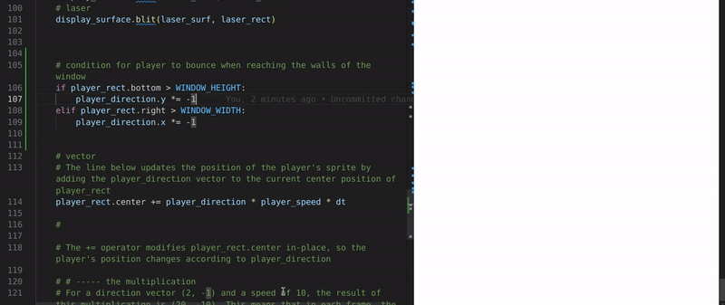

## 🟡 ANIMATION 3.


<br>
<br>

# 🟠 Make the player move

### Make the player ship bounce around the window like the old DVD logo

> #### The ship will move around the screen and bounce off the edges, reflecting off each side just like the old DVD logo animation.

- -  When the ship reaches the boundaries of the window, it will change direction and continue moving within the screen


<br>
<br>

## 🟦 Player direction

- Right now, the ship will move towards the right side.

```python
player_direction = pygame.math.Vector2(1, 0)
# This vector represents the direction and speed at which the player is moving:
```

<br>
<br>

### 🟤 Change it back to this

<br>

- The player will move towards the bottom of the screen because we're adding **1** to the `y-axis` with the direction (1, **1**).

```python
player_direction = pygame.math.Vector2(1, 1)

```

<br>

### 🟤 remove the test values from the `clock.tick(120)` , leave it empty

```python
  dt = clock.tick() / 1000
```

<br>
<br>


## 🌈 Conditional: for directions: `X,Y`


### 🟫 Basic Condition: Implement Bouncing Behavior for Player at Window Edges

>We already saw something like this in [Lesson 3](./RE_game-CODE_03.md)

<br>
<br>

## 🟠 `if` statements rather than `elif`

```python

        #  Y axis
    if player_rect.bottom > WINDOW_HEIGHT:
        player_direction.y *= -1

        #   X axis
    if player_rect.right > WINDOW_WIDTH:
        player_direction.x *= -1
```

#### output

[]()

<br>

- - 🔴 To handle the bouncing effect when the player reaches the edges of the window, we'll use individual if statements **rather than `elif`**.