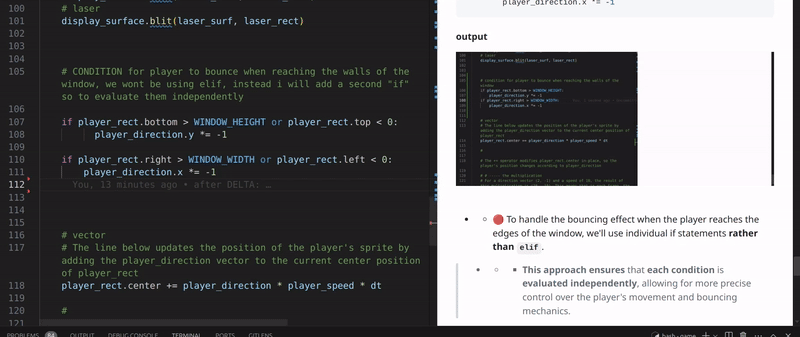
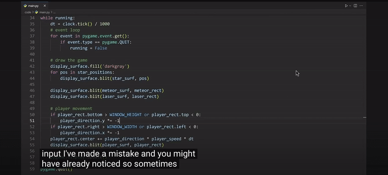
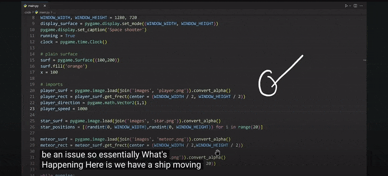

## 🟡 ANIMATION 3.


<br>
<br>

# 🟠 Make the player move

### Make the player ship bounce around the window like the old DVD logo

> #### The ship will move around the screen and bounce off the edges, reflecting off each side just like the old DVD logo animation.

- -  When the ship reaches the boundaries of the window, it will change direction and continue moving within the screen


<br>
<br>

## 🟦 Player direction

- Right now, the ship will move towards the right side.

```python
player_direction = pygame.math.Vector2(1, 0)
# This vector represents the direction and speed at which the player is moving:
```

<br>
<br>

### 🟤 Change it back to this

<br>

- The player will move towards the bottom of the screen because we're adding **1** to the `y-axis` with the direction (1, **1**).

```python
player_direction = pygame.math.Vector2(1, 1)

```

<br>

### 🟤 remove the test values from the `clock.tick(120)` , leave it empty

```python
  dt = clock.tick() / 1000
```

<br>
<br>


## 🌈 Conditional: for directions: `X,Y`


### 🟫 Basic Condition: Implement Bouncing Behavior for Player at Window Edges

>We already saw something like this in [Lesson 3](./RE_game-CODE_03.md)

<br>
<br>

## 🟠 `if` statements rather than `elif`

```python

        #  Y axis
    if player_rect.bottom > WINDOW_HEIGHT:
        player_direction.y *= -1

        #   X axis
    if player_rect.right > WINDOW_WIDTH:
        player_direction.x *= -1
```

#### output

[]()

<br>

- - 🔴 To handle the bouncing effect when the player reaches the edges of the window, we'll use individual if statements **rather than `elif`**.

<br>

> - -  - 🔴 **This approach ensures** that **each condition** is **evaluated independently**, allowing for more precise control over the player's movement and bouncing mechanics.

#### with ELIF

```python

        #  Y axis
    if player_rect.bottom > WINDOW_HEIGHT:
        player_direction.y *= -1

        #   X axis
    elif player_rect.right > WINDOW_WIDTH:
        player_direction.x *= -1
```

<br>
<br>

### 🟠 Before the Teacher Continues, Here's My Approach Based on  [Lesson 3](./RE_game-CODE_03.md)


> #### 🌈 Based on what we covered in Lesson 3, I've come up with the following solution to make the player bounce off the window edges.

<br>

- - This code **checks** if the player has hit the `top/bottom` **or** `left/right` boundaries and reverses the direction accordingly.

<br>

```python
   if player_rect.bottom > WINDOW_HEIGHT or player_rect.top < 0:
          player_direction.y *= -1

    if player_rect.right > WINDOW_WIDTH or player_rect.left < 0:
        player_direction.x *= -1
```

#### output

[]()


<br>
<br>

### 🟡 Possible bugs

### 1.   Stuck in Corners

The approach used in class, which matches my implementation, may result in a bug where the ship/player gets stuck in the corners of the screen.

[]()

<br>

### 2.  Speed Issues

Increasing the speed, for example, from `player_speed = 300` **to** `1000`, can lead to unexpected `behavior` **where the player moves erratically or skips over edges**.

 ## 🟧 🟣 What is happening?


[]()

<br>

 ## 🌈 Short-Term Solution

 - This solution might also have some issues (the teacher will use it anyway, but I’ll ask ChatGPT for more details).


 ### To address these issues, adjust the  conditions as follows:

<br>


 ### 🟤 Y axis

 ```python
# before
if player_rect.bottom > WINDOW_HEIGHT or player_rect.top <= 0:
          player_direction.y *= -1

# after
if player_rect.bottom >= WINDOW_HEIGHT or player_rect.top < 0:
          player_direction.y *= -1
 ```

  ### 🟤 X axis

```python
# before
if player_rect.right > WINDOW_WIDTH or player_rect.left < 0:
        player_direction.x *= -1

# after
if player_rect.right => WINDOW_WIDTH or player_rect.left <= 0:
        player_direction.x *= -1
```


<br>

### 🌈 The teacher might not go into much detail about this, but they recommend using it if the other option isn’t working for you.


<br>
<br>


## 🔴 Analysis of the Issue


### ✅ chatgpt:

### Stuck in Corners:

**Reason:**

- - When the player is moving quickly and hits a corner, the boundary conditions might be checked only once per frame.

> #### If the player's movement causes them to overlap both horizontal and vertical edges in a single frame, they might get stuck because both conditions are true simultaneously.

<br>

## 🟤 Speed Issues:

**Reason:**

- -  Higher speeds can cause the player to skip over boundary checks. If the player moves too quickly, they might cross multiple boundary conditions in a single frame, resulting in unpredictable behavior.

<br>
<br>

## 🟧  Alternative Solution for Boundary Handling

```python
    if player_rect.bottom >= WINDOW_HEIGHT:
        player_rect.bottom = WINDOW_HEIGHT
        player_direction.y = -1
```
