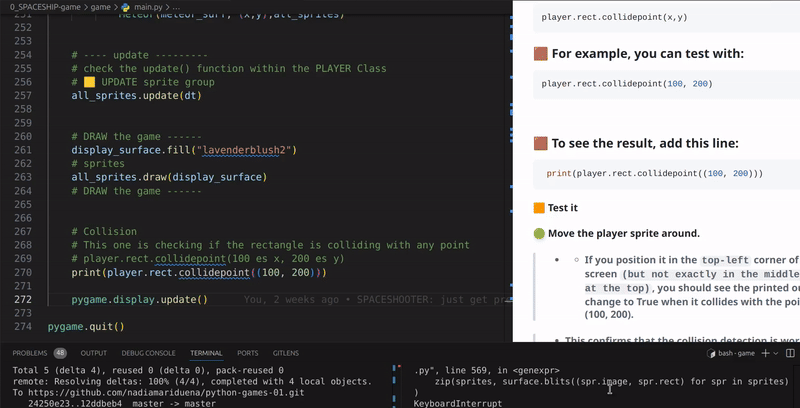
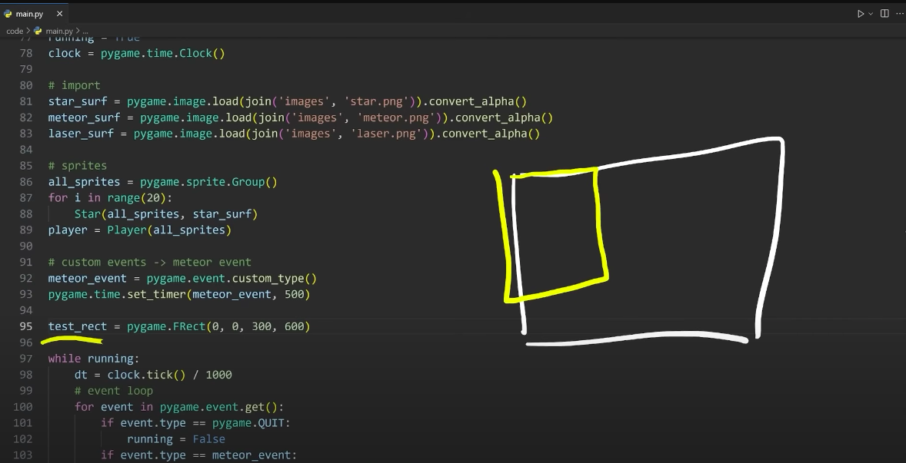
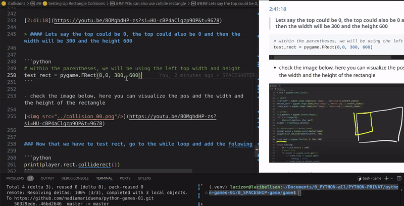
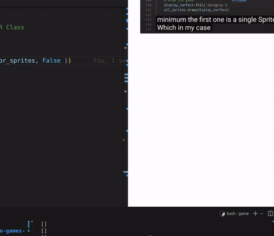
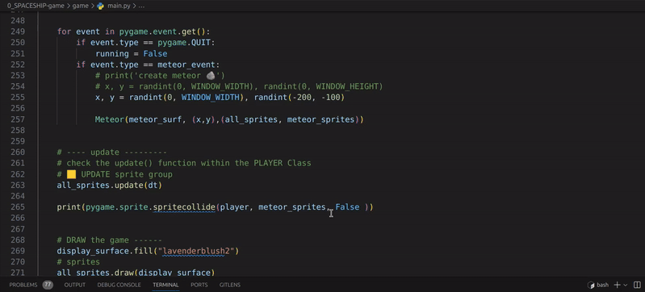

 # 🟡 SPRITES 6.

 <br>

- #### collision 🔫 🪨 💥 [DOCS](https://www.pygame.org/docs/ref/sprite.html)


<br>
<br>
<br>
<br>
<br>

---


# 🟡  Collisions


## 🟧 Understanding collisions


### 🫐  How to Check Collisions in Pygame


### ⚫ <u>There are `two main ways to handle collisions`</u>  in Pygame:

<a name="two_ways_to_handle_collisions"></a>

<br>

## 🟩 Way 1: Rectangle Collisions

> #### What It Is: You can use rectangles to check for collisions.

- - Each game object (like our meteors and player) can be represented as a rectangle.

<br>

**How It Works:** A rectangle can check for collisions in `three ways`:


<br>

- - - **With a Single Point:** Determine if a specific point is inside the rectangle.

- - - **With Another Rectangle:** Check if two rectangles overlap.

- - - **With a List of Rectangles:** See if a rectangle intersects with any rectangle in a list.


<br>

### Pygame offers several methods to check for collisions.

#### Common Collision Methods

> 🟤 Although there are quiet a few variations, check the  [documentation](https://www.pygame.org/docs/ref/rect.html)

<br>
<br>


## 🟩 Way 2: <u>Sprite Collisions</u>


**What It Is:** Sprite collisions focus on checking interactions between individual sprites (like our meteors) and groups of sprites.

**How It Works:** You can easily check if one sprite collides with any other sprite in a group, which is useful for detecting collisions in complex scenes.


### `spritecollide()`

>##### Check the  [documentation](https://www.pygame.org/docs/ref/sprite.html)


---

<br>
<br>
<br>
<br>
<br>


## ⬛ Before Moving on

### 💡 Before Implementing Group Collision Logic:

>Before diving into the full group collision logic, we’ll run some tests.

- 🔴 **Don’t skip** this step it’s important because **it will help you understand why we don’t use certain collision methods** in our game.

<br>

### 🟡  <u>Differences Between collidepoint and colliderect</u>

<a name="Differences_Between_collidepoint_and_colliderect"></a>


### 🟢 collidepoint:

- - Checks if a **specific point** (like (100, 200)) is inside the player's rectangle.

> #### It’s great for **precise checks**, like seeing if the player clicked on an object.

### 🟢 colliderect:

#### Checks if two rectangles overlap.

> #### It’s better for situations where you want to know if two objects (like the player and an obstacle) are touching or intersecting.

<br>

### 🟤 Why Use Each Method?

**Use `collidepoint` when** you want to check for interactions with specific points. This is often used for **mouse clicks or similar events**.

**Use `colliderect` when** dealing with larger objects or sprites, as it helps you determine if they are physically colliding.

<br>
<br>

### 🟨 We’ll begin by testing point-based collision detection.

- This will lay the groundwork for understanding how collision checks work and why we need more precise control in our case.


---

<br>
<br>


<br>
<br>


## 🟦 Let's Get Started!!

<a name="Setting_Up_Rectangle_Collisions"></a>

## 🟡 1.  <u>Setting Up Rectangle Collisions</u>

### 🟫 We’ll begin by creating some rectangle collision checks.


 🟤 `Right now`, we have the following line of code for our player:

```python
player = Player(all_sprites)
```
> **REMEMBER:** The line player = Player(all_sprites) creates the player character and adds it to the `all_sprites` group.

>- - - This means the **player** will be **part of the game**, can **be seen on the screen**, and will **move or change** every time the **game updates**.

<br>

>- - - The `all_sprites` group helps manage everything in the game (so all sprites can be drawn to the screen and updated together, like moving, changing images, or detecting collisions).

<br>
<br>


<a name="collide_point"></a>

## ⚫ <u>`collidepoint`</u>

 🟤 `Next`, go to your **game loop** and add the following line to check for collisions:


```python
player.rect.collidepoint()
```
> ####  This line checks if the player's rectangle is colliding with a specific point. To do this, we need to provide two values: the x and y coordinates.


### 🟫 The correct usage looks like this:


```python
player.rect.collidepoint(x,y)
```

### 🟫 For example, you can test with:


```python
player.rect.collidepoint(100, 200)
```


### 🟫 To see the result, add this line:


```python
 print(player.rect.collidepoint((100, 200)))
```


### 🟧 Test it

- -  Move the player sprite around(With the arrow)

> - - #### If you move the player with the arrow and position it in the `top-left` corner of the screen `(but not exactly in the middle or at the top)`, <u>you should see the printed output change to True </u> when it collides with the point (100, 200).

<br>

[]()

> - ###  This confirms that the collision detection is working!


<br>

```python
running = True
while running:
    # DELTA time
    # frame rate / division
    dt = clock.tick() / 1000
    # print(dt)


    for event in pygame.event.get():
        if event.type == pygame.QUIT:
            running = False
        if event.type == meteor_event:
            # print('create meteor 🪨')
            # x, y = randint(0, WINDOW_WIDTH), randint(0, WINDOW_HEIGHT)
            x, y = randint(0, WINDOW_WIDTH), randint(-200, -100)

            Meteor(meteor_surf, (x,y),all_sprites)


    # ---- update ---------
    # check the update() function within the PLAYER Class
    # 🟨 UPDATE sprite group
    all_sprites.update(dt)


    # DRAW the game ------
    display_surface.fill("lavenderblush2")
    # sprites
    all_sprites.draw(display_surface)
    # DRAW the game ------


    # 💥 Collision
    # This one is checking if the rectangle is colliding with any point
    # player.rect.collidepoint(100 es x, 200 es y)
    # If you position it in the `top-left` corner of the screen `(but not exactly in the middle or at the top)`, you should see the printed output change to True when it collides with the point (100, 200)
    print(player.rect.collidepoint((100, 200)))


    pygame.display.update()

pygame.quit()
```


<br>
<br>
<br>

<a name="collide__rect"></a>

## ⚫ <u>`colliderect`</u>


#### [2:41:18](https://youtu.be/8OMghdHP-zs?si=HU-cBP4aClqzp9OP&t=9678)

## Using `colliderect` method for Rectangle Collisions instead of `collidepoint`


## 🫐 🟡  What is colliderect?

> ####  The `colliderect` method is useful when you want to see if two rectangles overlap, rather than just checking if a point is inside a rectangle.

>    Checking if two rectangles are touching, we say 'we’re looking at if they overlap'

<br>


### 🟠 Create a Test Rectangle

> #### We'll create a test rectangle to demonstrate the purpose of colliderect in action.

```python
test_rect = pygame.Frect()
```

### 🟠 Create a rectangle with specified position and size

- - 🌈 Within the parentheses, we will be using the `left top width and height`

```python
# within the parentheses, we will be using the "left top width and height"
test_rect = pygame.FRect(0, 0, 300, 600)
```
<br>

### 🟤 Explanation


#### `0, 0` are the `x and y` coordinates for the `top-left` corner of the rectangle.

> #### `300` is the `width`, and `600` is the height

### 🟧 Visualize It:

> You can think of the rectangle like a box on the screen.

- - The top-left corner starts at (0, 0), and it stretches down to the right to cover an area of 300 pixels wide and 600 pixels tall.

[](https://youtu.be/8OMghdHP-zs?si=HU-cBP4aClqzp9OP&t=9678)

---

<br>
<br>
<br>
<br>

## 🟦 Moving Forward:

<a name="collide-rect_inthegameloop"></a>

## 🟡 2.   <u>`colliderect` in the Game Loop</u>

<br>

### 🟤 Step 1: Setting Up Collision Checks

#### 🟥 Now that we have our `test_rect` ready, it’s time to check for collisions in the game loop.

> 💡 This is where we see if the player is touching the obstacle.

<br>

#### Add the Collision Check:

-  Start by adding this line to your game loop:

```python
print(player.rect.colliderect())
```

<br>

### 🟤 Step 2: Checking Against `test_rect`


**Next**, we need to **specify which rectangle we’re checking** for collisions with.


```python
# ✋ Add the rectangle we just created as an argument to the colliderect method:
print(player.rect.colliderect(test_rect ))
```

<br>

### 🟤 Step 3: Understand What’s Happening

#### By doing this, we are asking the program: `“Is the player’s rectangle touching the test_rect?”`

> - - - #### If they overlap, this line will return True, and you’ll see it printed in the console.


### 🟠 Test It Out

### Move the Player

#### 🟢 Move the player sprite around the screen.

- Now, move the player sprite around.

- - When you reach the **(0, 0)** position with the arrow, check the console.

<br>

> #### It should display "TRUE" (on the console) when the player’s rectangle overlaps with the `test_rect`.

### 🔴 This shows that the two rectangles are colliding!

[]( )

<br>


```python
test_rect = pygame.FRect(0,0, 300, 600)


running = True
while running:
    # DELTA time
    # frame rate / division
    dt = clock.tick() / 1000
    # print(dt)


    for event in pygame.event.get():
        if event.type == pygame.QUIT:
            running = False
        if event.type == meteor_event:
            # print('create meteor 🪨')
            # x, y = randint(0, WINDOW_WIDTH), randint(0, WINDOW_HEIGHT)
            x, y = randint(0, WINDOW_WIDTH), randint(-200, -100)

            Meteor(meteor_surf, (x,y),all_sprites)


    # ---- update ---------
    # check the update() function within the PLAYER Class
    # 🟨 UPDATE sprite group
    all_sprites.update(dt)


    # DRAW the game ------
    display_surface.fill("lavenderblush2")
    # sprites
    all_sprites.draw(display_surface)
    # DRAW the game ------


    # 💥 Collision
    # This one is checking if the rectangle is colliding with any point
    # player.rect.collidepoint(100 es x, 200 es y)
    # If you position it in the `top-left` corner of the screen `(but not exactly in the middle or at the top)`, you should see the printed output change to True when it collides with the point (100, 200)
    # print(player.rect.collidepoint((100, 200)))
    print(player.rect.colliderect(test_rect))

    pygame.display.update()

pygame.quit()
```

<br>
<br>
<br>

---

## 🟠 Understanding Collision Limitations


### When we talk about collisions in Pygame, it's important to know how they work.

🌈 Pygame is like a helper that checks if things are touching each other, but it has some limitations.


### 🟤 What Does `Pygame` Collisions Do?

>Pygame’s collision system mainly looks for overlaps between rectangles.

<br>

🟨 **Example:**


### 🧸   `A Ball and a Wall` 🧶

> #### Imagine you’re playing with a bouncy ball in a room:

<br>

**The Ball:** This is like your player character.

**The Wall:** This represents an obstacle in the game.

<br>

### 🟤 What Happens When the Ball Hits the Wall?

When you roll the ball towards the wall, you want to know if it touches the wall.

-  `Pygame` can tell us when the ball (the player) is touching the wall. It says, “The ball is hitting the wall!”


###  The Limitation

>  However, just knowing that the ball is touching the wall doesn’t stop it from going through.

###  Rule

>  To make it realistic, you need to add a rule: **“If the ball touches the wall, it should stop moving forward!**”

<br>

### 🟤 Why Is This Important?

This means that while Pygame helps you see when two objects are touching, <u>you need to add your own rules to make sure the ball (or player) behaves correctly in the game world</u> .

<br>
<br>

## 🟣 QUESTIONS: Is this similar to raycasting?

### ✅ chatgpt:

💥 Yes, it's somewhat similar to raycasting!

 <br>

 <br><a name="about_raycasting"></a>

 ## 🫐 🟠 Raycasting


- ### What is Raycasting?

-  - Why Use Raycasting?

-  - -  Comparing to Rectangle Collisions

#### 🟩 Read More: [z__RAYCASTING](../z__RAYCASTING.md)

---


<br>
<br>
<br>
<br>
<br>
<br>


## 🟦 Moving Forward:

## 🟡 3.  Next Step: Remove the test:


```python
# remove the below:
test_rect = pygame.FRect(0,0, 300, 600)
    print(player.rect.colliderect(test_rect))
```

<br>


#### [2:42:40](https://youtu.be/8OMghdHP-zs?si=48T5ZXAtPyjJ7RUp&t=9760)


<a name="Checking_meteor_Collisions_within_the_Player"></a>

### 🟠 Checking Meteor Collisions within the Player

<br>

### 🟤Understanding the Problem:

#### 🔴 Currently, we have all our sprites like `meteors, stars, and the player grouped together` in a single sprite group.

This setup creates a challenge when we want to check for collisions between the player and the meteors.


### 🔴 Why Is This a Problem?

**Difficult Separation:**

####   When all sprites are in one group, it becomes hard to differentiate between them.

> ####   If we want to check if a meteor hits the player, we need a way to isolate those two specific sprites from the others in the group.

<br>

**Collision Logic:**

####   If all sprites are in one spot, collision detection isn’t as fast.

```python
# SPRITES  ------
all_sprites = pygame.sprite.Group()

for i in range(20):
    Star(all_sprites)

player = Player(all_sprites)

# -----------------
```

> - 🔴 We may end up checking collisions between the player and stars or other irrelevant sprites, which is not what we want!


<br>
<br>

# 🟦  Solution:

### 🔴 Creating Separate Sprite Groups


## 🟡 4. Create another sprite

- To solve this issue, we’ll create a separate **sprite group for the meteors**.

```bash
meteor_sprites = pygame.sprite.Group()
```

> - - This way, we can easily manage and check collisions between the player and only the meteor sprites.

<br>
<br>

## 🟡 5. two groups:

###  Once you create the second sprite: `meteor_sprites = pygame.sprite.Group()`, modify the below (within the game loop):

- Instead of managing just one sprite, we now want to organize everything into two groups:


```python
# BEFORE
Meteor(meteor_surf, (x,y),all_sprites)

# AFTER
Meteor(meteor_surf, (x,y),(all_sprites, meteor_sprites) )
```

### Explanation

**First Sprite Group `(all_sprites)`:** This group is used for updating and displaying all game objects.

**Second Sprite Group `(meteor_sprites)`:** This group specifically holds all meteor objects, making it easier to manage and identify them.


<br>
<br>


<br>
<br>

---

## 🟠 Instant Access vs. One-Time Use


###  Why Store Your Sprite?

<br>


### 🟤 Keeping a reference

The teacher mentioned that when you create a sprite, you're getting a return value, allowing you to reference it with a variable like the `player =`.

> - - #### However, you don’t always need to do that.


### 🟤 Creating it directly:

**For example**, when we create a meteor, we can use it directly without a variable: `Meteor(meteor_surf, (x,y), (all_sprites, meteor_sprites))`.

> - - #### 🌈 You only assign a variable if you plan to reuse that sprite multiple times in your code.


### ⚫ Summary

> - #### keeping a reference makes things smoother. Otherwise, it’s fine to create it directly.


---

<br>
<br>
<br>
<br>


## 🟦 Moving Forward:


## 🟡 6.  Collisions with `spritecollide()`

### Add the `spritecollide()` within your game loop:

```python
pygame.sprite.spritecollide()
```
####  How it should look like:

```bash
  #  UPDATE sprite group
    all_sprites.update(dt)
    # --------- collision ✋
    pygame.sprite.spritecollide()
    #---------- collision
```


### 🟧 The `spritecollide()` function checks if two objects (like your spaceship  and the 🪨 meteor) are touching or overlapping.


> #### Think of sprites as individual objects in your game, like your player or meteors.

<br>

- - -  When **two** sprites (such as your player and a meteor) come into contact, we say they collide.

<br>

- - -  Instead of manually checking each sprite's position, `spritecollide()` automatically compares the `hitboxes` of sprites in a `group`, making collision detection much faster and easier.

<br>

- -  - #### 💡 When a collision happens, you can decide what should happen next (like destroying the meteor "enemies", collecting items or causing some damage to the spaceship.)

<br>
<br>

#### [2:48:39](https://youtu.be/8OMghdHP-zs?si=yXNLSoF6OmRhHmIw&t=10119)

## 🟡 7.  Provide at least 3 arguments to the function:


 **Next:** Now that `pygame.sprite.spritecollide()` is in the game loop, Provide at least 3 arguments to the function

```python
pygame.sprite.spritecollide(🔺 player, 🔺meteor_sprites, 🔺False)
```
>**REMEMBER:** We’re checking if the player sprite collides with meteor sprites.

- <u>The three arguments are: the player, the meteor group, and True/False to remove the colliding sprites.</u>

### 🟤 Explanation of the Arguments

<br>

- -  🟤 **The sprite you're checking for collisions** (like your player character).

- - 🟤  **The group of sprites to check against** (like enemies or obstacles).

### To FALSE

#### 🔴 For now, let’s leave it as False so we can see the collision but not destroy the meteor right away.

---

<br>

 ## 🟠 Test it

### Pay attention to the console!

- You'll see a message every time your player crashes into a meteor.


[]( )


## 🟠 Remove from GROUP

 The third argument, when set to True, instructs Pygame to **remove the meteor sprites from the `meteor_sprites` group upon collision**.

>This is why, as shown in the image below, the meteor disappears when it collides with the player.

```python
pygame.sprite.spritecollide(player, meteor_sprites, True)
```

### As demonstrated in the image:

> ####  When the player collides with a meteor, the meteor vanishes ( 🔺 note: the laser feature is not yet functional).

[]( )


### 🟫 Remember

#### You can change the amount of meteors here:

```python
pygame.time.set_timer(meteor_event, 50)
```

###  🟤 `50:`

  ####  This is the interval in milliseconds between each event trigger.

> - -  #### 🟧In this case, the value 50 means the `meteor_event` will be triggered every `50` milliseconds. This interval determines how often new meteors are spawned.

<br>

- **Smaller values** (e.g., **20 or 30**) will result in more frequent meteor spawns.

- **Larger values** (e.g., **100 or 200**) will result in fewer meteor spawns over time

```python
pygame.time.set_timer(meteor_event, 100)  # Spawns a meteor every 100 milliseconds

```


---

<br>
<br>
<br>

## 🟦 Moving Forward:


## 🟡 8.  Conditional | `if` Statement to Check for Collisions

- first we will just print it:

#### Instead of simply printing the list of collided sprites, you would typically use an `if statement` to check if collisions occurred and then take action, like displaying a message or triggering an event.

```python
    if pygame.sprite.spritecollide(player, meteor_sprites, True):
        print("HTTING 💥")
```
<br>

## 🟠 Difference Compared to the Previous Line:

### 🟤 Previous Line:


```python
  print(pygame.sprite.spritecollide(player, meteor_sprites, True
```
#### prints a list of collided meteor** sprites, showing which meteors collided with the player.

-  - It prints all collisions that occur at that moment.

<br>

### 🟤 New Line with if Statement:


```python
if pygame.sprite.spritecollide(player, meteor_sprites, True):

```
>### Only prints the message "HITTING 💥" when a collision actually happens.


- - **It does not print** the list of collided meteors **but instead triggers an action** (like a visual effect, sound, or other game mechanics) when a collision occurs.

---


<br>
<br>

<br>
<br>
<br>

## 🟦 Moving Forward:


## 🟡 9. Tracking Player's 🪨 `Meteor Collisions` and Removing Them

- **Collision Detected:** First Meteor in the List Printed

```python
    collision_sprites =  pygame.sprite.spritecollide(player, meteor_sprites, True)
    if collision_sprites:
        print(collision_sprites[0])
```

<br>

## 🟧 What's Happening:

```python
collision_sprites =  pygame.sprite.spritecollide(player, meteor_sprites, True)
```

🟤 `collision_sprites = pygame.sprite.spritecollide(player, meteor_sprites, True):`

- - - This function **checks if** the **player** sprite **collides with any sprites in** the `meteor_sprites` group.

<br>

 🟤 The third argument `(True)` **removes the meteors from the group once they collide.**


> - - #### The function returns a list of collided meteor sprites (`collision_sprites`).


```python
if collision_sprites:
    print(collision_sprites[0])
```

#### 🟤 `if collision_sprites:`:

- -  This checks **if there is at least one** meteor in the `collision_sprites list`.

- - **If the list is not empty** (i.e., **if the player hit at least one meteor**), the game goes to the next step.

<br>

#### 🟤 `print(collision_sprites[0])`:

- - This tries to print the first meteor in the list.

<br>
<br>


## 🟧 Explanation of the Output:

- When you see output like:

```python
<Meteor Sprite(in 0 groups)>
<Meteor Sprite(in 0 groups)>
<Meteor Sprite(in 0 groups)>
<Meteor Sprite(in 0 groups)>
```
#### 🟫 It means that the `collision_sprites` <u>list </u> contains several meteor sprite objects, <u> but they are no longer part of any active sprite groups</u> because of the `True` argument used in `pygame.sprite.spritecollide()`.

### `True`:

> - - - #### instructs Pygame to remove the meteor sprites from the `meteor_sprites` **group upon collision**.


- - - #### After removal, the meteor sprites are still part of the list (collision_sprites), but they are no longer in any sprite groups.