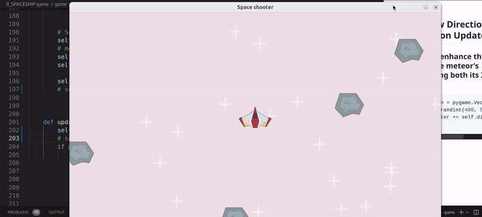
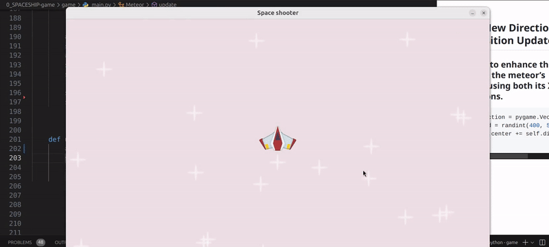

 # 🟡 SPRITES 6.

 <br>

 ### Intro


 - - What **We’ll Be Doing:** [Go to section](#What_We_will_Be_Doing_)


 <!--


 #### 🟨 create the meteor class

 - - create the meteor class [Go to section](#create_class_)


 - - -  #### 🟨 create the event

 - - - - create the event to make the meteor appear [Go to section](#event_meteor_1_)

 <br>


  -->


 <br>
 <br>
 <br>
 <br>

 ---

 <br>


 # 🟡 What We will Be Doing

 <a name="What_We_will_Be_Doing_"></a>


 ## 🫐 🟡 Adding Meteor Rains to Our Space Shooter

 ### In this lesson, we will be focusing on adding meteors to our space shooter game.

 > -  ### Specifically, we will set up a system where meteors fall from the top of the screen, <u>creating obstacles for the player to avoid</u> 💥.

 <br>

 ### 🟤 This will involve using Python's random module, specifically the `range() and uniform()` functions, to control the position and speed of the meteors as they appear and move downwards.

 <br>

 ## 🟡 NEXT

 ###  After completing this lesson, we'll also be ready to tackle meteor collisions!

 - You'll learn how to detect when a meteor hits the player’s spaceship and how to handle those collisions (either) by taking damage or ending the game.

 ---

 <br>
 <br>
 <br>
 <br>
 <br>


 # 🟦 Let's Start:


 ## 🟡 Steps to Implement the *Key* LOGIC


 <a name="create_class_"></a>


 <br>

 ### 🟧 1. Create the 🪨METEOR  class

 ```python
 class Meteor(pygame.sprite.Sprite):
 ```

 ### 🟧 2.  Now Create a Meteor for Every Meteor event

 Here, we set up the `constructor` for the **Meteor** class.

 - In the next step We’ll pass all necessary **parameters** to define the meteor's behavior and appearance.

 ```python
 class Meteor(pygame.sprite.Sprite):
     def __init__(self, )
 ```


 <br>

 ### 🟧 3. Pass all the parameters


 ### 🟤 Parameters: (self, surf, pos, groups)


 These parameters will help us **specify** the meteor's **surface, position**, and the **sprite group it belongs** to.

 ```python
 #🪨 METEOR
 class Meteor(pygame.sprite.Sprite):
     def __init__(self, surf, pos, groups):
         super().__init__(groups)

         try:
             self.image = surf
 ```
 <br>
 <br>

 <br>

 ---

 ### ⚫ RECAP:

 ### 🍭 self:

 This refers to the current instance of the Player class.

 > - - ####  When you call `Laser(laser_surf, self.rect.midtop, all_sprites)`, self is implicitly passed when invoking methods from the Player instance.

 <br>


 ### 🍭 surf 🖼️

 This corresponds to laser_surf, which is the surface you want the Laser to use.

 > - - #### 🌞 It’s the image that you’ve loaded for the laser.


 <br>

 ### 🍭 pos:

 This is `self.rect.midtop`, which provides the position where the laser will be created.

 >  - - #### It uses the player’s current position (specifically the midpoint of the top edge of the player’s rectangle).


 <br>

 ### 🍭 groups:

 > - - #### This refers to all_sprites, which is the group you want the laser instance to be added to.

 - - This allows the laser to be part of the sprite management system for updates and drawing.


 <br>

 ### 🍭 pos:

 This is `self.rect.midtop`, which provides the position where the laser will be created.

 >  - - #### It uses the player’s current position (specifically the midpoint of the top edge of the player’s rectangle).


 <br>

 ### 🍭 groups:

 > - - #### This refers to all_sprites, which is the group you want the laser instance to be added to.

 - - This allows the laser to be part of the sprite management system for updates and drawing.

 ---

<br>
<br>
<br>

## 🟦 Moving Forward:

## 🟧 4.  Set the Image and Position

In this step, we set the**meteor's image** using the provided surface.

- - If the image **isn’t found, we create a fallback** surface. We also define the **position** of the meteor using its rectangle.

```python
#🪨 METEOR
class Meteor(pygame.sprite.Sprite):
    def __init__(self, surf, pos, groups):
        super().__init__(groups)

        try:
            self.image = surf
        except KeyError:
            print("Meteor image not found in images dictionary.")
            self.image = pygame.Surface((80, 50))
            self.image.fill((255, 238, 72))  # Acid yellow


        # Set the position of the laser
        self.rect = self.image.get_frect(center = pos)
        # meteor_rect = meteor_surf.get_frect(center=(WINDOW_WIDTH / 2, WINDOW_HEIGHT / 2))
```


<br>
<br>
<br>

<a name="event_meteor_1_"></a>

## 🟧 5. Handle Meteor Events


### In this step, we listen for events in the game `loop`.

- - #### 🏁 When a `meteor_event` is triggered, we create a new `Meteor` instance using `meteor_surf`, specifying its position and adding it to the sprite group.

> #### This step is crucial for bringing meteors into the game, allowing them to appear on the screen.

```python
# 🧶 GAME LOOP ----
    for event in pygame.event.get():
        if event.type == pygame.QUIT:
            running = False
        # METEOR event ----
        if event.type == meteor_event:
            # print('create meteor 🪨')
            Meteor(meteor_surf, (400,500),all_sprites)


```

<br>

## 🟧 6. Test It Out!

After implementing **step 4**, run the game to see the meteors appear on the screen.

> #### You should now see the meteor in action!

[]()


<br>
<br>


## 🟧 7. Customize the Meteor Position

### 🟤 Define the Position Coordinates

To position the meteor accurately, we need to customize the **coordinates:**

```python
(400,500)
```


### 🟤   X and Y Coordinates

The coordinates correspond to the X and Y positions on the screen:

```python
# x
randint(0, WINDOW_WIDTH),
#y
randint(0, WINDOW_HEIGHT)
```
<br>

### 🟤  Randomize the Position
We can generate random X and Y values like this:

```python
x, y = randint(0, WINDOW_WIDTH), randint(0, WINDOW_HEIGHT)
```

<br>

### 🟤  Update Meteor Creation

> #### Now, let’s replace the hardcoded position with our randomized values

```python
# BEFORE

            Meteor(meteor_surf, (400,500),all_sprites)

# AFTER --------

            Meteor(meteor_surf, (x, y),all_sprites)
```
[]()

<br>


> ### 🟧 Update the event handling to create meteors at random positions:

```python
    for event in pygame.event.get():
        if event.type == pygame.QUIT:
            running = False


        # --------- METEOR ----------
        if event.type == meteor_event:
            # print('create meteor 🪨')
            x, y = randint(0, WINDOW_WIDTH), randint(0, WINDOW_HEIGHT)
            Meteor(meteor_surf, (x,y),all_sprites)
```


[]()

<br>
<br>

## 🟧 8.  Animate the Meteor

### To animate the meteor, we’ll add an update() function to the Meteor class, similar to what we did for the laser:


```python
class Meteor(pygame.sprite.Sprite):
    def __init__(self, surf, pos, groups):
        # .. more code here (related to the init)

    def update(self, dt):
```
<br>
<br>

## 🟧 9. Make the meteors move 👾

#### Now, let’s implement the movement logic inside the update() method:

```python
    def update(self, dt):
        self.rect.centery += 400 * dt
```

#### This code moves an object vertically (up or down) on the screen.

- - `self.rect.centery` is the **center** of the object.

- - `400 * dt` makes the **object move 400 pixels** per **second**.


- - `dt` **adjusts the movement** based on how fast the game is running.

> #### This ensures smooth, consistent movement regardless of frame rate.

<br>
<br>
<br>


## 🟦 Moving Forward:

### 🟧 10. Right now, when we create a meteor, it appears at a random position within the entire window. For example:

```python
x, y = randint(0, WINDOW_WIDTH), randint(0, WINDOW_HEIGHT)
```

> #### 👎 This means the user can see the meteor immediately as it appears in a visible area of the screen.


<br>
<br>

## 🟧 11. Adjusting the Y Position


#### 🟤 This means the user can see the meteor immediately as it appears in a visible area of the screen.

> ### To avoid that, we want to create the meteors above the visible area of the screen.

> - - #### 🟢 Specifically, we want them to start from a random position at the top, which means `adjusting the Y coordinate` to be a `bit higher than the window's top edge`.

- In other words, we want to be in a position `randomly` **between -200 & -100**

```python
x, y = randint(0, WINDOW_WIDTH), randint(-200, -100)
```

<br>

### 🟩 Output


[]()

<br>

### 🔴 Understanding the `Position Values` By setting the `Y position randomly` between `-200 and -100`, we achieve the following:


```python


                |                    |   <-- Meteor Spawn Area

                                         <-- (Y = -200)

                |                    |   (Y = -500)
                |                    |
                |                    |   <-- (Y = -100)
                |                    |
                |                    |
                |                    |
                |                    |
                |                    |
                +--------------------+   <-- Visible Area (Y = 0)
                |                    |
                |                    |
                |                    |
                +--------------------+
```

<br>


### 🟤 `-200`: the meteor can start as high as 200 pixels above the top of the window.

- - - When it **begins** up here, it’s completely **hidden from view**. This way, players have a moment to see the meteor as it starts to fall down.

### 🟤 `-100`: This number is the highest point where the meteor can start.

---

<br>
<br>
<br>
<br>

## 🟧 12. CUSTOMIZE the 🪨 meteor class

[2:32:42](https://youtu.be/8OMghdHP-zs?si=1-IlXIXDaRiQOLef&t=9162)


### In this customization, we want to do two things:

#### 🟢 1.  Destroy Every Meteor Sprite

>  We want each meteor sprite to disappear after 2 seconds.

> - - #### This way, they vanish before they reach the bottom of the screen.

> - - #### To do this, we’ll add the following line:

- **Destroy every  meteor** sprite **after 2 seconds** (we want the rocks to vanish before they reach the edge of the bottom of the screen), we will be doing it by adding the below line:


#### 🟤 Timer

- First, we need to set up the timer:

```python
# This line tells us when the TIMER should start
self.start_time = pygame.time.get_ticks()
```

<br>

### 🟠 Explanation:

-  - **Here**, `pygame.time.get_ticks()` gives us the current time in milliseconds since the game started.

> - - #### By saving this time in self.start_time, we can track how long the meteor has been alive.

<br>

### 🟤 Lifetime

- **Defining Lifetime:** Next, we set how long the meteor should live before it disappears.

```python
self.lifetime = 2000
```
<br>

> #### 🟠 Explanation:

This line means the meteor will last for 2000 milliseconds, or 2 seconds.

> #### This connects to our timer because it tells us how long we should wait before the meteor is removed.


### 🟦 Putting It All Together


```python
#🪨 METEOR
class Meteor(pygame.sprite.Sprite):
    def __init__(self, surf, pos, groups):
        super().__init__(groups)

        try:
            self.image = surf
        except KeyError:
            print("Meteor image not found in images dictionary.")
            self.image = pygame.Surface((80, 50))
            self.image.fill((255, 238, 72))  # Acid yellow


        # Set the position of the laser
        self.rect = self.image.get_frect(center = pos)

        # Timer 🟡
        self.start_time = pygame.time.get_ticks()
        # duration
        self.lifetime = 2000
```


### 🔴 Conditional

### 🟧 Update Function:

- Now, we’ll add a conditional statement in the update function to check if the meteor should disappear.

```python
    if pygame.time.get_ticks() - self.start_time >= self.lifetime:
        self.kill()
```


###  🟤 Explanation:

- This line **checks** `if` the `current time` **minus** the time when the meteor started (`self.start_time`) is greater than or equal to `self.lifetime`.


### 🟤 Understanding Each Part:

- - - `pygame.time.get_ticks()`: This part gives us the current time in milliseconds (like counting how many seconds have gone by since the game started).

- - - `self.start_time`: This is the time when the meteor was created. We saved it earlier, so we know when it started.

- -  - `self.lifetime`: This is the time we set for how long we want the meteor to live (in our case, 2000 milliseconds, or 2 seconds).

<br>

- - **If it is**, we use `self.kill()` **to remove the meteor**.

> #### 🌈 It’s like saying, “If 2 seconds have passed since the meteor was created, make it disappear!”


<br>

### 🔴 Why Is This Important?

#### This code helps control how long things stay in the game.

- - - It’s like having rules in a game: if you follow them, everything works smoothly!

<br>
<br>

### 🟦 Putting It All Together


```python
    def update(self, dt):
        self.rect.centery += 400 * dt
        if pygame.time.get_ticks() - self.start_time >= self.lifetime:
            self.kill()

```
<br>

### Output

[]()


<br>
<br>
<br>

## 🟧 13. Giving Meteors a Direction

### 🟤 Right Now:

- #### the meteors are moving in a straight line down the screen (watch the above img).

> - - ####  This can get a bit boring because they all follow the same path.


<br>

### 🟤 What We Want to Do?:

####  <u> We want each meteor to move in a different direction! </u>

- This will make the game more exciting and fun to play.


### 🟤 How We Do It:

- - #### To give each meteor its own direction, we’ll use `pygame.Vector2()`.

- - This tool is perfect for defining movement because it allows us to represent both the direction and speed of the meteor as a single object.

```python
pygame.Vector2(x, y)
```


<br>
<br>
<br>

---

## ⚫ Recap `Vector2()`:


### What is `pygame.Vector2()`?

### 🟧 `pygame.Vector2(x, y)`: This function creates a vector, which is like an <u>arrow that points in a specific direction</u> .

- `x` is how far to the side (left or right).

- `y` is how far up or down.


### 🌈 🟡 For example:

- - - If we use `pygame.Vector2(1, 0)`, the meteor will move to the right.

- - - If we use `pygame.Vector2(0, 1)`, the meteor will move down.

- -  - If we use `pygame.Vector2(1, 1)`, it will move diagonally down and to the right!

---

<br>
<br>
<br>


## 🟧 14. `uniform`

### `uniform` function to generate a random floating-point number for the `X` direction

- -  ### Now that `we have established a direction for our meteors` using `pygame.Vector2(x, 1)`, <u>we need to make the X value dynamic</u>.

<br>

- - 🌈 To achieve this, we’ll use the uniform function to generate a random floating-point number for the X direction.

<br>

>   #### 🌈 This will allow each meteor to have a unique horizontal movement, enhancing the game’s excitement and unpredictability.


<br>
<br>

>

### 🟦 Let’s get started!

###  <u>Continuing with Randomizing the X Value</u>

<br>

### 🟤 Step 1: Importing the Function


-  **First**, make sure you have the following **import statement** at the top of your app file:

```python
from random import randint, uniform
```
> This imports the uniform function, which we will use to generate random floating-point values for the meteor's X direction.


<br>
<br>

### 🟤 Step 2: Setting the Random `X Direction`

- **Next**, when you create a new meteor, assign a random value to its X direction:

```python
self.direction = pygame.Vector2(uniform(-0.5, 0.5), 1)
```
<br>

## 🟩 Breakdown of the Code:

### 🟢 `pygame.Vector2(...)`:

- - This creates a new vector that represents the direction the meteor will move.

> - - A vector is like an arrow that has both direction and length.


<br>
<br>

### 🟢 `uniform(-0.5, 0.5)`:

-   Generates a random floating-point number between -0.5 and 0.5 for the X direction.

### 🌈 What This Does:

>  This creates a new vector for the meteor's direction.

#### The X component is a random value generated by uniform(-0.5, 0.5), `which gives a slight left or right movement`.


## 🟢 `1:`

###  This `sets the Y direction to a fixed value of 1`, meaning the meteor will always `move downward`.

### 🧶 Why Fixed Y Direction?:

>#### By keeping the Y direction consistent, we ensure that all meteors fall from the top of the screen downwards, which maintains the core gameplay mechanic.

---

<br>
<br>
<br>

## 🟧 15.  Setting the Speed:

```python
self.speed = randint(400, 500)
```

### 🟤 What This Does:

#### This assigns a random speed to the meteor between 400 and 500 pixels per second.


- If the speed is set to 400, the meteor will move 400 pixels down the screen in one second.

- If the speed is set to 500, the meteor will move 500 pixels down in one second.

### 🟤 🟤 `Purpose of the Range:`

- - 🔴 By using randint(400, 500), each meteor gets a random speed within that range. This means that **some meteors will move faster than others**, creating variety in how quickly they fall.

<br>
<br>

### Output


[]()

<br>
<br>
<br>

## 🟡 Go to the Meteor class, within the `Update()` function:

### This is what we currently have to update the position:

```python
self.rect.centery += 400 * dt
```
>**Explanation:** This line moves the meteor downward at a speed of 400 pixels per second, scaled by dt (delta time).

 - - #### 🔴 While this effectively controls vertical movement, it doesn’t account for any horizontal motion.

<br>

### 🌈 Solution

> #### We need to `update the meteor's position` by using its `center`.

- To do this, we will <u>multiply</u> `self.direction` by `self.speed` and then by `dt`.

#### This will help us calculate how far the meteor should move in that frame.

<br>
<br>
<br>

## 🟧 16. New Direction and Position Update:

### We want to enhance this by updating the meteor’s position using both its X and Y directions.

- Modify the below


```python
# BEFORE
self.rect.centery += 400 * dt

# AFTER
self.rect.center += self.direction * self.speed * dt
```
<br>

### 🟠 What This Does:

```python
self.rect.center += self.direction * self.speed * dt
```

### This line updates the meteor's position based on its direction and speed.

- #### `self.direction * self.speed * dt:`

  This calculates the change in position for that frame.

- -  The `self.direction` vector gives the direction of movement.

<br>

-  - Multiplying by `self.speed` adjusts how fast the meteor moves.

<br>

### Finally, multiplying by `dt` ✋ ensures the movement is smooth and consistent, regardless of frame rate.


<br>

### Output

[]()


<br>
<br>

```python
# 🪨 METEOR CLASS
class Meteor(pygame.sprite.Sprite):
    def __init__(self, surf, pos, groups):
        super().__init__(groups)  # Initialize the parent class with the specified groups

        try:
            self.image = surf  # Set the meteor's image from the provided surface
        except KeyError:
            print("Meteor image not found in images dictionary.")  # Error message if the image is missing
            self.image = pygame.Surface((80, 50))  # Create a default surface if no image is found
            self.image.fill((255, 238, 72))  # Fill the default surface with a bright yellow color

        # Set the meteor's position based on its center
        self.rect = self.image.get_frect(center=pos)  # Create a rectangle for the meteor to define its position
        self.start_time = pygame.time.get_ticks()  # Record the start time for the meteor's lifetime
        self.lifetime = 3000  # Set how long the meteor will be visible (in milliseconds)

        # Set a random direction for the meteor (X varies, Y is fixed downwards)
        self.direction = pygame.Vector2(uniform(-0.5, 0.5), 1)
        # Assign a random speed between 400 and 500 pixels per second
        self.speed = randint(400, 500)

    def update(self, dt):
        # Update the meteor's position based on its direction and speed
        self.rect.center += self.direction * self.speed * dt
        # Check if the meteor's lifetime has expired and remove it if necessary
        if pygame.time.get_ticks() - self.start_time >= self.lifetime:
            self.kill()  # Remove the meteor from the game

```

<br>
<br>


<br>
<br>

## 🟡 Before we continue with the collisions, this is the current code


```python

import pygame
import os
from random import randint, uniform


#------------- INIT
pygame.init()
# -------------


# SCREEN
WINDOW_WIDTH, WINDOW_HEIGHT = 1280, 720
display_surface = pygame.display.set_mode((WINDOW_WIDTH, WINDOW_HEIGHT))
# TEXT screen
pygame.display.set_caption("Space shooter")


#🟨 imgs -----
script_dir = os.path.dirname(__file__)
# img's path
image_paths = {
    'player': os.path.join(script_dir, '..', 'images', 'player.png'),
    'star': os.path.join(script_dir, '..', 'images', 'star.png'),
    'meteor': os.path.join(script_dir, '..', 'images', 'meteor.png'),
    'laser': os.path.join(script_dir, '..', 'images', 'laser.png')

}

# INIT the images dictionary
images = {}

# Load images and handle errors
# Notice how we grab the dictionary "image_paths"
for key, path_imgs in image_paths.items():
    try:
        #LOAD and CONVERT the image in one step
        images[key] = pygame.image.load(path_imgs).convert_alpha()

    except pygame.error as img_item:

        print(f"Failed to load image '{path_imgs}': {img_item}")
        # Fall img IF LOAD fails
        images[key] = pygame.Surface((50,50)) # square
        images[key].fill((249, 255, 51 )) # yellow acid
# ---------

# IMAGES out of the class
# Define other surfaces
meteor_surf = images['meteor']
laser_surf = images['laser']
star_surf = images['star']
# ----------

# ----------
# positioning of the imgaes with surfaces, we will no longer need the below, because we are adding it directly within the laser for each one of them, like laser, meteor etc
# center of the screen for the 2 items below
# meteor_rect = meteor_surf.get_frect(center=(WINDOW_WIDTH / 2, WINDOW_HEIGHT / 2))
# laser_rect = laser_surf.get_frect(bottomleft=(20, WINDOW_HEIGHT - 10))
# -----------


class Player(pygame.sprite.Sprite):
    def __init__(self, groups):
        super().__init__(groups)
        try:

            self.image = images['player']
        except KeyError:
            print("Player image not found in images dictionary.")
            # Handle the failure (e.g., set a default image or exit)
            #  ---- 🔴 create a red square as a fallback/ shape red in case the img doesnt load --
            self.image = pygame.Surface((50, 50))  # Example fallback surface
            self.image.fill((0, 56, 175 ))  # BLUE Klein

        self.rect = self.image.get_frect(center=(WINDOW_WIDTH / 2, WINDOW_HEIGHT / 2))

        self.direction = pygame.Vector2()
        self.speed = 300

        # 🥶 cooldown
        self.can_shoot = True
        self.laser_shoot_time = 0
        self.cooldown_duration = 400 #  Players must wait 2 (2000) seconds between shots, promoting strategic timing and balanced gameplay by preventing rapid fire.


    def laser_timer(self):
        if not self.can_shoot:

            current_time = pygame.time.get_ticks()
            # print(current_time)
            if current_time - self.laser_shoot_time >= self.cooldown_duration:
                self.can_shoot = True

    def update(self, dt):
        keys = pygame.key.get_pressed()
        # INT:  `int()` is the function doing the conversion. int converts this boolean value into an integer. In Python, True is equivalent to 1 and False is equivalent to 0. Therefore, int(keys[pygame.K_RIGHT]) gives 1 if the key is pressed, and 0 if it is not
        self.direction.x = int(keys[pygame.K_RIGHT]) - int(keys[pygame.K_LEFT])
        self.direction.y = int(keys[pygame.K_DOWN]) - int(keys[pygame.K_UP])


        # to normalize the vector, after the issue when pressing top and left at the same time
        self.direction = self.direction.normalize() if self.direction else self.direction
        #    print("shipt is being updated")

        # Update the player position with speed and delta time
        self.rect.center += self.direction * self.speed * dt

        recent_keys = pygame.key.get_pressed()
        if recent_keys[pygame.K_SPACE] and self.can_shoot:
            print('fire laser')

            # 🟡 Laser SURF
            Laser(laser_surf, self.rect.midtop, all_sprites)

            # The player is unable to fire lasers continuously
            self.can_shoot = False
            self.laser_shoot_time = pygame.time.get_ticks()

        # Call the Laser_timer function from line 74
        self.laser_timer()


#🌟 STAR ---------
class Star(pygame.sprite.Sprite):
    def __init__(self, groups):
        super().__init__(groups)
        try:

            self.image = images['star']
        except KeyError:
            print("Star image not found in images dictionary.")

            self.image = pygame.Surface((70, 50))
            self.image.fill((241, 183, 0 )) # yellow

        self.rect = self.image.get_frect(center = (randint(0, WINDOW_WIDTH), randint(0, WINDOW_HEIGHT)))

# 🔫 LASER ---------
class Laser(pygame.sprite.Sprite):
    def __init__(self, surf, pos, groups):
        super().__init__(groups)

        try:
            self.image = surf
        except KeyError:
            print("Laser image not found in images dictionary.")
            self.image = pygame.Surface((80, 50))
            self.image.fill((255, 238, 72))  # Acid yellow


        # Set the position of the laser
        self.rect = self.image.get_frect(midbottom = pos)

    # 🔫 moving LASER bullets
    def update(self, dt):
        # centery because we only want to move 1 point
        self.rect.centery -= 400 * dt


        # conditional: to see if the laser bullet is off the window (not visible anymore), we want to destroy the sprite
        if self.rect.bottom < 0:
            self.kill()


#🪨 METEOR
class Meteor(pygame.sprite.Sprite):
    def __init__(self, surf, pos, groups):
        super().__init__(groups)

        try:
            self.image = surf
        except KeyError:
            print("Meteor image not found in images dictionary.")
            self.image = pygame.Surface((80, 50))
            self.image.fill((255, 238, 72))  # Acid yellow


        # Set the position of the laser
        self.rect = self.image.get_frect(center = pos)
        # meteor_rect = meteor_surf.get_frect(center=(WINDOW_WIDTH / 2, WINDOW_HEIGHT / 2))
        self.start_time = pygame.time.get_ticks()
        self.lifetime = 3000 # lower than 3000 the user will be able to see the rocks fading

        self.direction = pygame.Vector2(uniform(-0.5, 0.5), 1)
        self.speed = randint(400, 500)


    def update(self, dt):
        #self.rect.centery += 400 * dt
        self.rect.center += self.direction * self.speed * dt
        if pygame.time.get_ticks() - self.start_time >= self.lifetime:
            self.kill()


# SPRITES  ------
all_sprites = pygame.sprite.Group()
# Create PLAYER class instance
# all stars, without this you will only see 1 star, if i add it here
for i in range(20):
    Star(all_sprites)
## the player line below, has to be positioned under the Star(all_sprites), otherwise the star will appear on top of the player and it doesnt look good
player = Player(all_sprites)

# -----------------


# CLOCK:
#FPS (frame per second)
clock = pygame.time.Clock()


# CUSTOM EVENTS /timer
meteor_event = pygame.event.custom_type()
pygame.time.set_timer(meteor_event, 500)


running = True
while running:
    # DELTA time
    # frame rate / division
    dt = clock.tick() / 1000
    # print(dt)


    for event in pygame.event.get():
        if event.type == pygame.QUIT:
            running = False
        if event.type == meteor_event:
            # print('create meteor 🪨')
            # x, y = randint(0, WINDOW_WIDTH), randint(0, WINDOW_HEIGHT)
            x, y = randint(0, WINDOW_WIDTH), randint(-200, -100)

            Meteor(meteor_surf, (x,y),all_sprites)


    # ---- update ---------
    # check the update() function within the PLAYER Class
    # 🟨 UPDATE sprite group
    all_sprites.update(dt)


    # DRAW the game ------
    display_surface.fill("lavenderblush2")
    # sprites
    all_sprites.draw(display_surface)
    # DRAW the game ------


    pygame.display.update()

pygame.quit()
```