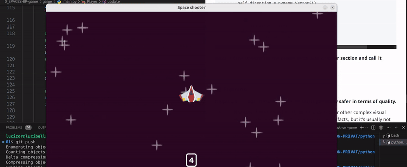

# 🟡 SPRITES 9.


[3:01:49](https://youtu.be/8OMghdHP-zs?si=CX6sc2Zze0JsHHXn&t=10909)

<br>

## 🟦 Score

### 🟠 In this lesson, we’re going to learn how to set up a score system for our Pygame space shooter game!

<br>

> #### So far, we’ve worked on important things like handling collisions and even setting up text colors.

> #### Now, it’s time to bring everything together by adding a score that keeps track of how well the player is doing.

<br>

### 🟠 A score will make the game more exciting by rewarding players for shooting down enemies or surviving for longer.

#### In this lesson, you’ll learn how to display the score on the screen and update it as the game progresses.

---

<br>
<br>
<br>

##  🟦 Lets get started:

### 🟤 1. Create a Function to Display the Score

> #### To show the score on the screen, we first need to create a function dedicated to displaying the score.

This will allow us to manage and update the score as needed during gameplay.

```python
def display_score():
```
<br>

### Why a function?

Functions help us organize the code, making it easier to call the same block of code multiple times. This is useful if we need to update the score at different points in the game.

#### What’s inside the function?
Inside the function, we will use Pygame's font.render() method to create a text surface (the score text) that we can then draw on the game screen.

<br>

### 🟤 2. re position the text within the function score

- When you add the **`text_surf`** inside the function, it will **no longer be accessible within the `while`** loop. (just for now)
```python
def display_score():
    text_surf = font.render('text', True, (255,255,255))


```

<br>

### 🟤 3. Track the Elapsed

### `pygame.time.get_ticks()`


#### 🟧 To keep track of time within your game or application, it is essential to capture the number of milliseconds since pygame was initialized.

> ####  This is where `pygame.time.get_ticks()` comes in.

### `current_time = pygame.time.get_ticks()`

#### This line gets the current time in milliseconds (thousandths of a second) since the game started.

> - - ####  Think of it like a **stopwatch** ⏱️ that has been running since you launched your game.

- - -  **You can use this value to see how much time has passed**, which is **useful for** things like **delays, animations, or when you want** to **do something after a certain amount of time**.


```python
def display_score():
    current_time = pygame.time.get_ticks()
    text_surf = font.render('text', True, (255,255,255))
```

<br>

### 🟤 4 Replace the `'text'` with `current_time`

 When you want to display the time (in milliseconds) instead of a simple static text like "text", you need to pass the current time to the `font.render()` function.

```python
#before
    text_surf = font.render('text', True, (255,255,255))
```

<br>
<br>

 > ### In this case, you're replacing the `'text'` with `(current_time)`.

  This ensures that the surface now shows the actual time in milliseconds, retrieved by `pygame.time.get_ticks()`.

```python
#after
    text_surf = font.render(current_time), True, (255,255,255))
 ```

<br>

### 🟤 5. Convert it with `str()`

#### 🔴 If you tried to test it, you will see you will get an error, to solve this add the `str()`

```python
    text_surf = font.render(str(current_time), True, (255,255,255))
```


#### 🟠 Why use `str()` here?

`pygame.font.render()` expects the text to be displayed as a string.

🟢 However, **`current_time` (the result of `pygame.time.get_ticks()`)** is a number (an integer representing milliseconds).

-  - 🟢 `str(current_time)` **converts the integer value of `current_time` into a string**, so it can be rendered as text on the screen.


### Putting it together:

```python
def display_score():
    current_time = pygame.time.get_ticks()
    text_surf = font.render(str(current_time), True, (255,255,255))
```

<br>
<br>
<br>
<br>

---

## 🟤 6.  Creating a Rectangle for the Text:

- This is just for testing purposes but it has a goal, we will see it later

```python

def display_score():
    current_time = pygame.time.get_ticks()
    text_surf = font.render(str(current_time), True, (255,255,255))
    # text_rect = text_surf.get_frect(midbottom = (x,y))
    text_rect = text_surf.get_frect(midbottom = (WINDOW_WIDTH / 2, WINDOW_HEIGHT -50))
    display_surface.blit(text_surf, text_rect)
```


<br>


### RECAP & Explanation:

#### `(text_rect = text_surf.get_frect(midbottom = (WINDOW_WIDTH / 2, WINDOW_HEIGHT - 50)))`

> #### This line is responsible for defining where the text will be displayed on the screen. Let's go through it in detail:


#### `text_surf.get_frect()`:

- - This gets the rectangle (or Rect object) that fits the text surface.

> - - This rectangle will help us position the text on the screen.

<br>

#### `midbottom = (WINDOW_WIDTH / 2, WINDOW_HEIGHT - 50)`:

- - This places the text at the center horizontally (WINDOW_WIDTH / 2) and 50 pixels above the bottom of the screen.

> - - The midbottom property positions the text so that its bottom center is exactly where you want it, which ensures the text is centered horizontally but placed a little above the bottom edge of the window.

---

<br>
<br>

<br>
<br>

## 🟤 7.   Update the Game Loop to Display the Score

#### Now that we have set up the function to display the score, it's time to integrate it into the game loop.


#### Replace the old text blitting with the following:

-  Previously, you might have used something like this to display text:

```python
    display_surface.blit(text_surf, (0, 0))  # Blit the text at position (x, y)
```

>However, instead of directly blitting the text onto the screen, we will now use the display_score() function we created earlier to handle displaying the score.

#### For this

#### call the `display_score()` function to render the score at the proper position on the screen.

```python
    display_surface.fill("#2a0822")
    all_sprites.draw(display_surface)


    display_score() #🟡
    pygame.display.update()

pygame.quit()
```


#### If you changed this value

```python
# before
   current_time = pygame.time.get_ticks()
# after
      current_time = pygame.time.get_ticks() // 100
```

### 🟠 What Does // 100 Do?

#### The `//` operator is integer division, which divides two numbers and returns the whole number result, discarding any remainder.

- So, when you divide `pygame.time.get_ticks()` by 100, you are effectively converting milliseconds into "hundredths of a second."

- - `pygame.time.get_ticks() // 100` **divides the time in milliseconds by 100**, which reduces the number of units we’re working with.

> #### This converts milliseconds into hundredths of a second (0.01 seconds).


<br>
<br>
<br>

---

[3:08:46](https://youtu.be/8OMghdHP-zs?si=FCLKZKyeo9IS1zja&t=11326)

## 🟡 Draw a Box Around the Score Text (with Rounded Corners)

#### In this step, we'll add a visual border around the score text to make it stand out more clearly on the screen.


### 🟩  What We’re Achieving:

- - A **rectangle** will be drawn around the score text to highlight it.

- - The rectangle will have **rounded corners** for a softer appearance.


- - We’ll also add **padding between the text and the rectangle** to make sure there’s space around the score, improving the overall aesthetics.


<br>
<br>

### 🟤 1.  Drawing a Rectangle Around the Text


```python
    pygame.draw.rect(display_surface, (240,240,240), text_rect.inflate(28, 30).move(0,-2), 5,10)
```


#### `text_rect.inflate(28, 30):`

- ####  This changes the size of the rectangle by expanding it. inflate(28, 30) means the rectangle will grow 28 pixels wider and 30 pixels taller than its original size.


- #### `.move(0,-2):`

- -  This shifts the position of the rectangle slightly. move(0,-2) moves the rectangle 0 pixels horizontally (left or right), and -2 pixels vertically (up), so it moves a little bit upwards.


### `5:`

- -  This is the thickness of the rectangle's border, meaning how thick the lines of the rectangle will be.

### `10:`

- - This is the corner radius of the rectangle, which controls how rounded the corners are. A value of 10 means the corners will be slightly rounded.

```python
# SCORE

def display_score():
    current_time = pygame.time.get_ticks() // 100
    text_surf = font.render(str(current_time), True, (255,255,255))
    # text_rect = text_surf.get_frect(midbottom = (x,y))
    text_rect = text_surf.get_frect(midbottom = (WINDOW_WIDTH / 2, WINDOW_HEIGHT -50))
    display_surface.blit(text_surf, text_rect)
    # BOX around padding, here you will have padding as inflate
    pygame.draw.rect(display_surface, (240,240,240), text_rect.inflate(28, 30).move(0,-2), 5,10)

```


<br>
<br>
<br>
<br>


---


 <br>

## 🟡 `pygame.transform`

- [DOCS pygame| transform](https://www.pygame.org/docs/ref/transform.html)


### 🫐 Mastering Surface Transformations in Pygame:

### `Scale, Rotate, Flip, and More`

<br>

### In this lesson, we'll explore the various transformation methods available in Pygame, covering some of the most commonly used techniques.

>  These methods offer a range of possibilities to tweak and enhance your visual assets.

<br>


### 🟤 VIDEO:  [How To Easily Scale And Rotate Images In Pygame](https://youtu.be/Xzmpl5tnJnc?si=2trEhnNIvCatLGwN)


#### 🟤Here’s a quick look at some of the possibilities that the pygame.transform module offers:

- -  **Scaling:** Resize images (make them bigger or smaller).

- - **Flipping:** Flip an image horizontally or vertically.

- - **Rotation:** Rotate images by any angle.

- - **Grayscale:** Convert images to grayscale for a retro or stylistic effect.

- - **Inverting Colors:** Change all the colors in an image to their opposites.

- - **Blurring:** Apply blur effects to soften the image details.

<br>

> #### 🟧 Each of these transformations can be `used independently or combined` for more complex effects. Now, let’s dive into some examples of how to use these powerful methods!


<br>


<br>
<br>

## 🟦 Lets get started:

### 🟡 1. Using `pygame.transform` Methods

> #### To transform a surface in Pygame, you’ll use the pygame.transform module's functions. Here’s a quick overview of the most commonly used ones:

<br>

#### [3:21:47](https://youtu.be/8OMghdHP-zs?si=Wv0y-9GgtXPhH2i1&t=12107)

### 🟤 1. We will start with the  `ROTATE` method

```python
self.image = pygame.transform.rotate(self.image, )
```

### 🟤 2. Then we will add an angle of 90 degrees

```python
self.image = pygame.transform.rotate(self.image,90)
```


### 🟤Test on your own other methods

---

<br>
<br>

## 🔴 Beware of Quality Loss When Transforming Sprites in Pygame


### 🟢 When using the transformation methods in Pygame, one important thing <u> to keep in mind is that not all transformations will maintain the quality of the original image</u>.

> #### In fact, some transformations can introduce artifacts or blurring, which can make your sprites look less sharp or more pixelated.

> - -  ✋This is especially true when scaling, rotating, or applying some effects.

> - - #### 🔴 Pygame doesn't use advanced image resampling or interpolation methods by default, which means that large transformations, especially scaling, can degrade the visual quality of your images.

<br>

### 🌈 Let's take a closer look at the methods that might cause quality issues and what you should be careful about.


<br>


### ⚫ Flipping:

#### Flipping an image (horizontal or vertical) is generally safer in terms of quality.

- - However, if the image has alpha transparency or other complex visual elements, flipping may still introduce minor artifacts, but it's usually not as noticeable as scaling or rotating.


### ⚫ Scaling:


#### Scaling an image up or down is where most quality issues arise.

>- - #### If you scale an image up (making it bigger), the image can appear pixelated because the pixels are being stretched to fit a larger area. On the other hand, scaling down (making the image smaller) can result in lost details or a blurry image, as Pygame has to discard pixels in the process.

#### Example of Scaling:

```python
# Original image
image = pygame.image.load('sprite.png')
# Scale up
scaled_up_image = pygame.transform.scale(image, (400, 400))
# Scale down
scaled_down_image = pygame.transform.scale(image, (50, 50))

```

### or

```python
self.image = pygame.transform.scale2x(self.image)
```

<br>


<br>

### 🟤 Potential Issues with Scaling:

**Upscaling (making the image larger):** This often results in a blurry or pixelated image because Pygame is just duplicating pixels.

**Downscaling (making the image smaller):** When reducing the size of an image, important details may be lost, and the image can become too blurry or lose clarity.

<br>

### ✅ Color Transformations (Grayscale, Inversion, etc.):

#### Transforming the colors of an image, like applying grayscale or inverting colors, generally doesn’t degrade the quality of the image.

- - However, it can alter the look and feel, so it’s important to make sure that the color changes align with your game’s artistic style.

```python
self.image = pygame.transform.grayscale(self.image)
```

<br>
<br>

## ⚫  Rotation:


####  Rotating an image by an angle (especially not a multiple of 90 degrees) can also reduce the image quality.

- - This is because Pygame performs a simple nearest-neighbor interpolation when rotating, which can cause jagged edges or blurring in the image.


---

<br>
<br>


## 🟡 Rotating the plane continuously

#### 🔴  Before applying this logic to the meteors, we will first observe its behavior with the player.

> - #### It's important to understand how it works in this context before extending it further.


<br>
<br>

### 🟢 Understanding Continuous Rotation in Pygame: <u>The Problem of Sprite Movement
</u>

>When implementing continuous rotation for a sprite, such as a player character in your game, it might seem straightforward to simply rotate the image and update its position.

> #### However, a common issue arises when the sprite starts moving in unexpected directions or shifts its position diagonally while rotating.


<br>
<br>


### 🟤 1. Define the Player Class and Initial Setup

- You dont have to add anything yet

```python
class Player(pygame.sprite.Sprite):
    def __init__(self, groups):
        super().__init__(groups)  # Initialize the sprite in the given groups

        # Load the player's image (assumed to be in the images dictionary)
        self.image = images['player']

        # Set the player's initial position (centered in the window)
        self.rect = self.image.get_frect(center=(WINDOW_WIDTH / 2, WINDOW_HEIGHT / 2))

        # Create a direction vector to track the player's movement direction (initially empty)
        self.direction = pygame.Vector2()

        # Set a movement speed for the player (in pixels per second)
        self.speed = 300

        # 🥶 Cooldown mechanism to limit the player's shooting ability
        self.can_shoot = True
        self.laser_shoot_time = 0  # Track when the player can shoot again
        self.cooldown_duration = 400  # Time in milliseconds between allowed shots

```


<br>

### 🟤 2.  Add a Rotation Variable

####  To control the rotation of the player, `we need a variable to store the current rotation angle`.

- - 🟩 We initialize this in the constructor `(__init__)` method:

```python
# Rotation variable to track the player's rotation angle (in degrees)
self.rotation = 0  # Start with no rotation

```
### 🟢 Why Add a Rotation Variable?

> #### We need to `keep track of the current angle` at which the player is facing, and this rotation variable will allow us to incrementally change that angle.

#### ✋ Initially, the rotation is `set to 0 degrees` (facing "up" or the default orientation).

<br>
<br>

## 🟤 3. Update Method:

### 🟠 <u>Implement Continuous Rotation</u>

### The player's rotation should change continuously in each frame.

> - #### This can be done in the `update()` method, which is called on each frame of the game loop.


```python
    def update(self, dt):
        # --- Other update logic here (movement, shooting, etc.) ---

        # CONTINUOUS ROTATION
        # Increment the player's rotation based on the time delta (dt) and a rotation speed
        self.rotation += 10 * dt  # Increase rotation by 10 degrees per second

```
### Explanation of Continuous Rotation:

### `dt:`

- -  This is the time passed between the current frame and the last frame. It's crucial for making the rotation smooth and independent of the frame rate.


### `self.rotation += 10 * dt`:

-  **We increment the rotation by 10 degrees per second.**

- change this value from 10 to 1 to see the behavior better

> - - ####  The multiplication by dt ensures that the rotation speed is frame-rate independent (i.e., if the game runs at different speeds on different systems, the rotation remains consistent).

<br>
<br>

### 🟤 4. Applying the Rotation to the Player's Image

#### Now that we have a variable controlling the player's rotation, we need to apply this rotation to the player's sprite image.

> #### ✋ This is done by transforming the image every frame:

<br>

```python
# Rotate the player's image by the current rotation angle
self.image = pygame.transform.rotate(images['player'], self.rotation)

# Recalculate the player's rectangle to match the new rotated image
self.rect = self.image.get_frect(center=self.rect.center)

```

<br>

## 🟤 Let's Test to see the Behavior


#### 🔴 As shown in the image below, the player is moving diagonally toward the bottom while rotating.

> #### This behavior is isnt good, as the rotation should not affect the player's movement direction.

<br>

[]( )

 <br>

## 🟦🟠 Reason

###  This happens because Pygame’s rotation method rotates the image around the top-left corner, not the center of the image.

> - - #### This causes the sprite’s bounding rectangle (the rect object) to change its dimensions and position, leading to strange behavior as the sprite rotates.

#### The result can be unintended movement or a sprite that appears to "drift" in the wrong direction.

<br>


<br>

## 🟠 How to Fix This:


#### You need to rotate the image, but after rotating, you should reset the center of the rect so that it doesn't shift its position.

### 🟢 Solution:

### 🟤 Use a Temporary Surface for the Rotation:

> #### You want to rotate the image, but instead of modifying the rect directly, keep the rotation on a temporary surface and then re-center the sprite.

### 🟤 Adjust the Rect After Rotation:

- - After rotating, update the rect so that it remains centered around the player’s position, regardless of the image's new dimensions.

<br>

### Here’s how you can fix it:

```python
  # --- Continuous Rotation Logic ---
        # Add rotation based on time and adjust by delta time (dt)
        self.rotation += 10 * dt

        # Rotate the image around the center (not the top-left)
        # First, rotate the image without affecting the rect
        rotated_image = pygame.transform.rotate(self.image, self.rotation)

        # Get the new rect after rotation (this rect will be rotated too)
        rotated_rect = rotated_image.get_rect(center=self.rect.center)

        # Update the player's image and rect with the rotated image and its new rect
        self.image = rotated_image
        self.rect = rotated_rect

```

<br>

## Updated Code:


```python
class Player(pygame.sprite.Sprite):
    def __init__(self, groups):
        super().__init__(groups)

        # Load the player image (replace 'images['player']' with actual image)
        try:
            self.image = images['player']
        except KeyError:
            print("Player image not found in images dictionary.")
            self.image = pygame.Surface((50, 50))  # Example fallback surface
            self.image.fill((0, 56, 175))  # BLUE Klein

        # Create a rect object for the image
        self.rect = self.image.get_rect(center=(WINDOW_WIDTH / 2, WINDOW_HEIGHT / 2))

        # Player direction and speed
        self.direction = pygame.Vector2()
        self.speed = 300

        # Cooldown for shooting
        self.can_shoot = True
        self.laser_shoot_time = 0
        self.cooldown_duration = 400  # Players must wait between shots

        # Initialize rotation
        self.rotation = 0

    def laser_timer(self):
        if not self.can_shoot:
            current_time = pygame.time.get_ticks()
            if current_time - self.laser_shoot_time >= self.cooldown_duration:
                self.can_shoot = True

    def update(self, dt):
        keys = pygame.key.get_pressed()

        # Handle movement direction
        self.direction.x = int(keys[pygame.K_RIGHT]) - int(keys[pygame.K_LEFT])
        self.direction.y = int(keys[pygame.K_DOWN]) - int(keys[pygame.K_UP])

        # Normalize the direction vector (to prevent diagonal speed boost)
        self.direction = self.direction.normalize() if self.direction else self.direction

        # Update the player's position based on direction and speed
        self.rect.center += self.direction * self.speed * dt

        # Handle shooting with spacebar
        if keys[pygame.K_SPACE] and self.can_shoot:
            Laser(laser_surf, self.rect.midtop, (all_sprites, laser_sprites))
            self.can_shoot = False
            self.laser_shoot_time = pygame.time.get_ticks()

        # Call the laser timer to reset shooting cooldown
        self.laser_timer()

        # --- Continuous Rotation Logic ---
        # Add rotation based on time and adjust by delta time (dt)
        self.rotation += 10 * dt

        # Rotate the image around the center (not the top-left)
        # First, rotate the image without affecting the rect
        rotated_image = pygame.transform.rotate(self.image, self.rotation)

        # Get the new rect after rotation (this rect will be rotated too)
        rotated_rect = rotated_image.get_rect(center=self.rect.center)

        # Update the player's image and rect with the rotated image and its new rect
        self.image = rotated_image
        self.rect = rotated_rect

```

<br>
<br>

## 🟤 Key Changes Explained:

### Rotating the Image (rotated_image):

#### `pygame.transform.rotate(self.image, self.rotation)` rotates the player image around its top-left corner.

> #### But instead of directly changing the self.image, we assign it to rotated_image.

<br>

### Adjusting the rect (rotated_rect):

#### `rotated_rect = rotated_image.get_rect(center=self.rect.center)` creates a new rect for the rotated image and re-centers it at the player's current position (self.rect.center).

> #### This ensures that the player remains in the correct position after the rotation, and the rect is always centered around the player, preventing any strange movement.

<br>

### Updating the Player's Image and Rect:

`self.image = rotated_image` **updates the player's image** to the rotated one.


`self.rect = rotated_rect` **updates the player's rect** to match the rotated image’s new position and size.

<br>
<br>
<br>

---

[3:28:18](https://youtu.be/8OMghdHP-zs?si=uGeQ5ilR2hMWIvPi&t=12498)

# 🟡 Make the Meteors rotate


###  By assigning a random rotation speed to each meteor and smoothly rotating their texture during gameplay, we enhance the visual effects and make the meteors more engaging.

<br>

### 🟤 Step 1: Store the Original Surface

#### Before we begin rotating the meteor, <u>we need to store the original image (the texture) of the meteor</u>  🔴 Without modifying the original image

> - - This ensures we can rotate it without modifying the original image, keeping it intact for future updates.


#### 🟢 Where to place this: Inside the meteor class's `__init__` method, right after loading the meteor's texture.


```python
self.original_surf = surf  # Store the original surface of the meteor

```
<br>

### 🟤 Step 2: Assign a Random Rotation Speed

#### Each meteor will need a unique speed at which it rotates.

-  - #### By giving each meteor a random rotation speed, the game will feel more varied and less predictable.

>#### This randomness adds to the chaos of meteor showers!


#### 🟢 Where to place this: Inside the `__init__` method, right after setting the original surface.


```python
self.rotation_speed = randint(20, 50)  # Assign a random rotation speed for each meteor

```

`randint()` is a function from the random module that generates a random integer.


- In this case, `randint(20, 50)` **will produce a random integer between 20 and 50**, inclusive.

> - - #### So, the rotation speed will be anywhere from 20 to 50 degrees per second.

#### `self.rotation_speed`, you're giving the object a dynamic rotation speed that varies every time the object is created or the code is executed.

### 🟧 Purpose of the Two Values:

 **The lower bound (20)** is the minimum rotation speed, meaning the object will rotate slowly.

**The upper bound (50)** is the maximum rotation speed, meaning the object can rotate more quickly.

<br>
<br>

### 🟤 Step 3: Update the Meteor's Position


#### Now, let’s ensure the meteor moves across the screen just like before.

> - - ####  We’ll maintain the movement logic, where the meteor updates its position based on its direction and speed.

- -  This is important for the meteor to move while also rotating.

#### 🟢 Where to place this: Inside the update method of the meteor class.