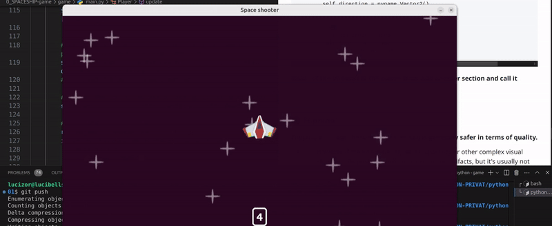

# 🟡 SPRITES 10.


## Intro


<br>
<br>


## 🟡 `pygame.transform`

- [DOCS pygame| transform](https://www.pygame.org/docs/ref/transform.html)


### 🫐 Mastering Surface Transformations in Pygame:

### `Scale, Rotate, Flip, and More`

<br>

 In this lesson, we'll explore the various transformation methods available in Pygame, covering some of the most commonly used techniques.

>  These methods offer a range of possibilities to tweak and enhance your visual assets.


### 🟤 VIDEO:  [How To Easily Scale And Rotate Images In Pygame](https://youtu.be/Xzmpl5tnJnc?si=2trEhnNIvCatLGwN)

<br>
<br>


#### 🟤Here’s a quick look at some of the possibilities that the pygame.transform module offers:

- -  **Scaling:** Resize images (make them bigger or smaller).

- - **Flipping:** Flip an image horizontally or vertically.

- - **Rotation:** Rotate images by any angle.

- - **Grayscale:** Convert images to grayscale for a retro or stylistic effect.

- - **Inverting Colors:** Change all the colors in an image to their opposites.

- - **Blurring:** Apply blur effects to soften the image details.

<br>

> #### 🟧 Each of these transformations can be `used independently or combined` for more complex effects. Now, let’s dive into some examples of how to use these powerful methods!


<br>
<br>
<br>

## 🟦 Let's get started:

### 🟡 1. Using `pygame.transform` Methods

> #### To transform a surface in Pygame, you’ll use the pygame.transform module's functions. Here’s a quick overview of the most commonly used ones:

<br>

#### [3:21:47](https://youtu.be/8OMghdHP-zs?si=Wv0y-9GgtXPhH2i1&t=12107)

### 🟤 1. We will start with the  `ROTATE` method

```python
self.image = pygame.transform.rotate(self.image, )
```

### 🟤 2. Then we will add an angle of 90 degrees

```python
self.image = pygame.transform.rotate(self.image,90)
```


##### 🟤Test on your own other methods

---

<br>
<br>

### 🔴 Beware of Quality Loss When Transforming Sprites in Pygame

<br>


#### 🟤 When using the transformation methods in Pygame, one important thing <u> to keep in mind is that not all transformations will maintain the quality of the original image</u>.

> #### In fact, some transformations can introduce artifacts or blurring, which can make your sprites look less sharp or more pixelated.

>  -  ✋This is especially true when scaling, rotating, or applying some effects.

>  - #### 🔴 Pygame doesn't use advanced image resampling or interpolation methods by default, which means that large transformations, especially scaling, can degrade the visual quality of your images.

<br>

### 🌈 Let's take a closer look at the methods that might cause quality issues and what you should be careful about.


<br>


### ⚫ Flipping:

#### Flipping an image (horizontal or vertical) is generally safer in terms of quality.

- - However, if the image has alpha transparency or other complex visual elements, flipping may still introduce minor artifacts, but it's usually not as noticeable as scaling or rotating.


### ⚫ Scaling:


#### Scaling an image up or down is where most quality issues arise.

>- - #### If you scale an image up (making it bigger), the image can appear pixelated because the pixels are being stretched to fit a larger area. On the other hand, scaling down (making the image smaller) can result in lost details or a blurry image, as Pygame has to discard pixels in the process.

#### Example of Scaling:

```python
# Original image
image = pygame.image.load('sprite.png')
# Scale up
scaled_up_image = pygame.transform.scale(image, (400, 400))
# Scale down
scaled_down_image = pygame.transform.scale(image, (50, 50))

```

### or

```python
self.image = pygame.transform.scale2x(self.image)
```

<br>


<br>

### 🟤 Potential Issues with Scaling:

**Upscaling (making the image larger):** This often results in a blurry or pixelated image because Pygame is just duplicating pixels.

**Downscaling (making the image smaller):** When reducing the size of an image, important details may be lost, and the image can become too blurry or lose clarity.

<br>

### ✅ Color Transformations (Grayscale, Inversion, etc.):

#### Transforming the colors of an image, like applying grayscale or inverting colors, generally doesn’t degrade the quality of the image.

- - However, it can alter the look and feel, so it’s important to make sure that the color changes align with your game’s artistic style.

```python
self.image = pygame.transform.grayscale(self.image)
```

<br>
<br>

## ⚫  Rotation:


####  Rotating an image by an angle (especially not a multiple of 90 degrees) can also reduce the image quality.

- - This is because Pygame performs a simple nearest-neighbor interpolation when rotating, which can cause jagged edges or blurring in the image.


---

<br>
<br>


## 🟡 Rotating the plane continuously

#### 🔴  Before applying this logic to the meteors, we will first observe its behavior with the player.

> - - #### It's important to understand how it works in this context before extending it further.


<br>
<br>

### 🟢 Understanding Continuous Rotation in Pygame: <u>The Problem of Sprite Movement
</u>

>When implementing continuous rotation for a sprite, such as a player character in your game, it might seem straightforward to simply rotate the image and update its position.

> #### However, a common issue arises when the sprite starts moving in unexpected directions or shifts its position diagonally while rotating.


<br>
<br>


### 🟤 1. Define the Player Class and Initial Setup

- You dont have to add anything yet

```python
class Player(pygame.sprite.Sprite):
    def __init__(self, groups):
        super().__init__(groups)  # Initialize the sprite in the given groups

        # Load the player's image (assumed to be in the images dictionary)
        self.image = images['player']

        # Set the player's initial position (centered in the window)
        self.rect = self.image.get_frect(center=(WINDOW_WIDTH / 2, WINDOW_HEIGHT / 2))

        # Create a direction vector to track the player's movement direction (initially empty)
        self.direction = pygame.Vector2()

        # Set a movement speed for the player (in pixels per second)
        self.speed = 300

        # 🥶 Cooldown mechanism to limit the player's shooting ability
        self.can_shoot = True
        self.laser_shoot_time = 0  # Track when the player can shoot again
        self.cooldown_duration = 400  # Time in milliseconds between allowed shots

```


<br>

### 🟤 2.  Add a Rotation Variable

####  To control the rotation of the player, `we need a variable to store the current rotation angle`.

- - 🟩 We initialize this in the constructor `(__init__)` method:

```python
# Rotation variable to track the player's rotation angle (in degrees)
self.rotation = 0  # Start with no rotation

```
### 🟢 Why Add a Rotation Variable?

> #### We need to `keep track of the current angle` at which the player is facing, and this rotation variable will allow us to incrementally change that angle.

#### ✋ Initially, the rotation is `set to 0 degrees` (facing "up" or the default orientation).

<br>
<br>

## 🟤 3. Update Method:

### 🟠 <u>Implement Continuous Rotation</u>

### The player's rotation should change continuously in each frame.

> - #### This can be done in the `update()` method, which is called on each frame of the game loop.


```python
    def update(self, dt):
        # --- Other update logic here (movement, shooting, etc.) ---

        # CONTINUOUS ROTATION
        # Increment the player's rotation based on the time delta (dt) and a rotation speed
        self.rotation += 10 * dt  # Increase rotation by 10 degrees per second

```
### Explanation of Continuous Rotation:

### `dt:`

- -  This is the time passed between the current frame and the last frame. It's crucial for making the rotation smooth and independent of the frame rate.


### `self.rotation += 10 * dt`:

-  **We increment the rotation by 10 degrees per second.**

- change this value from 10 to 1 to see the behavior better

> - - ####  The multiplication by dt ensures that the rotation speed is frame-rate independent (i.e., if the game runs at different speeds on different systems, the rotation remains consistent).

<br>
<br>

### 🟤 4. Applying the Rotation to the Player's Image

#### Now that we have a variable controlling the player's rotation, we need to apply this rotation to the player's sprite image.

> #### ✋ This is done by transforming the image every frame:

<br>

```python
# Rotate the player's image by the current rotation angle
self.image = pygame.transform.rotate(images['player'], self.rotation)

# Recalculate the player's rectangle to match the new rotated image
self.rect = self.image.get_frect(center=self.rect.center)

```

<br>

## 🟤 Let's Test to see the Behavior


### 🔴 As shown in the image below, the player is moving diagonally toward the bottom while rotating.

> #### This behavior is isnt good, as the rotation should not affect the player's movement direction.

[]( )


## 🟦🟠 Reason

###  This happens because Pygame’s rotation method rotates the image around the top-left corner, not the center of the image.

> - - #### This causes the sprite’s bounding rectangle (the rect object) to change its dimensions and position, leading to strange behavior as the sprite rotates.

#### The result can be unintended movement or a sprite that appears to "drift" in the wrong direction.

<br>

<!-- no public -->

---

### 🟢 Detailed Explanation of the Problem:

#### Rotating the Image:

- When you rotate the image using pygame.transform.rotate(self.image, self.rotation), Pygame rotates the image around its top-left corner, not around its center.

> This causes the bounding rectangle (rect) to change in size and shape because the rotated image is no longer a simple rectangle; it’s a more complex shape.

#### Position Misalignment:

Since the rect no longer accurately represents the rotated image's position, the sprite appears to move erratically. The center of the rectangle might drift from where you expect it to be, especially when rotating continuously.

---

<br>

## 🟤 How to Fix This:


### You need to rotate the image, but after rotating, you should reset the center of the rect so that it doesn't shift its position.

### 🟢 Solution:

### 🟤 Use a Temporary Surface for the Rotation:

> #### You want to rotate the image, but instead of modifying the rect directly, keep the rotation on a temporary surface and then re-center the sprite.

### 🟤 Adjust the Rect After Rotation:

- - After rotating, update the rect so that it remains centered around the player’s position, regardless of the image's new dimensions.

<br>

### Here’s how you can fix it:

```python
  # --- Continuous Rotation Logic ---
        # Add rotation based on time and adjust by delta time (dt)
        self.rotation += 10 * dt

        # Rotate the image around the center (not the top-left)
        # First, rotate the image without affecting the rect
        rotated_image = pygame.transform.rotate(self.image, self.rotation)

        # Get the new rect after rotation (this rect will be rotated too)
        rotated_rect = rotated_image.get_rect(center=self.rect.center)

        # Update the player's image and rect with the rotated image and its new rect
        self.image = rotated_image
        self.rect = rotated_rect

```

<br>

## Updated Code:


```python
class Player(pygame.sprite.Sprite):
    def __init__(self, groups):
        super().__init__(groups)

        # Load the player image (replace 'images['player']' with actual image)
        try:
            self.image = images['player']
        except KeyError:
            print("Player image not found in images dictionary.")
            self.image = pygame.Surface((50, 50))  # Example fallback surface
            self.image.fill((0, 56, 175))  # BLUE Klein

        # Create a rect object for the image
        self.rect = self.image.get_rect(center=(WINDOW_WIDTH / 2, WINDOW_HEIGHT / 2))

        # Player direction and speed
        self.direction = pygame.Vector2()
        self.speed = 300

        # Cooldown for shooting
        self.can_shoot = True
        self.laser_shoot_time = 0
        self.cooldown_duration = 400  # Players must wait between shots

        # Initialize rotation
        self.rotation = 0

    def laser_timer(self):
        if not self.can_shoot:
            current_time = pygame.time.get_ticks()
            if current_time - self.laser_shoot_time >= self.cooldown_duration:
                self.can_shoot = True

    def update(self, dt):
        keys = pygame.key.get_pressed()

        # Handle movement direction
        self.direction.x = int(keys[pygame.K_RIGHT]) - int(keys[pygame.K_LEFT])
        self.direction.y = int(keys[pygame.K_DOWN]) - int(keys[pygame.K_UP])

        # Normalize the direction vector (to prevent diagonal speed boost)
        self.direction = self.direction.normalize() if self.direction else self.direction

        # Update the player's position based on direction and speed
        self.rect.center += self.direction * self.speed * dt

        # Handle shooting with spacebar
        if keys[pygame.K_SPACE] and self.can_shoot:
            Laser(laser_surf, self.rect.midtop, (all_sprites, laser_sprites))
            self.can_shoot = False
            self.laser_shoot_time = pygame.time.get_ticks()

        # Call the laser timer to reset shooting cooldown
        self.laser_timer()

        # --- Continuous Rotation Logic ---
        # Add rotation based on time and adjust by delta time (dt)
        self.rotation += 10 * dt

        # Rotate the image around the center (not the top-left)
        # First, rotate the image without affecting the rect
        rotated_image = pygame.transform.rotate(self.image, self.rotation)

        # Get the new rect after rotation (this rect will be rotated too)
        rotated_rect = rotated_image.get_rect(center=self.rect.center)

        # Update the player's image and rect with the rotated image and its new rect
        self.image = rotated_image
        self.rect = rotated_rect

```

<br>
<br>

## 🟤 Key Changes Explained:

### Rotating the Image (rotated_image):

#### `pygame.transform.rotate(self.image, self.rotation)` rotates the player image around its top-left corner.

> #### But instead of directly changing the self.image, we assign it to rotated_image.

<br>

### Adjusting the rect (rotated_rect):

#### `rotated_rect = rotated_image.get_rect(center=self.rect.center)` creates a new rect for the rotated image and re-centers it at the player's current position (self.rect.center).

> #### This ensures that the player remains in the correct position after the rotation, and the rect is always centered around the player, preventing any strange movement.

<br>

### Updating the Player's Image and Rect:

`self.image = rotated_image` **updates the player's image** to the rotated one.


`self.rect = rotated_rect` **updates the player's rect** to match the rotated image’s new position and size.

<br>
<br>
<br>

---

[3:28:18](https://youtu.be/8OMghdHP-zs?si=uGeQ5ilR2hMWIvPi&t=12498)

## 🟡  <u>Make the Meteors rotate</u>


###  By assigning a random rotation speed to each meteor and smoothly rotating their texture during gameplay, we enhance the visual effects and make the meteors more engaging.

<br>

### 🟤 Step 1: Store the Original Surface

#### Before we begin rotating the meteor, <u>we need to store the original image (the texture) of the meteor</u>  🔴 Without modifying the original image

> - - This ensures we can rotate it without modifying the original image, keeping it intact for future updates.


#### 🟢 Where to place this: Inside the meteor class's `__init__` method, right after loading the meteor's texture.


```python
self.original_surf = surf  # Store the original surface of the meteor

```
<br>

### 🟤 Step 2: Assign a Random Rotation Speed

#### Each meteor will need a unique speed at which it rotates.

-  - #### By giving each meteor a random rotation speed, the game will feel more varied and less predictable.

>#### This randomness adds to the chaos of meteor showers!


#### 🟢 Where to place this: Inside the `__init__` method, right after setting the original surface.


```python
self.rotation_speed = randint(20, 50)  # Assign a random rotation speed for each meteor

```

`randint()` is a function from the random module that generates a random integer.


- In this case, `randint(20, 50)` **will produce a random integer between 20 and 50**, inclusive.

> - - #### So, the rotation speed will be anywhere from 20 to 50 degrees per second.

#### `self.rotation_speed`, you're giving the object a dynamic rotation speed that varies every time the object is created or the code is executed.

<br>
<br>

---

## 🟧 Purpose of the Two Values:

 **The lower bound (20)** is the minimum rotation speed, meaning the object will rotate slowly.

**The upper bound (50)** is the maximum rotation speed, meaning the object can rotate more quickly.


---

<br>

 <br>

## 🟤 Step 3: Update the Meteor's Position


### Now, let’s ensure the meteor moves across the screen just like before.

> ####  We’ll maintain the movement logic, where the meteor updates its position based on its direction and speed.

This is important for the meteor to move while also rotating.

<br>

### 🟢 Where to place this:

- Inside the update method of the meteor class.

```python
def update(self, dt):
    # Move the meteor 🪨
    self.rect.center += self.direction * self.speed * dt

    # Destroy the meteor after its lifetime
    if pygame.time.get_ticks() - self.start_time >= self.lifetime:
        self.kill()

```

<br>
<br>

## 🟤 Step 4: Begin Rotating the Meteor


#### To make the meteor rotate, we need to use `pygame.transform.rotozoom` or `pygame.transform.rotate`.

> - - #### ✋ For better quality, rotozoom is recommended, as it can handle resizing and rotation in one step, ✋ avoiding any quality loss that might happen with simple rotation.

#### 🟢 Where to place this: In the update method after updating the position.

```python
self.image = pygame.transform.rotozoom(self.original_surf, self.rotation, 1)  # Rotate the meteor image

```

<br>
<br>

### 🟤 Step 5: Create a Rotation Variable


#### We need a variable to store the current rotation angle of the meteor.

> #### <u>This variable will be used to update the rotation continuously over time</u> .

- - We initialize it either in the `__init__` method or just before the update method.

#### Where to place this: Just before the update method or at the bottom of the ``__init__` method.

```python
self.rotation = 0  # Initialize the rotation angle to 0 degrees

```

<br>
<br>

### 🟤 Step 6: Increment the Rotation Angle


#### In each update cycle, the meteor’s rotation angle should increase based on its speed.

> -  #### This makes the meteor rotate smoothly and continuously as it moves through the game world.

#### Where to place this: Inside the update method, before applying the rotation to the image.

```python
self.rotation += self.rotation_speed * dt  # Increment the rotation based on speed and delta time

```

<br>
<br>

### 🟤 Step 7: Apply the Rotation to the Image


#### Finally, we need to `apply` the `updated` <u>rotation</u>  `angle` to the meteor's image in each update.

<br>

> ### This will make the meteor rotate continuously as it moves, creating a dynamic and visually interesting effect.

<br>

#### Where to place this: Inside the update method after updating the rotation angle.

```python
self.image = pygame.transform.rotozoom(self.original_surf, self.rotation, 1)  # Rotate the meteor image with updated angle

```

### Test it

[]( )

<br>

## 🟫 Output Explanation:

### The teacher pointed out that although the meteors are moving, there's something weird about how they appear.

>  #### He explained that the issue comes from how the image is being updated.

> - - - #### Specifically, you are changing the image with this line: `self.image = pygame.transform.rotozoom(self.original_surf, self.rotation, 1)`, but the rectangle (which defines the position and size of the meteor) is still being set with the previous image dimensions using `self.rect = self.image.get_frect(center=pos)`.

#### This means that the rectangle might not properly match the new rotated image, causing the meteor to appear to move incorrectly."

<br>

### The problem lies in how we handle the meteor's rect (the bounding box for the image).

#### After applying the rotation, the rect remains the same size and position, even though the image itself has changed. This leads to strange movement behavior, especially when the meteor rotates while moving.

<br>

## 🟧 The Fix:

#### Adjust the rect After Each Rotation

> - - #### To fix this, we need to update the rect after every rotation, ensuring that it accurately reflects the size and position of the newly rotated image.

<br>

###  🟠  How to Adjust the rect:


#### Create a new rect after rotating the image.

- - - The new rect should be based on the rotated image, and it should be re-centered to the meteor's original position `(self.rect.center)`.


- - - **Update the rect** to **match the new rotated image** using `get_rect(center=self.rect.center)`.

```python
        self.rect = self.image.get_frect(center = self.rect.center)
```
<br>

### The line `self.rect = self.image.get_frect(center=self.rect.center)`

- - #### creates a new rectangle for the updated image, using the center of the previous rectangle `(self.rect.center).


- - ####  This keeps the object in the same position.

> #### In comparison, `self.rect = self.image.get_frect(center=pos)` creates the new rectangle with the center at pos, allowing you to explicitly set the object's position.

### 🟤 Test it

#### you will see that the meteors rotation is better

<br>
<br>

#### 🟠 code

```python
class Meteor(pygame.sprite.Sprite):
    def __init__(self, surf, pos, groups):
        super().__init__(groups)

        try:
            # 1. ✋Set up the meteor's original surface (image)
            self.original_surf = surf  # Store the original surface for later rotation
            self.image = surf  # Initially, the image is the same as the original
        except KeyError:
            print("Meteor image not found in images dictionary.")
            self.image = pygame.Surface((80, 50))  # If no image is found, create a placeholder
            self.image.fill((255, 238, 72))  # Fill placeholder with a bright color (acid yellow)

        # Set the position of the meteor based on its center point
        self.rect = self.image.get_frect(center=pos)  # The rectangle is centered at 'pos' for the meteor's position
        self.start_time = pygame.time.get_ticks()  # Track the time when the meteor was created
        self.lifetime = 3000  # Meteor will live for 3000 ms (3 seconds), after which it fades

        # Set direction and speed of the meteor's movement
        self.direction = pygame.Vector2(uniform(-0.5, 0.5), 1)  # Random direction, mainly downwards
        self.speed = randint(400, 500)  # Random speed between 400 and 500 pixels per second

        # 2. ✋ Set up rotation speed (random value for a more natural rotation)
        self.rotation_speed = randint(40, 100)  # The meteor will rotate at a random speed

        # 3. ✋ Initialize the rotation angle to 0 (no rotation initially)
        self.rotation = 0  # The rotation angle starts at 0 degrees

    def update(self, dt):
        # Move the meteor in the direction at the defined speed
        self.rect.center += self.direction * self.speed * dt  # Update position based on speed and time

        # If the meteor's lifetime exceeds the defined lifetime, destroy it
        if pygame.time.get_ticks() - self.start_time >= self.lifetime:
            self.kill()  # Remove the meteor from the sprite group

        # 4. ✋Update the rotation angle over time
        self.rotation += self.rotation_speed * dt  # Increment rotation angle based on time and speed

        # 5. ✋ Apply the rotation to the meteor's image
        # This line rotates the original surface ('self.original_surf') by 'self.rotation' degrees.
        # The '1' is the scale factor, meaning the size stays the same.
        self.image = pygame.transform.rotozoom(self.original_surf, self.rotation, 1)  # Rotate the image

        # 6. ✋ Update the rectangle to match the new rotated image
        # The 'get_frect()' method creates a new rectangle for the rotated image, keeping its center at the same position.
        # This ensures the meteor's position doesn't shift due to the rotation.
        self.rect = self.image.get_frect(center=self.rect.center)  # Adjust the rect to match the rotated image

```
<br>
<br>

```python

import pygame
import os
from os.path import join
from random import randint, uniform


#------------- INIT
pygame.init()
# -------------


# SCREEN
WINDOW_WIDTH, WINDOW_HEIGHT = 1280, 720
display_surface = pygame.display.set_mode((WINDOW_WIDTH, WINDOW_HEIGHT))
# TEXT screen
pygame.display.set_caption("Space shooter")


#🟨 imgs -----
script_dir = os.path.dirname(__file__)
# img's path
image_paths = {
    'player': os.path.join(script_dir, '..', 'images', 'player.png'),
    'star': os.path.join(script_dir, '..', 'images', 'star.png'),
    'meteor': os.path.join(script_dir, '..', 'images', 'meteor.png'),
    'laser': os.path.join(script_dir, '..', 'images', 'laser.png')

}

# INIT the images dictionary
images = {}

# Load images and handle errors
# Notice how we grab the dictionary "image_paths"
for key, path_imgs in image_paths.items():
    try:
        #LOAD and CONVERT the image in one step
        images[key] = pygame.image.load(path_imgs).convert_alpha()

    except pygame.error as img_item:

        print(f"Failed to load image '{path_imgs}': {img_item}")
        # Fall img IF LOAD fails
        images[key] = pygame.Surface((50,50)) # square
        images[key].fill((249, 255, 51 )) # yellow acid
# ---------

# IMAGES out of the class
# Define other surfaces
meteor_surf = images['meteor']
laser_surf = images['laser']
star_surf = images['star']
# ----------
# FONT
font = pygame.font.Font(join('../fonts', 'NeutralFace-Bold.otf'), 30)
# font = pygame.font.Font('../../FONT/NeutralFace-Bold.otf', 20)

# ----------
# positioning of the imgaes with surfaces, we will no longer need the below, because we are adding it directly within the laser for each one of them, like laser, meteor etc
# center of the screen for the 2 items below
# meteor_rect = meteor_surf.get_frect(center=(WINDOW_WIDTH / 2, WINDOW_HEIGHT / 2))
# laser_rect = laser_surf.get_frect(bottomleft=(20, WINDOW_HEIGHT - 10))
# -----------


#🤵 PLAYER ---------
class Player(pygame.sprite.Sprite):
    def __init__(self, groups):
        super().__init__(groups)
        try:

            self.image = images['player']
        except KeyError:
            print("Player image not found in images dictionary.")
            # Handle the failure (e.g., set a default image or exit)
            #  ---- 🔴 create a red square as a fallback/ shape red in case the img doesnt load --
            self.image = pygame.Surface((50, 50))  # Example fallback surface
            self.image.fill((0, 56, 175 ))  # BLUE Klein

        self.rect = self.image.get_frect(center=(WINDOW_WIDTH / 2, WINDOW_HEIGHT / 2))

        self.direction = pygame.Vector2()
        self.speed = 300

        # 🥶 cooldown
        self.can_shoot = True
        self.laser_shoot_time = 0
        self.cooldown_duration = 400 #  Players must wait 2 (2000) seconds between shots, promoting strategic timing and balanced gameplay by preventing rapid fire.

        # self.image = pygame.transform.rotate(self.image, 90)
        # self.image = pygame.transform.scale2x(self.image)
        # rotation
        # self.rotation = 0

    def laser_timer(self):
        if not self.can_shoot:

            current_time = pygame.time.get_ticks()
            # print(current_time)
            if current_time - self.laser_shoot_time >= self.cooldown_duration:
                self.can_shoot = True

    def update(self, dt):
        keys = pygame.key.get_pressed()
        # INT:  `int()` is the function doing the conversion. int converts this boolean value into an integer. In Python, True is equivalent to 1 and False is equivalent to 0. Therefore, int(keys[pygame.K_RIGHT]) gives 1 if the key is pressed, and 0 if it is not.
        #  --- KEYS / ARROWS:  -----
        self.direction.x = int(keys[pygame.K_RIGHT]) - int(keys[pygame.K_LEFT])
        self.direction.y = int(keys[pygame.K_DOWN]) - int(keys[pygame.K_UP])


        # to normalize the vector, after the issue when pressing top and left at the same time
        self.direction = self.direction.normalize() if self.direction else self.direction
        #    print("shipt is being updated")

        # Update the player position with speed and delta time
        self.rect.center += self.direction * self.speed * dt

        #  --- KEYS /  space bar
        recent_keys = pygame.key.get_pressed()
        if recent_keys[pygame.K_SPACE] and self.can_shoot:
            #print('fire laser')
            # 🟡 Laser SURF 🟡
            Laser(laser_surf, self.rect.midtop, (all_sprites, laser_sprites))
            # final phase: By adding `laser_sprites` as an argument in `Laser()`, each laser will be added to this group when created.

            # The player is unable to fire lasers continuously
            self.can_shoot = False
            self.laser_shoot_time = pygame.time.get_ticks()

        # Call the Laser_timer function from line 74
        self.laser_timer()


#🌟 STAR ---------
class Star(pygame.sprite.Sprite):
    def __init__(self, groups):
        super().__init__(groups)
        try:

            self.image = images['star']
        except KeyError:
            print("Star image not found in images dictionary.")

            self.image = pygame.Surface((70, 50))
            self.image.fill((241, 183, 0 )) # yellow

        self.rect = self.image.get_frect(center = (randint(0, WINDOW_WIDTH), randint(0, WINDOW_HEIGHT)))

# 🔫 LASER ---------
class Laser(pygame.sprite.Sprite):
    def __init__(self, surf, pos, groups):
        super().__init__(groups)

        try:
            self.image = surf
        except KeyError:
            print("Laser image not found in images dictionary.")
            self.image = pygame.Surface((80, 50))
            self.image.fill((255, 238, 72))  # Acid yellow


        # Set the position of the laser
        self.rect = self.image.get_frect(midbottom = pos)

    # 🔫 moving LASER bullets
    def update(self, dt):
        # centery because we only want to move 1 point
        self.rect.centery -= 400 * dt


        # conditional: to see if the laser bullet is off the window (not visible anymore), we want to destroy the sprite
        if self.rect.bottom < 0:
            self.kill()

#🪨 METEOR
class Meteor(pygame.sprite.Sprite):
    def __init__(self, surf, pos, groups):
        super().__init__(groups)

        try:

            # 1 rotation
            self.original_surf = surf

            self.image = surf
        except KeyError:
            print("Meteor image not found in images dictionary.")
            self.image = pygame.Surface((80, 50))
            self.image.fill((255, 238, 72))  # Acid yellow


        # Set the position of the laser
        self.rect = self.image.get_frect(center = pos)
        # meteor_rect = meteor_surf.get_frect(center=(WINDOW_WIDTH / 2, WINDOW_HEIGHT / 2))
        self.start_time = pygame.time.get_ticks()
        self.lifetime = 3000 # lower than 3000 the user will be able to see the rocks fading

        self.direction = pygame.Vector2(uniform(-0.5, 0.5), 1)
        self.speed = randint(400, 500)

        # 2 rotation
        self.rotation_speed = randint(40,100)
        #3
        self.rotation = 0


    def update(self, dt):
        #self.rect.centery += 400 * dt
        self.rect.center += self.direction * self.speed * dt
        if pygame.time.get_ticks() - self.start_time >= self.lifetime:
            self.kill()

        # 4
        self.rotation += self.rotation_speed * dt

        # 5
        self.image = pygame.transform.rotozoom(self.original_surf, self.rotation, 1 )

        # 6
        self.rect = self.image.get_frect(center = self.rect.center)

# 💥 🪨 METEOR & LASER collitions LOGIC

def collitions():

    global running  # 🟡 This makes 'running' refer to the global variable


    # Check for collisions between the player sprite and meteor sprites.
    # (third argument is True) This will remove the meteors that collide with the player.
    collision_sprites =  pygame.sprite.spritecollide(player, meteor_sprites, True)

    # If there are any collisions (i.e., a meteor collided with the player), print the first meteor that collided.
    if collision_sprites:
        # print(collision_sprites[0])
        running = False


    # a For each laser in the laser_sprites group, the code checks for collisions between that laser and all meteors in the meteor_sprites group.
    for laser in laser_sprites:
        # b If a collision is detected, the meteor is removed from the group (True tells the function to remove the colliding sprite).
        collided_sprites = pygame.sprite.spritecollide(laser, meteor_sprites,  True)
        # c This allows individual lasers to interact with meteors, removing both if they collide.
        if collided_sprites:
            laser.kill()
            #laser.kill() removes the laser sprite from the game, effectively destroying it.


# SCORE

def display_score():
    current_time = pygame.time.get_ticks() // 100
    text_surf = font.render(str(current_time), True, (255,255,255))
    # text_rect = text_surf.get_frect(midbottom = (x,y))
    text_rect = text_surf.get_frect(midbottom = (WINDOW_WIDTH / 2, WINDOW_HEIGHT -50))
    display_surface.blit(text_surf, text_rect)
    # BOX around padding, here you will have padding as inflate
    pygame.draw.rect(display_surface, (240,240,240), text_rect.inflate(28, 30).move(0,-2), 5,10)


# SPRITES  ------
all_sprites = pygame.sprite.Group()

# Second sprite 2:42:40
#https://youtu.be/8OMghdHP-zs?si=hrzM_sFtk8LEG8vq&t=9768
# Why create a second sprite when handling collision during the final phase of the game?: If all sprites are in one spot, collision detection isn’t as fast
meteor_sprites = pygame.sprite.Group()


# laser collision (final phase)
laser_sprites = pygame.sprite.Group()

# Create PLAYER class instance
# all stars, without this you will only see 1 star, if i add it here
for i in range(20):
    Star(all_sprites)
## the player line below, has to be positioned under the Star(all_sprites), otherwise the star will appear on top of the player and it doesnt look good
player = Player(all_sprites)

# -----------------


# CLOCK:
#FPS (frame per second)
clock = pygame.time.Clock()


# CUSTOM EVENTS /timer
meteor_event = pygame.event.custom_type()
pygame.time.set_timer(meteor_event, 500)


running = True
while running:
    # DELTA time
    # frame rate / division
    dt = clock.tick() / 1000
    # print(dt)


    for event in pygame.event.get():
        if event.type == pygame.QUIT:
            running = False
        if event.type == meteor_event:
            # print('create meteor 🪨')
            # x, y = randint(0, WINDOW_WIDTH), randint(0, WINDOW_HEIGHT)
            x, y = randint(0, WINDOW_WIDTH), randint(-200, -100)

            Meteor(meteor_surf, (x,y),(all_sprites, meteor_sprites))


    # ---- update ---------
    # check the update() function within the PLAYER Class
    # 🟨 UPDATE sprite group
    all_sprites.update(dt)

    # look for the function collisions in line 205
    collitions()


    # DRAW the game ------
    display_surface.fill("#2a0822")
    # sprites
    all_sprites.draw(display_surface)
    # DRAW the game ------

    # TEXT
    #display_surface.blit(text_surf, (0, 0))  # Blit the text at position (x, y)
    display_score()

    pygame.display.update()

pygame.quit()
```

