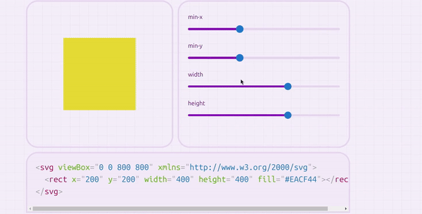
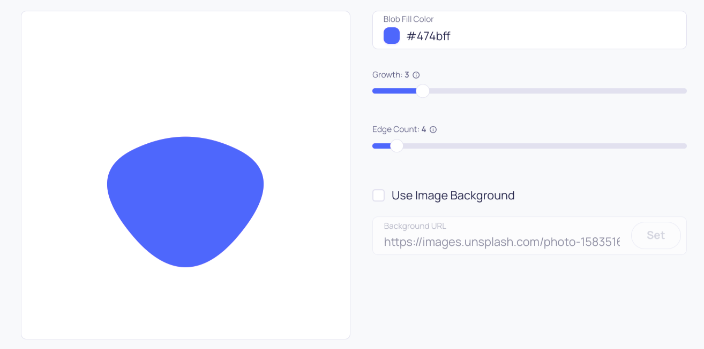
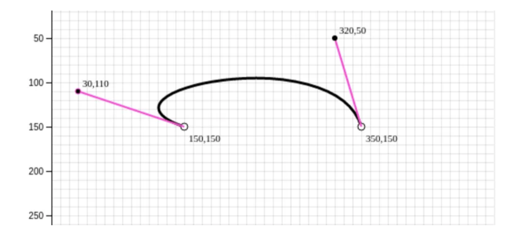
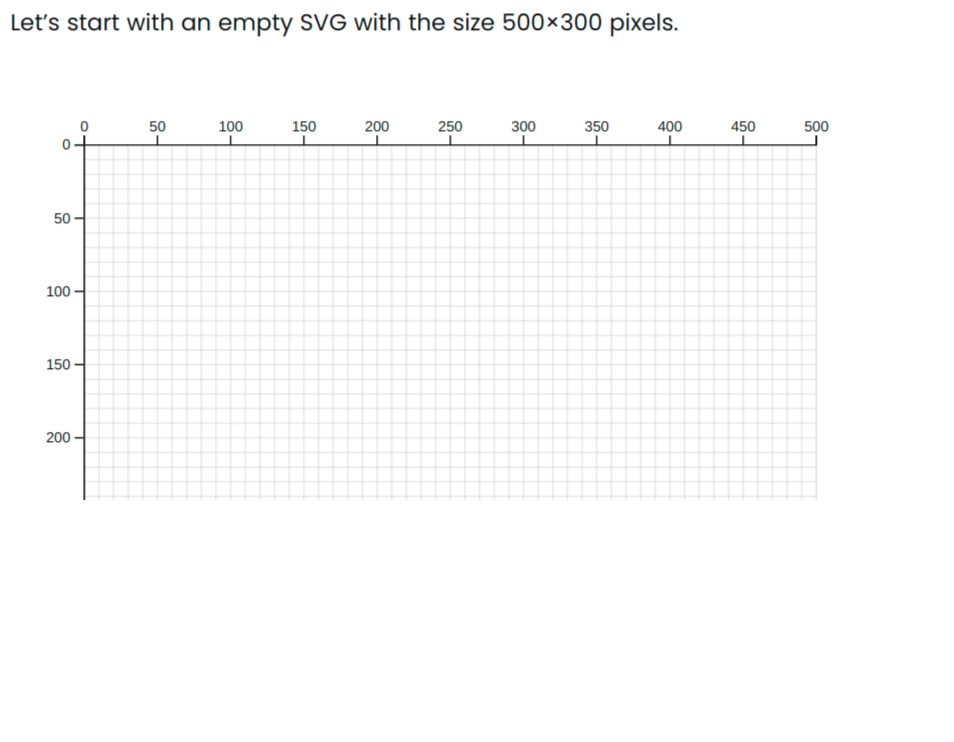

## 🟡 Svg vs Rect

<br>

### 🟣 Question: is SVG logic a bit similar to RECT()?


#### ✅ Chatgpt:

`SVG` (**Scalable Vector Graphics**) and **Pygame** <u>both allow for drawing</u> , but they operate differently and are used in different contexts.

<br>

#### 🟣 Question: Yes, but if you take this `svg` example: `rect x="200" y="200" width="400" height="400"`, it looks similar in the logic(not the syntax) to pygame Rect

<br>


<br>

🟢 play with this values: `-3 -41 782 877` , **here**: https://www.fffuel.co/sssvg/

```javascript
// SVG
<svg viewBox="-3 -41 782 877" xmlns="http://www.w3.org/2000/svg">
  <rect x="200" y="200" width="400" height="400" fill="#EACF44"></rect>
</svg>
```
#### output


[]()


<br>
<br>


### 🟧 Here’s a comparison of how SVG and Pygame handle drawing:


<br>

### 🟢 Explanation:

<br>

#### `<svg viewBox="0 0 800 800">`:

- - **Defines the SVG canvas** with a **coordinate system**.

- -  The **viewBox** attribute **sets up a coordinate** system with an **origin at** `(0,0)` **and dimensions** `800x800` **units.**

<br>
<br>

#### `<rect x="200" y="200" width="400" height="400" fill="#EACF44"></rect>`:

- - Draws a rectangle on the SVG canvas.

- - `x="200" and y="200"`: **Position** of the **rectangle’s** top-left corner.


- - `width="400" and height="400"`: Dimensions of the rectangle.

- - `fill="#EACF44":` Color of the rectangle.


<br>

### ✅ Chatgpt:

<br>

**Yes**, the **logic behind the SVG example and the Pygame example is similar** in that **both** are used to **render graphics** and follow a straightforward process of defining what to draw and where.

> - -  #### 🌈 Despite differences in syntax and rendering environments, the underlying logic of specifying what to draw, where to draw it, and how to style it is quite similar between SVG and Pygame.

<br>

### 🟤  Here’s a breakdown of how they compare in terms of logic:

<br>

#### 🟤 Coordinate System:

Both SVG and Pygame use coordinate systems where positions are specified with x and y values.

- -  In SVG, coordinates are based on the viewBox, while in Pygame, they are directly related to the window size.


#### 🟤 Drawing Primitives:

Both use similar concepts for drawing shapes.

- - ***SVG uses XML** tags (`xmlns=`), while **Pygame** uses functions (e.g., `pygame.draw.rect()`).


<br>

<br>

---

<br>
<br>

## SVG

[]()


```bash
<svg id="10015.io" viewBox="0 0 480 480" xmlns="http://www.w3.org/2000/svg" xmlns:xlink="http://www.w3.org/1999/xlink" >


	<path fill="#474bff" d="M316,330Q240,420,163.5,330Q87,240,163.5,202.5Q240,165,316,202.5Q392,240,316,330Z" />
</svg>
```

## 🟤 Explanation

<br>

#### `<path>`:

The `<path>` element is used to define a complex shape using a series of commands and parameters.

<br>


#### 🟤 `fill="#474bff"`:

- - **Sets the** `fill` **color** of the `path`.

- - -  `#474bff` is a hexadecimal color code representing a shade of blue.

<br>
<br>

#### 🔴 Before Continue reading:

- - Check the video Below, it will give you an understanding of what you are going to read next, specially for the coordinates, control points, sin, lerp and other stuff, the important is that you get **a bit** familiar with the **path** (i' am also not a genius in svg manipulation, but its funny once you start  animating it :)

<br>

https://github.com/user-attachments/assets/dbb1c275-2270-4f98-a11e-fffcb1b8270d

<br>

> SOURCE: tutorial by **Olivier Larose** [How to Make an Animated SVG Curve using Next.js, Sine, Linear Interpolation](https://youtu.be/5FqetqO2Y9A?si=zSmKnnWEwPmbdr7s)

<br>


##  🟠 Understanding the Cubic Bézier Curve in SVG

[](https://jesperkiledal.com/blog/understanding-cubic-bezier-curve-svg/)

> SOURCE: https://jesperkiledal.com/blog/understanding-cubic-bezier-curve-svg/

<br>

#### 🟤 `d="M316,330Q240,420,163.5,330Q87,240,163.5,202.5Q240,165,316,202.5Q392,240,316,330Z":`

- - 🟤 The   **`d`** attribute contains a series of commands and parameters that **describe** the <u>shape of the path</u> .

<br>


### Here’s a breakdown of the path data:

```bash
"M316,330Q240,420,163.5,330Q87,240,163.5,202.5Q240,165,316,202.5Q392,240,316,330Z"
```

###  `M316,330`:

🟤 `M`: **Move To command**.

- - **Moves the pen to** the `coordinate (316, 330)` without drawing anything.

<br>


[](https://jesperkiledal.com/blog/understanding-cubic-bezier-curve-svg/)


<br>

### 🟤 `Q240,420,163.5,330`:

🟤 `Q`: **Quadratic Bezier Curve command**.

- - **Draws a curve** from the current position (`316, 330`) to (`163.5, 330`) with a control point at (`240, 420`).


```bash
M316,330Q240,420,163.5,330Q87,240,163.5,202.5Q240,165,316,202.5Q392,240,316,330Z
```

<br>

#### [Cubic Bezier / shape](https://jesperkiledal.com/blog/understanding-cubic-bezier-curve-svg/)

- other types with anim [Cubic Bezier](https://cubic-bezier.com/#.17,.67,.83,.67)


<br>
<br>


### `Q87,240,163.5,202.5`:

**Another Quadratic Bezier Curve**.

- - Draws a curve from (163.5, 330) to (163.5, 202.5) with a control point at (87, 240).


#### `Q240,165,316,202.5`:

**Another Quadratic Bezier Curve**.

- - Draws a curve from (163.5, 202.5) to (316, 202.5) with a control point at (240, 165).


#### `Q392,240,316,330`:

**Another Quadratic Bezier Curve**.

- - Draws a curve from (316, 202.5) back to the starting point (316, 330) with a control point at (392, 240).
Z:

#### Close Path command. Draws a straight line back to the starting point of the path, closing the shape.
