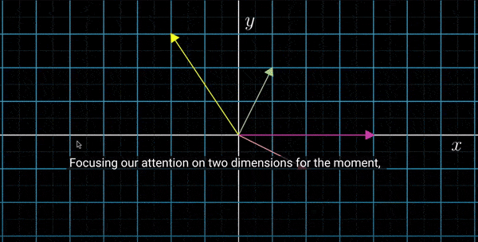

# 🟡 VECTORS


- Why to use vectors?

- Vector Multiplication

- Mutable and Flexible

<br>
<br>

 ### 🟦 Using a vector can be a good solution  to handle position updates more flexibly and avoid the issues you encountered with directly modifying the:

  `center` attribute of a `Rect` **object**.

<br>


### 🟠 Vectors are mathematical objects used to represent quantities with both magnitude and direction.

- -  In 2D space, a vector has two components: `x (horizontal) and y (vertical)`.

> - -  #### 🟢 Operations like addition, subtraction, and scaling (multiplying by a scalar) are performed element-wise("element-wise" means that each component of the vector is operated on individually.).

#### 🍊 Vectors simplify calculations and transformations in graphics and physics by managing direction and distance efficiently.


<br>

### 🟨 `Vectors` can be thought of as `lists` with `two` values: `x and y`, `representing coordinates in a 2D` space.

<br>

### 🟤 Vector Multiplication

**Multiplying a Vector by a Number:**

- -  When you multiply a vector by a ✋ `scalar` **(a single number)**, each component of the vector is multiplied by that number.

```python
vector = Vector2(4, 2)  # A vector with x = 4 and y = 2
scaled_vector = vector * 2  # Multiply both x and y by 2
# 4 x 2 = 8
# 2 x 2 = 4

# 👍 output of the multiplication
# This results in a new vector: Vector2(8, 4)


```
### 🟤 Difference from Lists

**In Lists:**

- - 🔴 Multiplying a list by a number duplicates the entire list, but does not operate on its individual elements.

```python
lst = [4, 2]
scaled_lst = lst * 2  # Duplicates the list
# 🔴 Result: [4, 2, 4, 2]

```
<br>


### 🟠  Key Difference


**Vector Operation:** Affects each component of the vector individually, scaling them according to the scalar value.

<br>

**List Operation:** Repeats the entire list without altering individual elements.

<br>

### 🍯 Summary:

**Vectors:** When multiplied by a scalar, each component of the vector is scaled, resulting in Vector2(8, 4) from Vector2(4, 2) when scaled by 2.


**Lists:** Multiplying a list by a number duplicates the entire list, resulting in [4, 2, 4, 2] from [4, 2].


<br>

[](https://youtu.be/fNk_zzaMoSs?si=JBdbdHGBhV7Ih5y9)


**WATCH** the video from the above img: [Vectors | Chapter 1, Essence of linear algebra](https://youtu.be/fNk_zzaMoSs?si=JBdbdHGBhV7Ih5y9)


https://github.com/user-attachments/assets/4b72d2c1-2ef0-4982-a86c-9d1a165c2a14


<br>
<br>
<br>

## 🌈 Recapitulative

<br>
<br>


### Here’s a detailed explanation of how and why using a vector helps:


### 🧶 Using a Vector for Position Updates

<br>

## 🟦 Why Use a Vector?


### 🟠 Mutable and Flexible:

####  tuples, vectors...

<br>

**Unlike** `tuples`, **vectors** (often represented as `pygame.math.Vector2` in Pygame) **are mutable.**

- -  #### 🟡 This means you can easily perform arithmetic operations like addition or subtraction on them.

<br>
