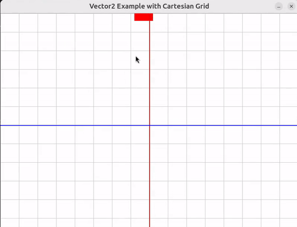

# 🟡 VECTORS


- Why to use vectors?

- Vector Multiplication

- Mutable and Flexible

<br>
<br>

 ### 🟦 Using a vector can be a good solution  to handle position updates more flexibly and avoid the issues you encountered with directly modifying the:

  `center` attribute of a `Rect` **object**.

<br>


### 🟠 Vectors are mathematical objects used to represent quantities with both magnitude and direction.

- -  In 2D space, a vector has two components: `x (horizontal) and y (vertical)`.

> - -  #### 🟢 Operations like addition, subtraction, and scaling (multiplying by a scalar) are performed element-wise("element-wise" means that each component of the vector is operated on individually.).

#### 🍊 Vectors simplify calculations and transformations in graphics and physics by managing direction and distance efficiently.


<br>

### 🟨 `Vectors` can be thought of as `lists` with `two` values: `x and y`, `representing coordinates in a 2D` space.

<br>

### 🟤 Vector Multiplication

**Multiplying a Vector by a Number:**

- -  When you multiply a vector by a ✋ `scalar` **(a single number)**, each component of the vector is multiplied by that number.

```python
vector = Vector2(4, 2)  # A vector with x = 4 and y = 2
scaled_vector = vector * 2  # Multiply both x and y by 2
# 4 x 2 = 8
# 2 x 2 = 4

# 👍 output of the multiplication
# This results in a new vector: Vector2(8, 4)


```
### 🟤 Difference from Lists

**In Lists:**

- - 🔴 Multiplying a list by a number duplicates the entire list, but does not operate on its individual elements.

```python
lst = [4, 2]
scaled_lst = lst * 2  # Duplicates the list
# 🔴 Result: [4, 2, 4, 2]

```
<br>


### 🟠  Key Difference


**Vector Operation:** Affects each component of the vector individually, scaling them according to the scalar value.

<br>

**List Operation:** Repeats the entire list without altering individual elements.

<br>

### 🍯 Summary:

**Vectors:** When multiplied by a scalar, each component of the vector is scaled, resulting in Vector2(8, 4) from Vector2(4, 2) when scaled by 2.


**Lists:** Multiplying a list by a number duplicates the entire list, resulting in [4, 2, 4, 2] from [4, 2].


<br>

[](https://youtu.be/fNk_zzaMoSs?si=JBdbdHGBhV7Ih5y9)


**WATCH** the video from the above img: [Vectors | Chapter 1, Essence of linear algebra](https://youtu.be/fNk_zzaMoSs?si=JBdbdHGBhV7Ih5y9)


https://github.com/user-attachments/assets/4b72d2c1-2ef0-4982-a86c-9d1a165c2a14


<br>
<br>
<br>

## 🌈 Recapitulative

<br>
<br>


### Here’s a detailed explanation of how and why using a vector helps:


### 🧶 Using a Vector for Position Updates

<br>

## 🟦 Why Use a Vector?


### 🟠 Mutable and Flexible:

####  tuples, vectors...

<br>

**Unlike** `tuples`, **vectors** (often represented as `pygame.math.Vector2` in Pygame) **are mutable.**

- -  #### 🟡 This means you can easily perform arithmetic operations like addition or subtraction on them.

<br>

### 🟠 Simplified Math Operations:

- - 🔴 With vectors, **<u>you can perform vector arithmetic directly</u>** , which is more intuitive and flexible **compared to handling separate `x` and `y`** values.

<br>
<br>
<br>


<br>

## 🟡 Example of Vector2 in Action


### 🟢 🟢  Role of Vector2:

- - 🫐 **Provides a mutable**, intuitive **way to handle and update positions**, improving both the ease of use and readability of the code.


<br>

### 🟤 Initialization:

```python
center_vector = Vector2(player_rect.center)
```
- Converts the rectangle’s center point into a Vector2, making it easier to manipulate.


<br>

### 🟤 Update

- Adds the movement vector to center_vector, updating its position.

```python
center_vector += movement
```

<br>

### 🟤 Assignment:

- Sets the updated position back to the rectangle.


```python
player_rect.center = center_vector
```

<br>
<br>
<br>


<br>

## 🟨 On the code

### 👾 Here’s how you can update the rectangle's position using a Vector2:


- This Pygame script creates a visual demonstration of how the Vector2 class from Pygame's math module can be used to handle and update the position of an object (in this case, a rectangle) within a Cartesian coordinate system.


```python
import pygame
from pygame.math import Vector2

# Initialize Pygame
pygame.init()

# Screen dimensions
width, height = 800, 600
screen = pygame.display.set_mode((width, height))
pygame.display.set_caption("Vector2 Example with Cartesian Grid")

# Colors
WHITE = (255, 255, 255)
GRAY = (200, 200, 200)
RED = (255, 0, 0)
BLUE = (0, 0, 255)

# Create a rectangle
rect_width, rect_height = 50, 50
player_rect = pygame.Rect(100, 100, rect_width, rect_height)

# Convert the rectangle's center to a vector
center_vector = Vector2(player_rect.center)

# Movement vector
movement = Vector2(20, -10)

# Main loop
running = True
while running:
    for event in pygame.event.get():
        if event.type == pygame.QUIT:
            running = False

    # Clear the screen
    screen.fill(WHITE)

    # Draw grid
    for x in range(0, width, 50):
        pygame.draw.line(screen, GRAY, (x, 0), (x, height), 1)
    for y in range(0, height, 50):
        pygame.draw.line(screen, GRAY, (0, y), (width, y), 1)

    # Draw axes
    pygame.draw.line(screen, RED, (width // 2, 0), (width // 2, height), 2)  # X-axis (Red)
    pygame.draw.line(screen, BLUE, (0, height // 2), (width, height // 2), 2)  # Y-axis (Blue)

    # Draw the rectangle
    pygame.draw.rect(screen, RED, player_rect)

    # Update the vector position
    center_vector += movement
    player_rect.center = center_vector

    # Refresh the display
    pygame.display.flip()

    # Control frame rate
    pygame.time.Clock().tick(30)

pygame.quit()

```

<br>

[]( )

<br>


<br>

#### Look at the coordinates for the `y` axis, that is why when i change (in the video) the value within the `clock.tick()` to +10 instead of -10, it goes to the bottom


[]( )

https://www.pygame.org/docs/ref/math.html


<br>
<br>


<br>


## 🎠 Purpose

### Visualize Position Updates:

The main goal is to illustrate how position updates work when using vectors.

- - The code shows a rectangle moving on a grid, with its position updated each frame using vector arithmetic.

<br>

### 🌈 Understanding the code (just some key points)

#### Rectangle Setup:

- - - player_rect is initialized as a rectangle with a starting position of (100, 100) and size 50x50.

```python
rect_width, rect_height = 50, 50
player_rect = pygame.Rect(100, 100, rect_width, rect_height)
```
<br>

#### 🟢 Vector Initialization:

- - - `center_vector` is created as a **Vector2** instance, initialized with the center position of player_rect.

```python
# Convert the rectangle's center to a vector
center_vector = Vector2(player_rect.center)
```

> - - - #### This allows for more convenient manipulation of the rectangle’s position.

<br>


#### 🟡 🎠 Movement Vector:

- -  **movement** is a `Vector2` **representing the change in** `position: (20, -10)`.

```python
# Movement vector
movement = Vector2(20, -10)
```

> - - #### This vector will be added to `center_vector` to update the rectangle’s position.


<br>
<br>

## 🟡 How Vector2 Helps:


<br>

##  🔶 Simplifies Arithmetic Operations:

Vector2 makes it easier to perform arithmetic operations on positions.

- - Instead of manually updating x and y coordinates separately, you can add or subtract Vector2 instances directly.

- - This is more intuitive and less error-prone.

