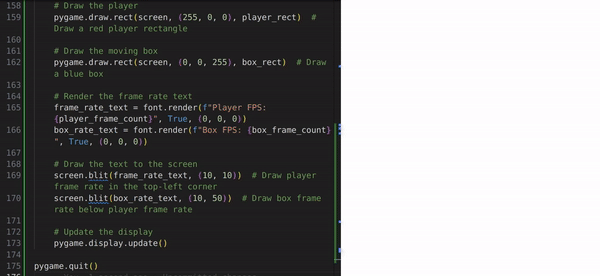
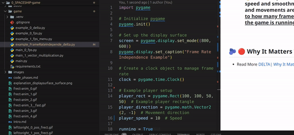

# 🟡 FRAME Rate independence

<br>

- Frame rate independence is a concept in game development that **ensures the game's behavior and movement remain consistent regardless of the frame rate**.


 - - #### 🔴  Essentially, it means that the speed and smoothness of animations and movements are <u>not directly tied to how many frames per second (FPS) the game is running at</u> 🔴 .

<br>

# 🟡 Why It Matters


### Consistent Experience Across Different Systems:

<br>

- - 🟤**Different systems** may run games at different frame rates.

<br>

- - 🔴 **Frame rate independence ensures that** the game behaves the same way on a high-end system running at 120 FPS and on a lower-end system running at 30 FPS.

<br>
<br>

# 🫐 🟡 Why It Matters

### Consistent Experience Across Different Systems:

<br>

- - 🟤**Different systems** may run games at different frame rates.

<br>

- - 🔴 **Frame rate independence ensures that** the game behaves the same way on a high-end system running at 120 FPS and on a lower-end system running at 30 FPS.


<br>

### 🟫 Smooth Gameplay:

- -  **Without frame rate independence, if the frame rate drops**, movements and animations might slow down or become jerky. With frame rate independence, movement speed remains consistent even if the frame rate varies.

<br>
<br>

# 🫐 🟡 How It’s Achieved

- 🔴 (I’ll show you a simple example of how delta is useful soon. For now, just check out the information below)

<br>
<br>

## 🟡 DELTA

- recap

#### To achieve frame rate independence, you typically need to use the concept of delta time.


-  - **DELTA is a way to measure how much time has passed since the last frame** (or screen update) in a game.

> - - #### This helps in making sure that the game moves the same way regardless of how fast or slow the computer is running the game.

<br>

- - 🟦  **Delta** time refers to the time elapsed since the last frame.

> - - - ###  🧸 By incorporating delta time into your movement calculations, you ensure that movement is <u>based on real time rather than the number of frames.</u>


<br>
<br>
<br>

## 🧶 Here’s how you can modify your game loop to incorporate `delta` time:

<br>

### 🟩 Track Elapsed Time:

<br>

- - **Calculate the time** that has passed since the last frame.

<br>

### 🟩 Adjust Movement Based on Time:


```python
import pygame

# Initialize pygame
pygame.init()

# Set up the display surface
screen = pygame.display.set_mode((800, 600))
pygame.display.set_caption("Frame Rate Independence Example")

# Create a clock object to manage frame rate
clock = pygame.time.Clock()

# Font setup
font = pygame.font.Font(None, 36)  # Use a default font and set the size to 36


#------------🟥
# Example player setup
player_rect = pygame.Rect(100, 100, 50, 50)  # Example player rectangle
player_direction = pygame.math.Vector2(2, -1)  # Movement direction
player_speed = 100  # Speed in pixels per second


#------------🟦
# Box to visualize frame rate independence
box_rect = pygame.Rect(400, 300, 50, 50)  # Box position and size
box_direction = pygame.math.Vector2(-1, 2)  # Movement direction of the box
box_speed = 50  # Speed in pixels per second


# Timing variables
player_last_update = pygame.time.get_ticks()
box_last_update = pygame.time.get_ticks()


player_update_interval = 1000 / 60  # Player updates at 60 FPS
box_update_interval = 1000 / 30  # Box updates at 30 FPS

# Frame rate counters
player_frame_count = 0
box_frame_count = 0
player_time_accumulator = 0
box_time_accumulator = 0

running = True
while running:
    # Handle events
    for event in pygame.event.get():
        if event.type == pygame.QUIT:
            running = False

    # Calculate delta time
    delta_time = clock.tick(60) / 1000.0  # Cap the frame rate at 60 FPS

    # Update player position based on delta time
    player_time_accumulator += delta_time
    if player_time_accumulator >= player_update_interval / 1000.0:
        player_movement = player_direction * player_speed * delta_time
        player_rect.center += player_movement
        player_time_accumulator = 0
        player_frame_count += 1

    # Update box position based on delta time
    box_time_accumulator += delta_time
    if box_time_accumulator >= box_update_interval / 1000.0:
        box_movement = box_direction * box_speed * delta_time
        box_rect.topleft += box_movement
        box_time_accumulator = 0
        box_frame_count += 1

    # Clear the screen
    screen.fill((255, 255, 255))  # White background

    # Draw the player
    pygame.draw.rect(screen, (255, 0, 0), player_rect)  # Draw a red player rectangle

    # Draw the moving box
    pygame.draw.rect(screen, (0, 0, 255), box_rect)  # Draw a blue box

    # Render the frame rate text
    frame_rate_text = font.render(f"Player FPS: {player_frame_count}", True, (0, 0, 0))
    box_rate_text = font.render(f"Box FPS: {box_frame_count}", True, (0, 0, 0))

    # Draw the text to the screen
    screen.blit(frame_rate_text, (10, 10))  # Draw player frame rate in the top-left corner
    screen.blit(box_rate_text, (10, 50))  # Draw box frame rate below player frame rate

    # Update the display
    pygame.display.update()

pygame.quit()


```

### output

[]( )


<br>
<br>
<br>
<br>


## 🟦 Let’s focus on a simple example


```python
import pygame

# Initialize pygame
pygame.init()

# Set up the display surface
screen = pygame.display.set_mode((800, 600))
pygame.display.set_caption("Frame Rate Independence Example")

# Create a clock object to manage frame rate
clock = pygame.time.Clock()

# Example player setup
player_rect = pygame.Rect(100, 100, 50, 50)  # Example player rectangle
player_direction = pygame.math.Vector2(2, -1)  # Movement direction
player_speed = 10  # Speed

running = True
while running:
    # Calculate delta time (seconds since last frame)
    delta_time = clock.tick(60) / 1000.0  # Cap the frame rate at 60 FPS

    for event in pygame.event.get():
        if event.type == pygame.QUIT:
            running = False

    # Update player position based on delta time
    movement = player_direction * player_speed * delta_time
    player_rect.center += movement

    # Clear the screen
    screen.fill("lavenderblush2")

    # Draw the player
    pygame.draw.rect(screen, (255, 0, 0), player_rect)  # Draw a red player rectangle

    # Update the display
    pygame.display.update()

pygame.quit()

```
[]( )


<br>
<br>

## 🟡 🫐 Explanation


### `delta_time = clock.tick(60) / 1000.0`

### 🟦 🟠 60 means we want the game to run at a maximum of 60 frames per second (FPS)

<br>

### What it does:

- - This part of the code is used to control the speed of the game loop.

- - 🔴 It tells the computer to wait until enough time has passed to make sure the game doesn’t run too fast.

- - - 🟠 Here, **60** means we want the game to run at a maximum of 60 frames per second (FPS).

<br>

### What it returns:

### 🟢 `clock.tick(60)`:

- -  gives us the **time in milliseconds** (**a thousandths** of a second) that has passed since the last time this line was executed.

> #### 🟤 So, if `clock.tick(60)` returns 16, it means 16 milliseconds have passed.

<br>

### 🟢 `/ 1000.0`:

#### Why we divide by 1000 ?:

- - The number we get from clock.tick(60) is in **milliseconds**.

- - - There are 1000 milliseconds in one second, so to convert milliseconds to seconds, we divide by 1000.

<br>

**Result:**

###   🌈 Dividing by 1000 changes the time from milliseconds to seconds.

- - 🔴 For example, **if `clock.tick(60)` returns 16 milliseconds**, then `16 / 1000.0` **equals 0.016 seconds**.

<br>

## 🍯  Putting It All Together 🐝

<br>

### 💥 When you write `delta_time = clock.tick(60) / 1000.0`, 🐻 you’re doing two things:

<br>

### 1. 🫐 Control the Speed:

  You are making sure the game doesn’t run faster than 60 frames per second.

  - - This is useful to keep the game speed consistent on different computers.

### 2. 🫐 Measure Elapsed Time:

  You’re finding out how much time has passed since the last frame.

- - - This time is measured in seconds, so it’s easier to use in calculations to move objects smoothly.


<br>
<br>

### Example


### 💅 🌪️ Imagine a game where you want to move a character forward.

- - 🦄 If you want the character to move 100 pixels per second, you need to know how much time has passed to move it correctly.

<br>

#### If `delta_time` is `0.016` **seconds**, you know that 16 milliseconds have passed since the last frame.


<br>

- **To move the character**, you use `speed * delta_time`.

<br>

- - #### 🌈 If the **speed is** `100 pixels per second`, **then you move** the **character by** `100 * 0.016` **pixels**, `which is 1.6 pixels` **for this frame**.


<br>

> #### 🟧 By using `delta_time`, you make sure the character moves smoothly and at the same speed, `whether the game is running at 30 FPS or 60 FPS`.

#### This is because the movement is adjusted according to the actual time passed, not just the number of frames.

<br>
